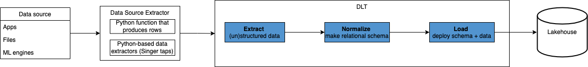

<p align="center">

[](https://pypi.org/project/python-dlt/)
[](https://github.com/scale-vector/dlt/actions/workflows/lint.yml)
[](https://github.com/scale-vector/dlt/actions/workflows/test_common.yml)
[](https://github.com/scale-vector/dlt/actions/workflows/test_loader_redshift.yml)
[](https://github.com/scale-vector/dlt/actions/workflows/test_loader_bigquery.yml)

</p>

# Data Load Tool (DLT)

## What is DLT?

Data Load Tool (DLT) is an open source python library for building data pipelines. The goal of DLT is to make it easier and faster to build low-maintenance data pipelines. It's designed to run anywhere (Python 3.8+), so it can fit into your existing workflows or be scheduled independently (e.g. using GitHub Actions).

If you are interested in trying DLT out, please email tyler@scalevector.ai :)

## Who is DLT for?

DLT is for data professionals who use Python to build pipelines.
- DLT enables anyone who knows a bit of Python to build commercial-grade pipelines
- DLT minimises maintenance requirements by design
- The DLT community shares pipelines with each other, so frequently you'll be able to just use a pipeline created by someone else

## Why use DLT?

DLT takes the Python scripts you already write to the next level with a library you install using pip in order to create highly scalable, easily maintainable pipelines that are straightforward to deploy.

If you end up creating your own pipeline in python, then create it with DLT and your loading scripts will benefit from
- Automatic schema maintenance (i.e. schema inference, deployment, evolution, data contracts, etc.)
- Configurable loading (e.g. append, replace, merge, etc.)
- Configurable normalisation (i.e. decide how to unpack nested documents, specify date formats, etc.)
- High performance loading engine (i.e. data engineering best practices like idempotent, atomic, scalable loading)

## How does it work?

DLT aims to simplify data loading for the millions of people who have taken at least one Python course

To achieve this, we take into account the progressive steps of data pipelining:



### 1. Data extraction

DLT accepts json and json-producing functions as input, including nested, unstructured data.

### 2. Data normalisation

DLT features a configurable normalisation engine that can recursively unpack nested structures into relational tables, handle various data type conversions, etc.

### 3. Data loading

When we load data, many things can interrupt the process, so we want to make sure we can safely retry without generating artifacts in the data. Additionally, it's not uncommon to not know the data size in advance, making it a challenge to match data size to loading infrastructure. With good pipelining design, safe loading becomes a non-issue.

* Schema evolution - configurable strategy for schema changes: automatic migration or fail&alert.
* Idempotency & Atomicity: Built in best practices of Atomic loading (all or nothing), and configurable Idempotency (do not double load, incurs a table "read" cost)
* Data-size agnostic: By using generators (like incremental downloading) and online storage as a buffer, it can incrementally process sources of any size without running into worker-machine size limitations.

## Why?

Data loading is how all data work starts.

The current ecosystem of tools follows an old paradigm, where the data pipeline creator is a software engineer, while the data pipeline user is an analyst. In the real world, the data analyst needs to solve problems end to end, including loading.

Currently, there are no simple libraries to achieve this, only clunky frameworks that require engineering expertise to host, run, manage, scale, and maintain. DLT aims to simplify data pipeline building, making it easier and faster to build low-maintenance pipelines with evolving schemas.

## Why not an OOP framework?

Data professionals operate at the intersection between business, statistics, and APIs.

As a result, the learning curve to create data pipelines using complex Object Oriented Programming (OOP) frameworks / SDKs (e.g. Airbyte, Singer, etc.) is too steep for all but the most tech savvy people.

In contrast, DLT allows you to throw JSON into a database with little to no learning curve.

## Supported data warehouses

Google BigQuery:
```pip3 install python-dlt[gcp]```

Amazon Redshift:
```pip install python-dlt[redshift]```
