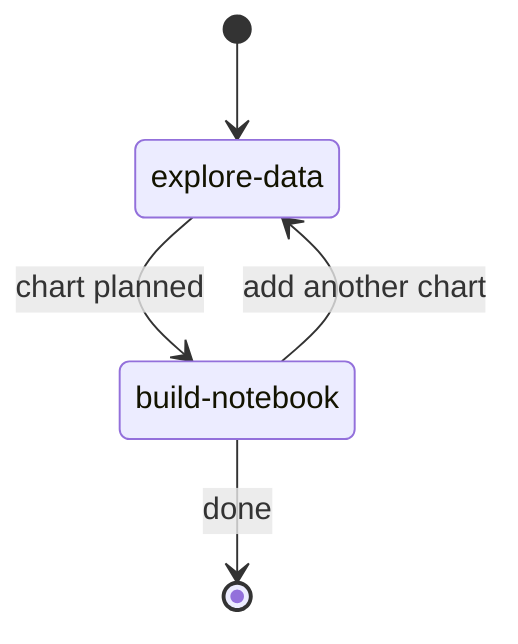
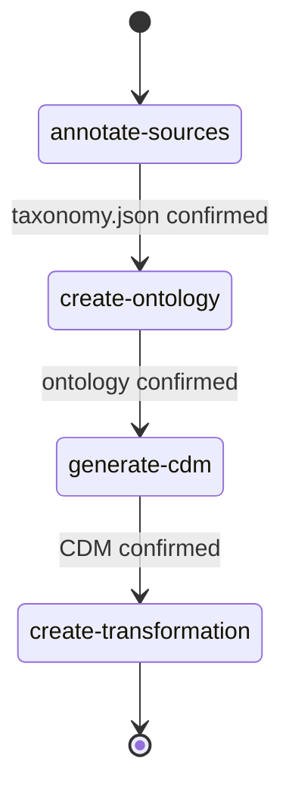

# Explore and Transform your data with dltHub AI Workbench

:::info
The dltHub AI Workbench is a part of the dltHub platform. View the license [here](https://github.com/dlt-hub/dlthub-ai-workbench/blob/master/LICENSE). Sign up [here](https://dlthub.com/solutions/for-small-data-teams) for early access to dltHub.
:::

## Overview

Once your pipeline is running and your data is loaded, the next step is to understand it and shape it for downstream use. The dltHub AI Workbench provides two toolkits for this phase:

- **`data-exploration`** — connects to your loaded pipeline data, profiles it, plans charts, and assembles an interactive [marimo](../../general-usage/dataset-access/marimo.md) dashboard with Altair visualizations.
- **`transformations`** — maps your raw source tables to canonical business concepts, builds a Kimball-style CDM, and generates `@dlt.hub.transformation` functions to populate it.

Both toolkits work with **Claude Code**, **Cursor**, and **Codex** and are designed to integrate directly into the workflow started by the [rest-api-pipeline toolkit](llm-native-workflow.md).

## Setup

### Install the toolkits

If you have already run `dlt ai init` (as part of the [REST API pipeline guide](llm-native-workflow.md#setup)), you only need to install the toolkits:

```sh
uv run dlt ai toolkit data-exploration install
uv run dlt ai toolkit transformations install
```

If this is a fresh project, set up `uv`, install `dlt[workspace]`, and initialize your coding assistant first — see the [setup steps](llm-native-workflow.md#setup).

## Explore your data

The **data-exploration** toolkit connects to a dlt pipeline and builds an interactive notebook. The coding assistant adapts to the specificity of your intent:

- **High-intent** (i.e. you already know which kind of insights you want to generate from your data, e.g. "show revenue by month"): scans the schema, plans the chart, and renders it directly.
- **Low-intent** (i.e. you want to explore your data without a specific question to focus on, e.g. "explore my github data"): profiles all tables, proposes 5–10 business questions, and builds the dashboard from your selection.

### `/explore-data` — connect and plan charts

The explore-data skill connects to your pipeline, profiles the data, and plans one chart at a time. It writes an `analysis_plan.md` artifact that captures the chart spec, the SQL query, and the Altair chart code.

```text
/explore-data github_pipeline
```

```text
/explore-data github_pipeline -- what is the distribution of issues by label?
```

The skill uses the dlt MCP tools (`list_pipelines`, `list_tables`, `get_table_schema`, `execute_sql_query`) to inspect your data without you copying output manually. After each chart is planned, the coding agent will propose handing off to `/build-notebook`.

### `/build-notebook` — assemble and launch the dashboard

Reads the `analysis_plan.md` and assembles a marimo Python notebook with all planned charts, then validates and launches it:

```sh
uv run marimo edit <pipeline_name>_dashboard.py --no-token
```

The agents iterate over this loop: plan one chart with `/explore-data`, launch with `/build-notebook`, then add the next chart. Each re-invocation of `/explore-data` appends a new chart to the plan and `/build-notebook` regenerates the full notebook.

### Anatomy of the data-exploration toolkit



## Transform your data

The **transformations** toolkit starts from your source data and your stated business goals, and **derives the model from an ontology** — a formal description of the business entities and relationships that exist across your sources.

The process moves through four stages: annotating sources with business concepts, building an entity graph (ontology), generating a Kimball-style Canonical Data Model (CDM), and finally writing the transformation code. At each stage the assistant confirms decisions with you before proceeding, so the resulting model reflects your domain — not a generic template.

The output is a `@dlt.hub.transformation` script powered by ibis that populates the Canonical Data Model from your raw pipeline tables.

### `/annotate-sources` — map tables to business concepts

The first step maps your source tables to canonical business entities (e.g. `Person`, `Company`, `Event`). The assistant:

1. Confirms your pipeline names via `list_pipelines` and exports schemas as DBML files under `.schema/<cdm-name>/`
2. Proposes core business entities that match your stated use cases
3. Maps each source table to an entity and confirms with you
4. Identifies **natural keys** — columns like `email` that link the same entity across multiple source systems

```text
/annotate-sources hubspot, luma -- track event attendance and link contacts to companies
```

All decisions are recorded in `.schema/<cdm-name>/taxonomy.json` and the annotated DBML files.

### `/create-ontology` — build the entity graph

Translates the confirmed source annotations into a formal entity graph in [Graph ISON](https://graph.ison.dev/) format. For each concept it:

- Collects all contributing columns across all source tables
- Resolves cross-source attribute conflicts using the natural key strategy you confirm
- Defines relationships (`BELONGS_TO`, `ATTENDED`, `STITCHED_BY`) between entities
- Flags semantic gaps where a use case requires data that no source table provides

Output: `.schema/<cdm-name>/ontology.ison` + a human-readable `.schema/<cdm-name>/ontology.md` summary.

### `/generate-cdm` — design the dimensional model

Translates the ontology into an implementation-ready CDM schema using Kimball principles:

- Classifies entities as **dimension** or **fact** tables
- Defines an explicit grain for every fact table ("one row per person per event attended")
- Adds surrogate keys, SCD type assignments, and sentinel rows (no NULL foreign keys)
- Writes the schema to `.schema/<cdm-name>/CDM.dbml`

### `/create-transformation` — write the transformation code

Generates `@dlt.hub.transformation` functions that map your source tables to CDM entities using ibis:

```py
import dlt
import ibis

@dlt.source
def person_interactions_to_cdm():
    yield dim_person
    yield dim_company
    yield dim_event
    yield fact_event_attendance

@dlt.hub.transformation(write_disposition="replace")
def dim_person(dataset: dlt.Dataset):
    contacts = dataset["hubspot__contacts"].to_ibis()
    guests   = dataset["luma__guests"].to_ibis()
    ...
```

The output script follows naming conventions based on business domain, not source system names (e.g. `person_interactions_to_cdm.py`).

:::note
The `transformations` toolkit requires `dlt[hub]` and a dltHub license:
```sh
uv add "dlt[hub]"
dlt license issue dlt.hub.transformations
```
:::

### Anatomy of the transformations toolkit



## Results

By the end of this guide you should have:

- An interactive marimo notebook with Altair charts built from your pipeline data
- An annotated source schema and taxonomy mapping raw tables to business concepts
- A Kimball Canonical Data Model in DBML format
- A working `@dlt.hub.transformation` script that populates the CDM

Next steps:
- [Deploy and schedule your pipeline](llm-native-workflow.md#handover-to-other-toolkits) with the `dlthub-runtime` toolkit
- [Replace the local destination with your data warehouse](../../walkthroughs/share-a-dataset.md)