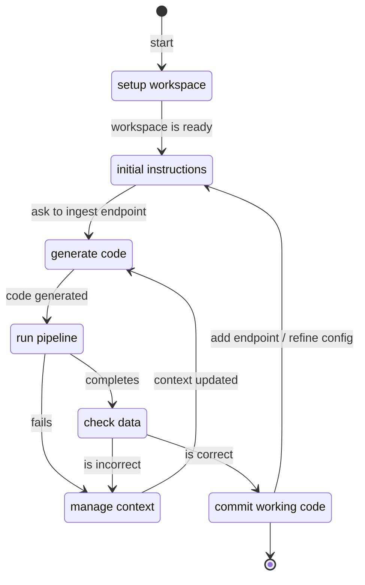
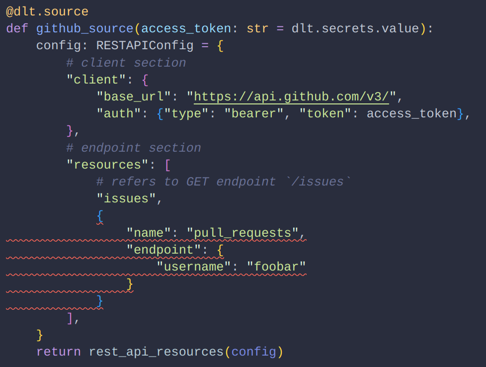
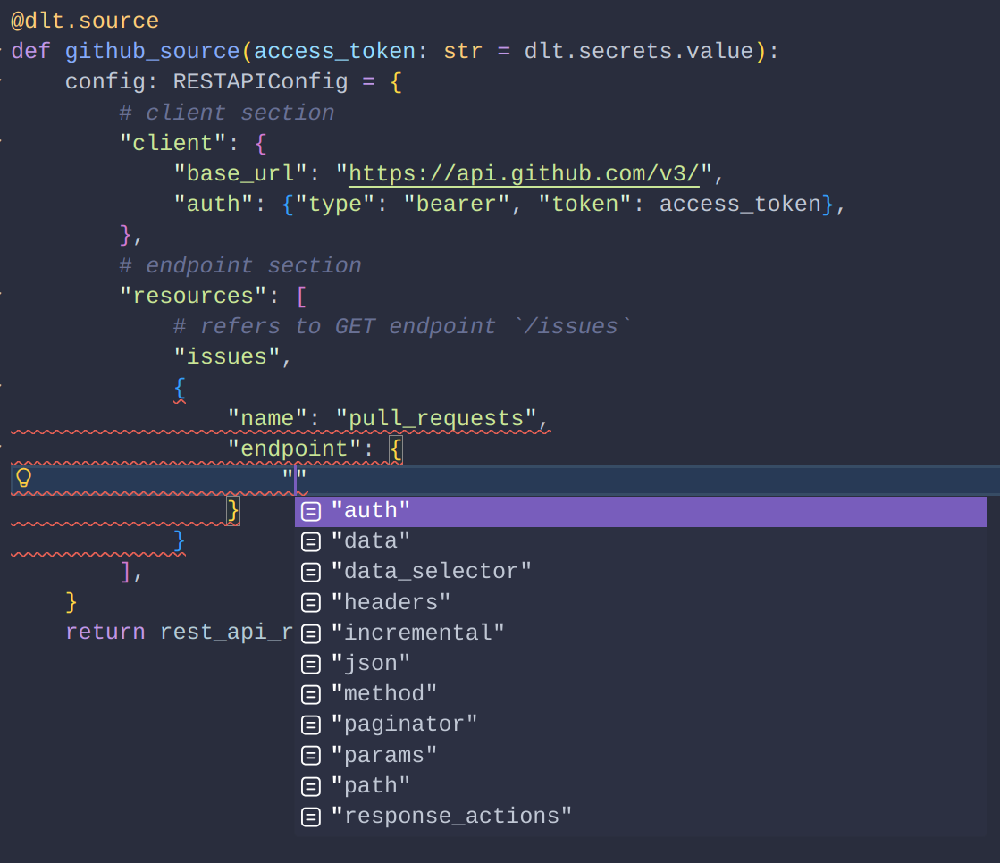

# REST API source in 10min

## Overview

The Python library `dlt` provides a powerful [REST API toolkit](../../dlt-ecosystem/verified-sources/rest_api/basic.md) to ingest data. Combined with our [LLM scaffolds](https://dlthub.com/workspace) and [MCP server](../../hub/features/mcp-server.md), you can build a custom connector for any of the 8k+ available sources in 10 minutes by following this guide.

Building with LLMs is an iterative process. We will follow this general workflow and give practical tips for each step.



:::note
You will need an AI-enabled IDE or agent, such as Copilot, Claude Code, Cursor, Continue, etc.
:::


## Setup
Before starting to build our connector, we need to initialize our [dltHub workspace](../../hub/workspace/overview.md) and configure our IDE.


### Python dependencies

Run this command to install the Python library `dlt` with the `workspace` extra.

```sh
pip install "dlt[workspace]"
```

### Initialize workspace

To initialize your workspace, you will run a command of this shape:

```sh
dlt init dlthub:{source} {destination}
```

For the destination, `duckdb` is recommend for local development.
Once you have a working pipeline, you easily change the destination to your
data warehouse.

For the source, select one of the 8k+ REST API sources available
at [https://dlthub.com/workspace](https://dlthub.com/workspace). The source's page includes a command you can copy-paste to initialize your workspace.

For example, this command setups ingestion from GitHub to local DuckDB.
```sh
dlt init dlthub:github duckdb
```

Several files will be added to your directory, similar to this:

```text
my_project/
├── .cursor/  # rules for Cursor IDE
│   ├── rules.mdc
│   └── ... # more rules
├── .dlt/
│   ├── config.toml  # dlt configuration
│   └── secrets.toml  # dlt secrets
├── .cursorignore
├── .gitignore
├── github_pipeline.py  # pipeline template
├── requirements.txt
└── github-docs.yaml  # GitHub LLM scaffold
```

### Configure IDE

When running `dlt init`, you will be prompted to select the IDE or agent that you want to use.

```sh
❯ dlt init dlthub:github duckdb
dlt will generate useful project rules tailored to your assistant/IDE.
Press Enter to accept the default (cursor), or type a name:
```

Run this command to manually setup another IDE.

```sh
dlt ai setup {IDE}
```

### Choose an LLM

Your experience will greatly depend on the capabilities of the LLM you use. We suggest minimally using `GPT-4.1` from OpenAI or `Claude Sonnet 4` from Anthropic.


<!--TODO setup MCP server-->


## Initial instructions

To get good result and make progress, it's best to implement one REST endpoint at a time.

The source's page on dlthub.com/workspace includes a prompt to get you started that looks
like this:

```text
Generate a REST API Source for {source}, as specified in @{source}-docs.yaml
Start with endpoint {endpoint_name} and skip incremental loading for now.
Place the code in {source}_pipeline.py and name the pipeline {source}_pipeline.
If the file exists, use it as a starting point.
Do not add or modify any other files.
After adding the endpoint, allow the user to run the pipeline with
`python {source}_pipeline.py`
and await further instructions.
```

:::tip
Reference `{source}-docs.yaml` and ask what the available endpoints are.
:::

## Generate code

The LLM can quickly produce a lot of code. When reviewing its proposed changes, your role is to nudge it in the right direction.

### Anatomy of a REST API source
Before practical tips, let's look at a minimal REST API source:

```py
import dlt
from dlt.sources.rest_api import rest_api_resources
from dlt.sources.rest_api.typing import RESTAPIConfig

# decorator indicates that this function produces a source
@dlt.source
def github_source(
    # the `access_token` will be retrieved from `.dlt/secrets.toml` by default
    access_token: str = dlt.secrets.value
):
    config: RESTAPIConfig = {
        # client section
        "client": {
            "base_url": "https://api.github.com/v3/",
            # access token will be passed via headers
            "auth": {"type": "bearer", "token": access_token},
        },
        # endpoint section
        "resources": [
            # refers to GET endpoint `/issues`
            "issues",
        ],
    }
    # returns a list of resources
    return rest_api_resources(config)
```

For now, it's best to delete all the code you don't understand (e.g., paginator, incremental, data selector). This keeps the LLM focused and reduces the surface for bugs. After generating a working pipeline and committing code, you can go back configure endpoints more precisely.

:::tip
Reference `{source}-docs.yaml` and ask what the available endpoints parameters are.
:::

### Leveraging the IDE

`dlt` provides extensive validation and completion suggestions inside the IDE.

Invalid code generated by the LLM produce red error lines, simplifying code review.



Completion suggestions makes it easy to fix LLM errors or set configuration options.



## Run pipeline
### Agent running the pipeline
Typically, the agent will ask permission to run the pipeline via the chat:

```sh
python github_pipeline.py
```

If you accept, it will run the pipeline and directly receive the output of the command (success or error).
Then, it can automatically start fixing things or ask follow-up questions.

:::note
Depending on the IDE, the pipeline may fail because of missing Python dependencies. In this case,
you should run the pipeline manually.
:::

### Manually running the pipeline
You can manually run this command in the terminal to run the pipeline.

```sh
python github_pipeline.py
```

Then, use `@terminal` inside the chat window to add the success / error message to the LLM context.

### Success: pipeline completed without error
A successful execution should print a message similar to this one:

```sh
Pipeline github_source load step completed in 0.26 seconds
1 load package(s) were loaded to destination duckdb and into dataset github_source_data
The duckdb destination used duckdb:/github_source.duckdb location to store data
Load package 1749667187.541553 is LOADED and contains no failed jobs
```

### Failure: source credentials

Your first few iterations will probably trigger credentials errors. This can be easily fixed by filling the `.dlt/config.toml` and `.dlt/secrets.toml` or by using environment variables.

```text
dlt.common.configuration.exceptions.ConfigFieldMissingException: Missing 1 field(s) in configuration `GithubRestApiSourceConfiguration`: `access_token`
for field `access_token` the following (config provider, key) were tried in order:
  (Environment Variables, GITHUB_PIPELINE__SOURCES__GITHUB_PIPELINE__GITHUB_REST_API_SOURCE__ACCESS_TOKEN)
  (Environment Variables, GITHUB_PIPELINE__SOURCES__GITHUB_PIPELINE__ACCESS_TOKEN)
  (Environment Variables, GITHUB_PIPELINE__SOURCES__ACCESS_TOKEN)
  (Environment Variables, GITHUB_PIPELINE__ACCESS_TOKEN)
  (secrets.toml, github_pipeline.sources.github_pipeline.github_rest_api_source.access_token)
  (secrets.toml, github_pipeline.sources.github_pipeline.access_token)
  (secrets.toml, github_pipeline.sources.access_token)
  (secrets.toml, github_pipeline.access_token)
  (Environment Variables, SOURCES__GITHUB_PIPELINE__GITHUB_REST_API_SOURCE__ACCESS_TOKEN)
  (Environment Variables, SOURCES__GITHUB_PIPELINE__ACCESS_TOKEN)
  (Environment Variables, SOURCES__ACCESS_TOKEN)
  (Environment Variables, ACCESS_TOKEN)
  (secrets.toml, sources.github_pipeline.github_rest_api_source.access_token)
  (secrets.toml, sources.github_pipeline.access_token)
  (secrets.toml, sources.access_token)
  (secrets.toml, access_token)
Provider `secrets.toml` loaded values from locations:
        - /home/user/path/to/my_project/.dlt/secrets.toml
        - /home/user/.dlt/secrets.toml
Provider `config.toml` loaded values from locations:
        - /home/user/path/to/my_project/.dlt/config.toml
        - /home/user/.dlt/config.toml
```

Unfortunately, getting your credentials or your API key from a source system can be tedious. For popular sources, the LLM can sometimes provide helpful step-by-step instructions to obtain credentials.

### Failure: destination credentials


## Manage context

If you're looking to ingest from specific endpoints or implement specific `dlt` features,
you can use TODO

- use `@` to refer to documentation
- use `@` to refer to the terminal output (if you ran a command and it produced an error)
- ask the LLM to use a specific MCP tool (e.g., check if data is loaded, what is the schema, how many rows)

## Check data

### dlt Dashboard

You can use launch locally the interactive dlt dashboard [LINK] to view your pipeline execution.

```sh
dlt pipeline github_pipeline show
```

You can quickly view:
- Pipeline state and metrics
- Data schema (tables, columns, types)
- SQL data explorer

The dashboard helps detect silent failures due to pagination errors, schema drift, or incremental load misconfigurations.

<div style={{textAlign: 'center'}}>

</div>


### Ask the MCP server
If the [dlt MCP server](../../hub/features/mcp-server) is connected, you can directly ask in the IDE chat window if the data was successfully loaded.

TODO: list a few example prompt / queries


### Python data exploration

Running a `dlt` pipeline creates a **dataset**. This provides a consistent interface to interact with loaded data and removes the destination-specific friction

This snippets gives access to the GitHub data I loaded
```py
import dlt

# this refers to my previously ran pipeline
github_pipeline = dlt.pipeline("github_pipeline")
github_dataset = github_pipeline.dataset()

# call `.df()` to load the results as a pandas dataframe
github_dataset.table("pull_requests").df()
```

The dataset truly shines in interactive environments like [marimo](../../general-usage/dataset-access/marimo) or Jupyter for data explorations, defining data quality checks, or writing data transformations ([Learn more](../../general-usage/dataset-access/dataset)).

### Data quality
- data validation
- schema contract
- data quality checks

## Conclusion
By the end of this guide, you should have:
- a local workspace
- a working REST API source
- a working pipeline
- a local dataset

Next steps:
- [explore the dataset and build a data product](../../general-usage/dataset-access/dataset)
- [replace the local destination with your data warehouse](../../walkthroughs/share-a-dataset)
- [deploy the pipeline](../../walkthroughs/deploy-a-pipeline/)
