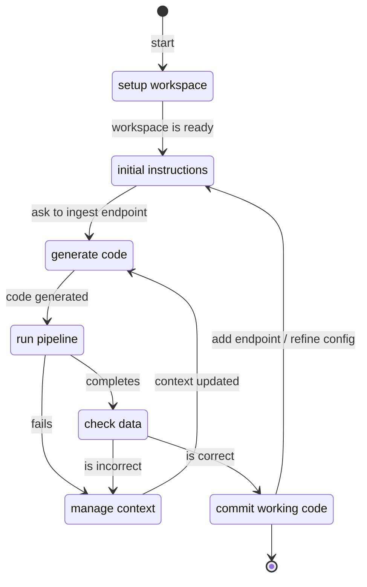

# REST API source in 10min

## Overview

The Python library `dlt` provides a powerful [REST API toolkit](../../dlt-ecosystem/verified-sources/rest_api/basic.md) to ingest data. Combined with our [LLM scaffolds](https://dlthub.com/workspace) and [MCP server](../../hub/features/mcp-server.md), you can build a custom connector for any of the 8k+ available sources in 10 minutes by following this guide.

Building with LLMs is an iterative process. We will follow this general workflow and give practical tips for each step.



:::note
You will need an AI-enabled IDE or agent, such as Copilot, Claude Code, Cursor, Continue, etc.
:::


## Setup
Before starting to build our connector, we need to initialize our [dltHub workspace](../../hub/workspace/overview.md) and configure our IDE.


### Python dependencies

Run this command to install the Python library `dlt` with the `workspace` extra.

```sh
pip install "dlt[workspace]"
```

### Initialize workspace

To initialize your workspace, you will run a command of this shape:

```sh
dlt init dlthub:{source} {destination}
```

For the destination, `duckdb` is recommend for local development.
Once you have a working pipeline, you easily change the destination to your
data warehouse.

For the source, select one of the 8k+ REST API sources available
at [https://dlthub.com/workspace](https://dlthub.com/workspace). The source's page includes a command you can copy-paste to initialize your workspace.

For example, this command setups ingestion from GitHub to local DuckDB.
```sh
dlt init dlthub:github duckdb
```

Several files will be added to your directory, similar to this:

```text
my_project/
├── .cursor/  # rules for Cursor IDE
│   ├── rules.mdc
│   └── ... # more rules
├── .dlt/
│   ├── config.toml  # dlt configuration
│   └── secrets.toml  # dlt secrets
├── .cursorignore
├── .gitignore
├── github_pipeline.py  # pipeline template
├── requirements.txt
└── github-docs.yaml  # GitHub LLM scaffold
```

### Configure IDE

When running `dlt init`, you will be prompted to select the IDE or agent that you want to use.

```sh
❯ dlt init dlthub:github duckdb
dlt will generate useful project rules tailored to your assistant/IDE.
Press Enter to accept the default (cursor), or type a name:
```

Run this command to manually setup another IDE.

```sh
dlt ai setup {IDE}
```

### Choose an LLM

Your experience will greatly depend on the capabilities of the LLM you use. We suggest minimally using `GPT-4.1` from OpenAI or `Claude Sonnet 4` from Anthropic.


### Install MCP server (optional)

You can install the [dlt MCP server ](https://github.com/dlt-hub/dlt-mcp) by adding this snippet to your IDE's configuration.

This default configuration will support local DuckDB destination
```json
{
  "name": "dlt",
  "command": "uv",
  "args": [
    "run",
    "--with",
    "dlt-mcp[search]",
    "python",
    "-m",
    "dlt_mcp"
  ]
}
```

:::note
The configuration file format varies slightly across IDEs
:::

## Initial instructions

To get good result and make progress, it's best to implement one REST endpoint at a time.

The source's page on dlthub.com/workspace includes a prompt to get you started that looks
like this:

```text
Generate a REST API Source for {source}, as specified in @{source}-docs.yaml
Start with endpoint {endpoint_name} and skip incremental loading for now.
Place the code in {source}_pipeline.py and name the pipeline {source}_pipeline.
If the file exists, use it as a starting point.
Do not add or modify any other files.
After adding the endpoint, allow the user to run the pipeline with
`python {source}_pipeline.py`
and await further instructions.
```

:::tip
Reference `{'{'}source{'}'}-docs.yaml` and ask what the available endpoints are.
:::

## Generate code

The LLM can quickly produce a lot of code. When reviewing its proposed changes, your role is to nudge it in the right direction.

### Anatomy of a REST API source
Before practical tips, let's look at a minimal REST API source:

```py
import dlt
from dlt.sources.rest_api import rest_api_resources
from dlt.sources.rest_api.typing import RESTAPIConfig

# decorator indicates that this function produces a source
@dlt.source
def github_source(
    # the `access_token` will be retrieved from `.dlt/secrets.toml` by default
    access_token: str = dlt.secrets.value
):
    config: RESTAPIConfig = {
        # client section
        "client": {
            "base_url": "https://api.github.com/v3/",
            # access token will be passed via headers
            "auth": {"type": "bearer", "token": access_token},
        },
        # endpoint section
        "resources": [
            # refers to GET endpoint `/issues`
            "issues",
        ],
    }
    # returns a list of resources
    return rest_api_resources(config)
```

For now, it's best to delete all the code you don't understand (e.g., paginator, incremental, data selector). This keeps the LLM focused and reduces the surface for bugs. After generating a working pipeline and committing code, you can go back configure endpoints more precisely.

:::tip
Reference `{'{'}source{'}'}-docs.yaml` and ask what the available endpoints parameters are.
:::

### Leveraging the IDE

`dlt` provides extensive validation and completion suggestions inside the IDE.

Invalid code generated by the LLM produce red error lines, simplifying code review.


Completion suggestions makes it easy to fix LLM errors or set configuration options.


## Run pipeline
### Agent running the pipeline
Typically, the agent will ask permission to run the pipeline via the chat:

```sh
python github_pipeline.py
```

If you accept, it will run the pipeline and directly receive the output of the command (success or error).
Then, it can automatically start fixing things or ask follow-up questions.

:::note
Depending on the IDE, the pipeline may fail because of missing Python dependencies. In this case,
you should run the pipeline manually.
:::

### Manually running the pipeline
You can manually run this command in the terminal to run the pipeline.

```sh
python github_pipeline.py
```

Then, use `@terminal` inside the chat window to add the success / error message to the LLM context.

### Success: pipeline completed without error
A successful execution should print a message similar to this one:

```sh
Pipeline github_source load step completed in 0.26 seconds
1 load package(s) were loaded to destination duckdb and into dataset github_source_data
The duckdb destination used duckdb:/github_source.duckdb location to store data
Load package 1749667187.541553 is LOADED and contains no failed jobs
```

### Failure: source credentials

Your first iterations will likely trigger credentials errors similar to the one below. The error message indicates how you can set credential values using `.dlt/config.toml`  and `.dlt/secrets.toml` or environment variables ([learn more](../../general-usage/credentials/setup))

```text
dlt.common.configuration.exceptions.ConfigFieldMissingException: Missing 1 field(s) in configuration `GithubRestApiSourceConfiguration`: `access_token`
for field `access_token` the following (config provider, key) were tried in order:
  (Environment Variables, GITHUB_PIPELINE__SOURCES__GITHUB_PIPELINE__GITHUB_REST_API_SOURCE__ACCESS_TOKEN)
  (Environment Variables, GITHUB_PIPELINE__SOURCES__GITHUB_PIPELINE__ACCESS_TOKEN)
  (Environment Variables, GITHUB_PIPELINE__SOURCES__ACCESS_TOKEN)
  (Environment Variables, GITHUB_PIPELINE__ACCESS_TOKEN)
  (secrets.toml, github_pipeline.sources.github_pipeline.github_rest_api_source.access_token)
  (secrets.toml, github_pipeline.sources.github_pipeline.access_token)
  (secrets.toml, github_pipeline.sources.access_token)
  (secrets.toml, github_pipeline.access_token)
  (Environment Variables, SOURCES__GITHUB_PIPELINE__GITHUB_REST_API_SOURCE__ACCESS_TOKEN)
  (Environment Variables, SOURCES__GITHUB_PIPELINE__ACCESS_TOKEN)
  (Environment Variables, SOURCES__ACCESS_TOKEN)
  (Environment Variables, ACCESS_TOKEN)
  (secrets.toml, sources.github_pipeline.github_rest_api_source.access_token)
  (secrets.toml, sources.github_pipeline.access_token)
  (secrets.toml, sources.access_token)
  (secrets.toml, access_token)
Provider `secrets.toml` loaded values from locations:
        - /home/user/path/to/my_project/.dlt/secrets.toml
        - /home/user/.dlt/secrets.toml
Provider `config.toml` loaded values from locations:
        - /home/user/path/to/my_project/.dlt/config.toml
        - /home/user/.dlt/config.toml
```

:::tip
Getting credentials or API keys from a source system can be tedious. For popular sources, LLMs can provide step-by-step instructions
:::


### Failure: destination credentials

Destination credentials are similar to source credentials errors and can be fixed via `.dlt/config.toml`  and `.dlt/secrets.toml` or environment variables ([learn more](../../general-usage/credentials/setup)). Destination-specific information can be found in [the documentation](../../dlt-ecosystem/destinations).

Alternatively, you can point the LLM to the Python code that defines the configuration. It's typically found in `from dlt.destinations.impl.{'{'}destination{'}'}.configuration`. For example, this retrieves the Snowflake configuration and credentials

```py
from dlt.destinations.impl.snowflake.configuration import SnowflakeCredentials, SnowflakeClientConfiguration
```

Credentials are what you typically put in `secrets.toml` and configuration in `config.toml`.

## Manage context

"Managing context" is about providing the right information to the LLM and help it focus on the right task. Below is a list of practical tips:

- Specify: "I'm a data engineer using the Python library `dlt` to ingest data from {'{'}source{'}'} to {'{'}destination{'}'}. I'm also using the Python libraries X,Y,Z."
- Specify: "Focus on a single REST API endpoint `X`."
- In later iteration when you're tuning your pipeline, specify "The current Python code works as expected. Make minimal and focused changes to do X"
- Use the `@` symbol to reference the terminal output after running the pipeline
- Use the `@` symbol to reference to the LLM scaffolds
- Ingest documentation and index your code using your IDE. Refer to it explicitly using `@`
- Ask the LLM to list available tools and explain them.
- If the LLM goes on a tangent, trim the conversation history or create a new conversation

:::note
These tips will differ slightly across IDEs
:::

## Check data

### dlt Dashboard

 Don't vibe into production. A pipeline that runs without errors isn't necessarily correct. The LLM doesn't know:
- How many records your source should have
- Whether the schema matches your business needs
- If the data types work for your downstream analytics
- Whether incremental loading is actually working

Before deploying, you need to answer five questions that only you can validate.

### Development checklist

Open the [dlt Dashboard](../../general-usage/dashboard) to validate your pipeline:

```sh
dlt pipeline github_pipeline show
```

| Question | What to check |
|----------|---------------|
| 1) Am I grabbing data correctly? | Row counts match expected volume (not just page 1) |
| 2) Am I loading data correctly? | Incremental cursor advances between runs |
| 3) Is my schema correct? | No unexpected child tables or missing columns |
| 4) Do I have the right business data? | Required entities and attributes are present |
| 5) Are my data types correct? | Numbers, dates, booleans aren't stored as strings |

See the [full checklist](../../general-usage/dashboard#using-the-dashboard) for detailed steps.

<div style={{textAlign: 'center'}}>


</div>

:::tip
Inside Cursor 2.0, you can open the [dashboard's web page inside the IDE](https://cursor.com/docs/agent/browser) and directly reference visual elements inside the chat.
:::


### Ask the dlt MCP server
If the [dlt MCP server](https://github.com/dlt-hub/dlt-mcp) is connected, you can directly ask in the IDE chat window if the data was successfully loaded. Based on your MCP configuration, it can have access to:
- pipeline metadata
- loaded data
- dlt documentation and source code

It can answer questions such as:
- What are the available pipelines?
- What are the available tables?
- What's table X's schema?
- When was data last loaded?
- Did schema change last run?
- Display the pipeline's schema
- How many rows are in table X?
- Give me a data sample of table X


### Python data exploration

Running a `dlt` pipeline creates a dataset, which can be accessed via Python code:

```py
import dlt

# this refers to my previously ran pipeline
github_pipeline = dlt.pipeline("github_pipeline")
github_dataset = github_pipeline.dataset()
# list tables
github_dataset.tables
# list columns
github_dataset.table("pull_requests").columns
# load the results as a pandas dataframe
github_dataset.table("pull_requests").df()
```

This shines in interactive environments like [marimo](../../general-usage/dataset-access/marimo) and Jupyter for data explorations. It's a great way to add data quality checks.

### Automated data quality

Once you're familiar with the data, you can write expectations about the data in code. This section is an introduction to deep topics with their own documentation page.

:::tip
Instead of asking the LLM to make data a certain way, you can ask the LLM to help you write automated data quality. Then, you can feedback the data quality information back to the LLM after each pipeline run.
:::

#### Schema contract
Enabling [schema contracts](../../general-usage/schema-contracts) lets you configure what aspect of the data can change or not between pipeline runs.

For example, this configuration allows to add new tables, raises on new columns, and drops records with incorrect data type:

```py
@dlt.source(
    schema_contract={
        "tables": "evolve",
        "columns": "freeze",
        "data_type": "discard_row",
    }
)
def github_source(): ...
```

#### Data validation
Using [Pydantic](https://docs.pydantic.dev), you can define extend schema contract features and validate individual records one-by-one ([learn more](../../general-usage/resource#define-a-schema-with-pydantic)).

This allows to catch invalid data early, cancel the pipeline run, and prevent data being written to the destination

Data validation needs to be set on the **resource** rather than the **source**. We need a few more lines of code to retrieve them.

```py
import dlt
from pydantic import BaseModel

class PullRequestModel(BaseModel):
    ...

@dlt.source
def github_source(): ...

if __name__ == "__main__":
    source = github_source()
    # "pull_requests" would be one of the endpoints defined by `github_source`
    source.resources["pull_requests"].apply_hints(columns=PullRequestModel)

    pipeline = dlt.pipeline("github_pipeline")
    pipeline.run(source)
```

#### Data quality checks
A [data quality check](../../hub/features/quality/data-quality) declares how the data on the destination should look like. It can be executed on the destination and efficiently process large data volume.

```py
from dlt.hub import data_quality as dq

pipeline = dlt.pipeline("github_pipeline")
pipeline.run(github_source())

dataset = pipeline.dataset()

pull_requests_checks = [
    dq.checks.is_not_null("id"),
    dq.checks.is_in("author", ["Romeo", "Foxtrot", "Tango"]),
    dq.checks.case("created_at > 2025-01-01"),
]

dq.run_checks(dataset, checks={"pull_requests": pull_requests_checks})
```

:::tip
Data quality checks write results to the destination, which can be inspected via the dashboard, MCP server, and manual exploration
:::


## Conclusion
By the end of this guide, you should have:
- a local workspace
- a working REST API source
- a working pipeline
- a local dataset

Next steps:
- [explore the dataset and build a data product](../../general-usage/dataset-access/dataset)
- [replace the local destination with your data warehouse](../../walkthroughs/share-a-dataset)
- [deploy the pipeline](../../walkthroughs/deploy-a-pipeline/)
