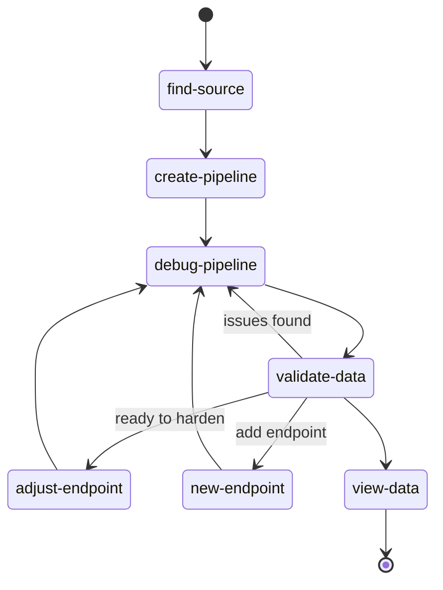

# REST API Source with AI Workbench

## Overview

Build a custom REST API connector for any of the 8k+ available sources — often in a single session — by stating what data you need.
The **AI Workbench** gives your coding agent workflow skills, project rules, and MCP tools so it can scaffold, debug, and validate pipelines autonomously.
It works with **Claude Code**, **Cursor**, and **Codex**.

## Setup

### Python environment

Install `uv` ([instructions](https://docs.astral.sh/uv/getting-started/installation/)) and create a virtual environment:

```sh
uv venv && source .venv/bin/activate
```

### Install dlt

```sh
pip install "dlt[workspace]"
```

### Initialize AI agent

<Tabs values={[{"label": "Claude Code", "value": "claude"}, {"label": "Cursor", "value": "cursor"}, {"label": "Codex", "value": "codex"}]} groupId="ai-agent" defaultValue="claude">
<TabItem value="claude">

```sh
dlt ai init --agent claude
```

</TabItem>
<TabItem value="cursor">

```sh
dlt ai init --agent cursor
```

:::note
After running the command, manually enable the MCP server in **Cursor Settings > MCP**.
:::

</TabItem>
<TabItem value="codex">

```sh
dlt ai init --agent codex
```

:::note
In Codex, commands map to **skills** and rules map to **skills + AGENTS.md**.

Set sandbox config `web_search = "live"` to allow the agent to research APIs:

`.codex/config.toml`
```toml
web_search = "live"
```

The Codex CLI picks up the MCP server automatically; in the Codex UI you need to copy the MCP configuration manually.
:::

</TabItem>
</Tabs>

`dlt ai init` installs project rules, a secrets management skill, appropriate ignore files, and configures the dlt MCP server for your agent.

### Install toolkit

```sh
dlt ai toolkit install rest-api-pipeline
```

This installs the **rest-api-pipeline** toolkit: a workflow rule that orchestrates the agent, an entry skill, step-by-step skills for each phase, and MCP tool definitions for data access.

## Build your first pipeline

The toolkit provides a skill-driven workflow. Each skill listed below is invoked by naming it in your agent's chat — the workflow rule guides the agent through the right sequence.

### `/find-source` — discover your data source

Start a conversation with the `/find-source` skill. You can be precise or intent-based:

```text
/find-source I need to ingest pull requests and issues from the GitHub REST API
```

```text
/find-source I want to track customer orders from our internal fulfillment API
```

Less precise prompts let the agent research the API on its own, which often produces better results for well-documented public APIs.

### `create-rest-api-pipeline` — scaffold the pipeline

The agent runs `dlt init`, reads API documentation, and presents endpoint options. It produces a pipeline file with a structure like this:

```py
import dlt
from dlt.sources.rest_api import rest_api_resources
from dlt.sources.rest_api.typing import RESTAPIConfig

@dlt.source
def github_source(
    access_token: str = dlt.secrets.value,
):
    config: RESTAPIConfig = {
        "client": {
            "base_url": "https://api.github.com/",
            "auth": {"type": "bearer", "token": access_token},
        },
        "resources": [
            "issues",
        ],
    }
    return rest_api_resources(config)
```

The agent starts with a single endpoint, sets `dev_mode=True`, and adds `.add_limit(1)` so the first run finishes fast and validates the structure.

### `setup-secrets` — configure credentials

The agent uses MCP tools to manage secrets — it never reads `secrets.toml` directly.
It will tell you what credentials are needed and where to obtain them. You provide the values and the agent writes them securely via `dlt ai secrets update-fragment`.

### `debug-pipeline` — run and fix

The first run validates the pipeline structure. A credential error is expected if secrets are not yet configured:

```text
dlt.common.configuration.exceptions.ConfigFieldMissingException:
  Missing 1 field(s) in configuration: `access_token`
```

The agent sets INFO logging, inspects traces, and iterates until the pipeline completes:

```text
Pipeline github_source load step completed in 0.26 seconds
1 load package(s) were loaded to destination duckdb and into dataset github_source_data
The duckdb destination used duckdb:/github_source.duckdb location to store data
Load package 1749667187.541553 is LOADED and contains no failed jobs
```

### `validate-data` — check your data

A pipeline that runs without errors is not necessarily correct. Before moving on, the agent helps you validate results using the dashboard, MCP queries, and schema inspection.

Open the [dlt Dashboard](../../general-usage/dashboard.md):

```sh
dlt pipeline github_pipeline show
```

| Question | What to check |
|----------|---------------|
| 1) Am I grabbing data correctly? | Row counts match expected volume (not just page 1) |
| 2) Am I loading data correctly? | Incremental cursor advances between runs |
| 3) Is my schema correct? | No unexpected child tables or missing columns |
| 4) Do I have the right business data? | Required entities and attributes are present |
| 5) Are my data types correct? | Numbers, dates, booleans are not stored as strings |

See the [full checklist](../../general-usage/dashboard.md#using-the-dashboard) for detailed steps.

## Extend and harden

### `adjust-endpoint` — remove dev limits and configure loading

Remove `dev_mode` and `.add_limit()`, verify pagination works end-to-end, and add [incremental loading](../../general-usage/incremental-loading.md) so subsequent runs only fetch new data.

### `new-endpoint` — add more resources

Add additional API endpoints to your source. Test them individually with `with_resources()` before running the full pipeline.

### `view-data` — explore your dataset

Open the [dlt Dashboard](../../general-usage/dashboard.md) for a visual overview, or use the Python dataset API for programmatic exploration:

```py
import dlt

github_pipeline = dlt.pipeline("github_pipeline")
github_dataset = github_pipeline.dataset()
github_dataset.tables
github_dataset.table("pull_requests").columns
github_dataset.table("pull_requests").df()
```

This works well in interactive environments like [marimo](../../general-usage/dataset-access/marimo.md) and Jupyter.

## Anatomy of the toolkit


```mermaid
stateDiagram-v2
    find: find-source
    create: create-pipeline
    debug: debug-pipeline
    validate: validate-data
    adjust: adjust-endpoint
    newep: new-endpoint
    view: view-data

    [*] --> find
    find --> create
    create --> debug
    debug --> validate
    validate --> debug: issues found
    validate --> adjust: ready to harden
    validate --> newep: add endpoint
    adjust --> debug
    newep --> debug
    validate --> view
    view --> [*]
```

The toolkit is composed of:

- **Workflow rule** — orchestrates the agent through the correct skill sequence
- **Entry skill** (`/find-source`) — kicks off the workflow
- **Step skills** — one per phase (create, setup-secrets, debug, validate, adjust, new-endpoint, view-data)
- **MCP server** — gives the agent read access to pipeline metadata, schemas, and loaded data
- **`improve-skills`** — a meta-skill that lets the toolkit learn from your sessions

### How the components interact

The **workflow rule** is loaded into the agent's context automatically. When you invoke the entry skill, the rule tells the agent which skill to run next based on the current state.
**Skills** are prompts with embedded instructions — they teach the agent how to use `dlt` APIs, REST API configuration, and MCP tools.
The **MCP server** exposes tools like `list_pipelines`, `get_schema`, and `query_data` so the agent can inspect results without you copying output manually.

## Handover to other toolkits

Once your pipeline is validated, you can install additional toolkits:

- **`data-exploration`** — marimo notebooks, charts, and dashboards for deeper analysis
- **`dlthub-runtime`** — deploy, schedule, and monitor your pipeline in production

```sh
dlt ai toolkit install data-exploration
dlt ai toolkit install dlthub-runtime
```

## Conclusion

By the end of this guide, you should have:
- A workspace with AI agent rules and MCP tools configured
- A working REST API source with validated endpoints
- A local dataset you have inspected and verified

Next steps:
- [Explore the dataset and build a data product](../../general-usage/dataset-access/dataset.md)
- [Replace the local destination with your data warehouse](../../walkthroughs/share-a-dataset.md)
- [Deploy the pipeline](../../walkthroughs/deploy-a-pipeline/index.md)
