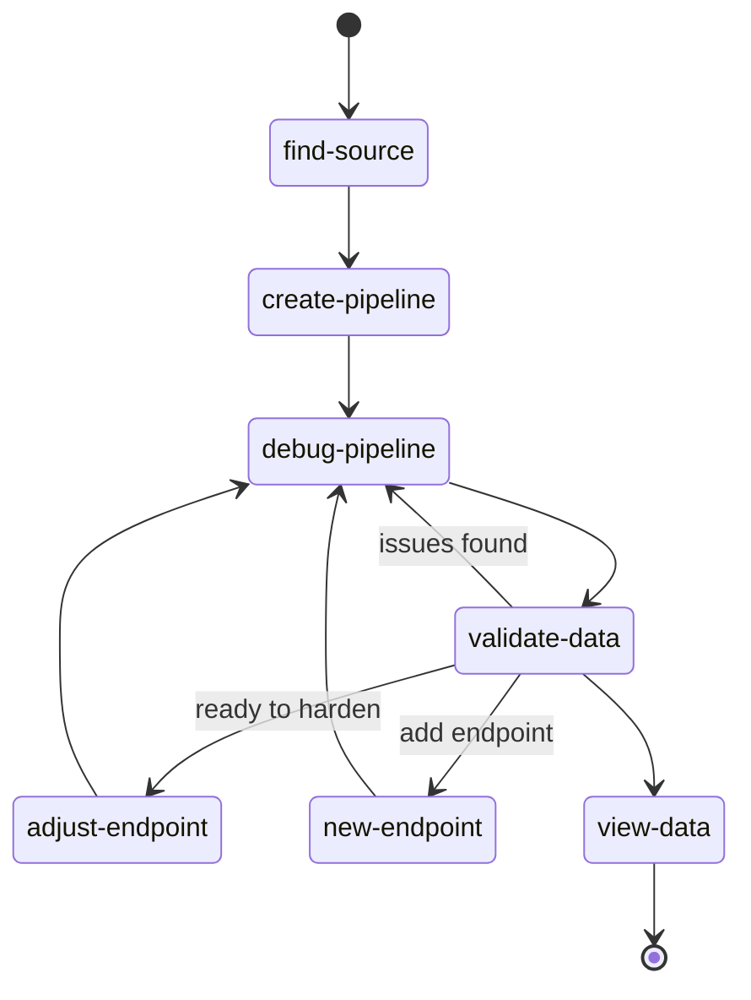

# REST API Source with dltHub AI Workbench

## Overview

Build a custom REST API connector for any of the 8k+ available sources — often in a single session. Instead of generating ad-hoc code, the AI assistant follows a defined sequence of steps from start to finish to help you build production-grade pipelines following the dltHub best practices. 

The **rest-api-pipeline** toolkit is part of the [dltHub AI Workbench](https://github.com/dlt-hub/dlthub-ai-workbench) and gives your coding assistant a structured, guided workflow — skills, rules, and an MCP server — tied together by a **workflow** that tells the assistant which skill to run at each step. It is designed to support an iterative data pipeline development flow and helps you validate results step by step. 

The dltHub AI workbench works with **Claude Code**, **Cursor**, and **Codex**.

## Setup

### Python environment

Install `uv` ([instructions](https://docs.astral.sh/uv/getting-started/installation/)) and create a virtual environment:

```sh
uv venv && source .venv/bin/activate
```

We recommend using uv. If you use uv, prefix all following commands with `uv run`. 

### Install dlt

Install the dlt workspace:

```sh
pip install "dlt[workspace]"
```
or upgrade to the latest version:

```sh
pip install --upgrade "dlt[workspace]"
```

### Initialize the AI assistant

<Tabs values={[{"label": "Claude Code", "value": "claude"}, {"label": "Cursor", "value": "cursor"}, {"label": "Codex", "value": "codex"}]} groupId="ai-agent" defaultValue="claude">
<TabItem value="claude">

```sh
dlt ai init --agent claude
```

:::note
Add the following to your `CLAUDE.md` to improve safe credential handling:
```text
CRITICAL: never ask for credentials in chat. Always let the user edit secrets directly and do not attempt to read them.
```
:::

</TabItem>
<TabItem value="cursor">

```sh
dlt ai init --agent cursor
```

:::note
After running the command, manually enable the dlt-workspace-mcp server in **Cursor Settings > MCP**.

Add the following to your `.cursor/rules/security.mdc` to improve safe credential handling:
```text
CRITICAL: never ask for credentials in chat. Always let the user edit secrets directly and do not attempt to read them.
```
:::

</TabItem>
<TabItem value="codex">

```sh
dlt ai init --agent codex
```

:::note
Codex does not support commands and rules, so the installer converts those into skills and AGENTS.md.

Codex runs in a strict sandbox — enable web access to allow the assistant to research APIs:

`.codex/config.toml`
```toml
web_search = "live"
```

Add the following to your `AGENTS.md` to improve safe credential handling:
```text
CRITICAL: never ask for credentials in chat. Always let the user edit secrets directly and do not attempt to read them.
```

The Codex CLI picks up the MCP server automatically; in the Codex UI you need to copy the MCP configuration manually.
:::

</TabItem>
</Tabs>

`dlt ai init` detects your coding assistant from environment variables and config files (unless you have multiple coding assistants set up), then installs skills, rules, and the MCP server in the correct locations for that tool.

### Install toolkit

```sh
dlt ai toolkit rest-api-pipeline install
```

This installs the **rest-api-pipeline** toolkit: a workflow that orchestrates the assistant, an entry point skill, and step-by-step skills for each phase.

:::info Claude Code marketplace plugin (Early Access)
The workbench is also available as a **Claude Code marketplace plugin**. You don't need `uv`, Python, or `dlt` installed to get started — the `bootstrap` plugin handles everything from scratch.

> **Early Access:** The Claude Code plugin is currently in early access and may not provide the best linking experience between different toolkits. We recommend using the `dlt ai` CLI above for the best experience.

In Claude Code, run:

```text
/plugin marketplace add dlt-hub/dlthub-ai-workbench
/plugin install bootstrap@dlthub-ai-workbench --scope project
```

In your terminal, `exit` the Claude session and restart (`claude`) — plugins take effect only after restarting Claude Code. Then run:

```text
/init-workspace
```

The bootstrap skill checks for `uv` and Python, installs what's missing, creates a virtual environment, installs `dlt[workspace]`, and runs `dlt ai init` — so you go from an empty directory to a fully configured workspace in one step.
:::

## Build your first pipeline

The toolkit provides a skill-driven workflow. Each skill listed below is triggered by the identified user intent or explicitly by naming it in prompt — the workflow guides the assistant through the right sequence.

### `/find-source` — discover your data source

Start a conversation with the `/find-source` skill. You can be explicit or let your coding assistant identify your intent:

```text
/find-source I need to ingest pull requests and issues from the GitHub REST API
```

```text
/find-source I want to track customer orders from our internal fulfillment API
```

Less explicit prompts let the assistant research the API on its own, which often produces better results for well-documented public APIs.

### `/create-rest-api-pipeline` — scaffold the pipeline

This step makes the coding assistant run `dlt init`, read the API documentation, and presents endpoint options. It produces a pipeline file with a structure like this:

```py
import dlt
from dlt.sources.rest_api import rest_api_resources
from dlt.sources.rest_api.typing import RESTAPIConfig

@dlt.source
def github_source(
    access_token: str = dlt.secrets.value,
):
    config: RESTAPIConfig = {
        "client": {
            "base_url": "https://api.github.com/",
            "auth": {"type": "bearer", "token": access_token},
        },
        "resources": [
            "issues",
        ],
    }
    return rest_api_resources(config)
```

The assistant starts with a single endpoint, sets `dev_mode=True`, and adds `.add_limit(1)` so the first run finishes fast and validates the structure with a sample.

### `setup-secrets` — configure credentials

The assistant uses MCP tools to manage secrets — it is instructed not to read `secrets.toml` directly.
It will tell you what credentials are needed and where to obtain them. The coding assistant can see the shape of the secrets without actual values, so it is still able to detect misconfigurations and other dlt-related problems.

### `/debug-pipeline` — run and fix

The first run validates the pipeline structure. A credential error is expected if secrets are not yet configured:

```text
dlt.common.configuration.exceptions.ConfigFieldMissingException:
  Missing 1 field(s) in configuration: `access_token`
```

The assistant sets INFO logging, inspects traces, and iterates until the pipeline completes:

```text
Pipeline github_source load step completed in 0.26 seconds
1 load package(s) were loaded to destination duckdb and into dataset github_source_data
The duckdb destination used duckdb:/github_source.duckdb location to store data
Load package 1749667187.541553 is LOADED and contains no failed jobs
```

### `/validate-data` — check your data

A pipeline that runs without errors is not necessarily correct. Before moving on, the assistant helps you validate results using the dashboard, MCP queries, and schema inspection.

You can open [Workspace Dashboard](../../general-usage/dashboard.md) to apply your own judgement:

```sh
dlt pipeline github_pipeline show
```

| Question | What to check |
|----------|---------------|
| 1) Am I grabbing data correctly? | Row counts match expected volume (not just page 1) |
| 2) Am I loading data correctly? | Incremental cursor advances between runs |
| 3) Is my schema correct? | No unexpected child tables or missing columns |
| 4) Do I have the right business data? | Required entities and attributes are present |
| 5) Are my data types correct? | Numbers, dates, booleans are not stored as strings |

See the [full checklist](../../general-usage/dashboard.md#using-the-dashboard) for detailed steps.

## Extend and harden

### `/adjust-endpoint` — remove dev limits and configure loading

This step removes `dev_mode` and `.add_limit()`, verifies that pagination works end-to-end, and adds [incremental loading](../../general-usage/incremental-loading.md) so subsequent runs only fetch new data.

### `/new-endpoint` — add more resources

With this skill, you can add additional API endpoints to your source. The assistant is instructed to test them individually with `with_resources()` before running the full pipeline.

### `/view-data` — explore your dataset

Open the [dlt Dashboard](../../general-usage/dashboard.md) for visual inspection, or use the Python dataset API for programmatic exploration:

```py
import dlt

github_pipeline = dlt.pipeline("github_pipeline")
github_dataset = github_pipeline.dataset()
github_dataset.tables
github_dataset.table("pull_requests").columns
github_dataset.table("pull_requests").df()
```

This works well in interactive environments like [marimo](../../general-usage/dataset-access/marimo.md) and [Jupyter](https://jupyter.org/).

## Anatomy of the REST API pipeline toolkit


```mermaid
stateDiagram-v2
    find: find-source
    create: create-pipeline
    debug: debug-pipeline
    validate: validate-data
    adjust: adjust-endpoint
    newep: new-endpoint
    view: view-data

    [*] --> find
    find --> create
    create --> debug
    debug --> validate
    validate --> debug: issues found
    validate --> adjust: ready to harden
    validate --> newep: add endpoint
    adjust --> debug
    newep --> debug
    validate --> view
    view --> [*]
```

A toolkit contains skills, rules, and an MCP server — tied together by a workflow that tells the assistant which skill to run at each step and how to leverage the MCP.

| Component | What it is | When it runs |
|-----------|------------|--------------|
| **Skill** | Step-by-step procedure the assistant follows | Triggered by user intent or explicitly with `/skill-name` |
| **Rule** | Always-on context (conventions, constraints) | Every session, automatically |
| **Workflow** | Ordered sequence of skills with a fixed entry point | Loaded as a rule — always active |
| **MCP server** | Exposes pipelines, tables, and secrets as tools | During a session, via MCP protocol |

### How the components interact

The **workflow** is loaded into the assistant's context automatically as a rule. When you invoke the entry skill, it tells the assistant which skill to run next based on the current state.
**Skills** are prompts with embedded instructions — they teach the assistant how to use `dlt` APIs, REST API configuration, and MCP tools.
The **MCP server** exposes tools like `list_pipelines`, `get_table_schema`, and `execute_sql_query` so the assistant can inspect results without you copying output manually.

## Handover to other toolkits

Once your pipeline is validated, you can continue to the next phase of the data engineering lifecycle by installing additional toolkits:

- **`data-exploration`** — query loaded data and create marimo notebooks, charts, and dashboards
- **`dlthub-runtime`** — deploy, schedule, and monitor your pipeline in production 

[Sign up for dltHub Early Access](https://info.dlthub.com/waiting-list)

```sh
uv run dlt ai toolkit data-exploration install
uv run dlt ai toolkit dlthub-runtime install
```

## Results

By the end of this guide, you should have:
- A workspace with coding assistant rules and MCP tools configured
- A working REST API source with validated endpoints
- A local dataset you have inspected and verified

Next steps:
- [Explore the dataset and build a data product](../../general-usage/dataset-access/dataset.md)
- [Replace the local destination with your data warehouse](../../walkthroughs/share-a-dataset.md)
