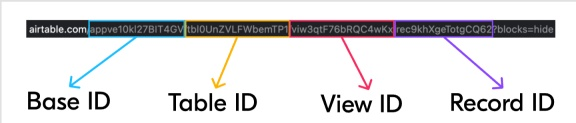

import Header from './_source-info-header.md';

# Airtable

<Header/>

[Airtable](https://www.airtable.com/) is a cloud-based platform that merges spreadsheet and database functionalities for easy
data management and collaboration.

This Airtable `dlt` verified source and
[pipeline example](https://github.com/dlt-hub/verified-sources/blob/master/sources/airtable_pipeline.py)
loads data using the “Airtable API” to the destination of your choice.

Sources and resources that can be loaded using this verified source are:

| Name              | Description                                |
| ----------------- |--------------------------------------------|
| airtable_source   | Retrieves tables from an Airtable base     |
| airtable_resource | Retrieves data from a single Airtable table |

## Setup guide

### Grab Airtable personal access tokens

1. Click your account icon in the top-right.
1. Choose "Developer Hub" from the dropdown.
1. Select "Personal access token" on the left, then "Create new token".
1. Name it appropriately.
1. Add read scopes for "data records" and "schema bases".
1. Add a base to specify the desired base for data access.
1. Hit "Create token" and save the displayed token securely for credential use.

> Note: The Airtable UI, which is described here, might change.
> The full guide is available at [this link.](https://airtable.com/developers/web/guides/personal-access-tokens)

### Grab Airtable IDs

Upon logging into Airtable and accessing your base or table, you'll notice a URL in your browser's address bar resembling:

```sh
https://airtable.com/appve10kl227BIT4GV/tblOUnZVLFWbemTP1/viw3qtF76bRQC3wKx/rec9khXgeTotgCQ62?blocks=hide
```

Between each slash, you'll find identifiers for the base, table, and view
as explained in [this documentation on finding Airtable IDs](https://support.airtable.com/docs/finding-airtable-ids):
- Base IDs start with "app", currently set to "appve10kl227BIT4GV".

- Table IDs start with "tbl", currently set to "tblOUnZVLFWbemTP1".

- View IDs start with "viw", currently set to "viw3qtF76bRQC3wKx".

- Record IDs start with "rec", currently set to "rec9khXgeTotgCQ62".

  

### Initialize the verified source

To get started with your data pipeline, follow these steps:

1. Enter the following command:

   ```sh
   dlt init airtable duckdb
   ```

   [This command](../../reference/command-line-interface) will initialize
   [the pipeline example](https://github.com/dlt-hub/verified-sources/blob/master/sources/airtable_pipeline.py)
   with Airtable as the [source](../../general-usage/source) and [duckdb](../destinations/duckdb.md)
   as the [destination](../destinations).

1. If you'd like to use a different destination, simply replace `duckdb` with the name of your
   preferred [destination](../destinations).

1. After running this command, a new directory will be created with the necessary files and
   configuration settings to get started.

For more information, read the guide on [how to add a verified source.](../../walkthroughs/add-a-verified-source).

### Add credentials

1. In the `.dlt` folder, there's a file called `secrets.toml`. It's where you store sensitive
   information securely, like access tokens. Keep this file safe.

   Use the following format for service account authentication:

      ```toml
      [sources.airtable]
      access_token = "Please set me up!" # Please set me up!
      ```

1. Finally, enter credentials for your chosen destination as per the [docs](../destinations/).

1. Next, you need to configure ".dlt/config.toml", which looks like:

   ```toml
   [sources.airtable]
   base_id = "Please set me up!"       # The ID of the base.
   table_names = ["Table1","Table2"]   # A list of table IDs or table names to load.
   ```

   > Optionally, you can also input "base_id" and "table_names" in the script, as in the pipeline
   > example.

For more information, read the [General Usage: Credentials.](../../general-usage/credentials)

## Run the pipeline

1. Before running the pipeline, ensure that you have installed all the necessary dependencies by
   running the command:

   ```sh
   pip install -r requirements.txt
   ```

1. You're now ready to run the pipeline! To get started, run the following command:

   ```sh
   python airtable_pipeline.py
   ```

1. Once the pipeline has finished running, you can verify that everything loaded correctly by using
   the following command:

   ```sh
   dlt pipeline <pipeline_name> show
   ```

   For example, the `pipeline_name` for the above pipeline example is `airtable`, you
   may also use any custom name instead.

For more information, read the guide on [how to run a pipeline](../../walkthroughs/run-a-pipeline).

## Sources and resources

`dlt` works on the principle of [sources](../../general-usage/source) and
[resources](../../general-usage/resource).

### Source `airtable_source`

This function retrieves tables from a given Airtable base.

```py
@dlt.source
def airtable_source(
    base_id: str = dlt.config.value,
    table_names: Optional[List[str]] = None,
    access_token: str = dlt.secrets.value,
) -> Iterable[DltResource]:
   ...
```

`base_id`: The base's unique identifier.

`table_names`: A list of either table IDs or user-defined table names to load. If not specified, all
tables in the schema are loaded.

`access_token`: Your personal access token for authentication.

### Resource `airtable_resource`

This function retrieves data from a single Airtable table.

```py
def airtable_resource(
    api: pyairtable.Api,
    base_id: str,
    table: Dict[str, Any],
) -> DltResource:
   ...
```

`table`: Airtable metadata, excluding actual records.

## Customization


### Create your own pipeline

If you wish to create your own pipelines, you can leverage source and resource methods from this verified source.

1. Configure the pipeline by specifying the pipeline name, destination, and dataset as follows:

   ```py
   pipeline = dlt.pipeline(
        pipeline_name="airtable",  # Use a custom name if desired
        destination="duckdb",      # Choose the appropriate destination (e.g., duckdb, redshift, post)
        dataset_name="airtable_data"  # Use a custom name if desired
   )
   ```

1. To load the entire base:

   ```py
   base_id = "Please set me up!"     # The ID of the base.

   airtables = airtable_source(base_id=base_id)
   load_info = pipeline.run(load_data, write_disposition="replace")
   ```

1. To load selected tables from a base table:

   ```py
   base_id = "Please set me up!"     # The ID of the base.
   table_names = ["Table1", "Table2"] # A list of table IDs or table names to load.

   airtables = airtable_source(
      base_id = base_id,
      table_names = table_names
   )
   load_info = pipeline.run(airtables, write_disposition = "replace")
   ```

   > You have the option to use table names or table IDs in the code above, in place of "Table1" and
   > "Table2".

1. To load data and apply hints to a specific column:

   ```py
   base_id = "Please set me up!"       # The ID of the base.
   table_names = ["Table1", "Table2"]   # A list of table IDs or table names to load.
   resource_name = "Please set me up!" # The table name we want to apply hints.
   field_name = "Please set me up!"    # The table field name for which we want to apply hints.

   airtables = airtable_source(
        base_id="Please set me up!",
        table_names=["Table1", "Table2"],
   )

   airtables.resources[resource_name].apply_hints(
        primary_key=field_name,
        columns={field_name: {"data_type": "text"}},
   )
   load_info = pipeline.run(airtables, write_disposition="replace")
   print(load_info)
   ```

<!--@@@DLT_TUBA airtable-->

