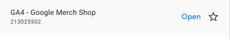

import Header from './_source-info-header.md';

# Google analytics

<Header/>

[Google Analytics](https://marketingplatform.google.com/about/analytics/#?modal_active=none) is a
service for web analytics that tracks and provides data regarding user engagement with your website
or application.

This Google Analytics `dlt` verified source and
[pipeline example](https://github.com/dlt-hub/verified-sources/blob/master/sources/google_analytics_pipeline.py)
loads data using the "Google Analytics API" to the destination of your choice.

Sources and resources that can be loaded using this verified source are:

| Name             | Description                                                   |
| ---------------- | ------------------------------------------------------------- |
| google_analytics | Loads basic Analytics info to the pipeline                    |
| metrics_table    | Assembles and presents data relevant to the report's metrics  |
| dimensions_table | Compiles and displays data related to the report's dimensions |

## Setup guide

### Grab credentials

There are two methods to get authenticated for using this verified source:

- OAuth credentials
- Service account credentials

Let's go over how to set up both OAuth tokens and service account credentials. In general, OAuth
tokens are preferred when user consent is required, while service account credentials are better
suited for server-to-server interactions. You can choose the method of authentication as per your
requirement.

### Grab Google service account credentials

You need to create a GCP service account to get API credentials if you don't have one. To create
one, follow these steps:

1. Sign in to [console.cloud.google.com](http://console.cloud.google.com/).

1. [Create a service account](https://cloud.google.com/iam/docs/service-accounts-create#creating) if
   needed.

1. Enable the "Google Analytics API". Refer to the
   [Google documentation](https://support.google.com/googleapi/answer/6158841?hl=en) for
   comprehensive instructions on this process.

1. Generate credentials:

   1. Navigate to IAM & Admin in the console's left panel, and then select Service Accounts.
   1. Identify the service account you intend to use, and click on the three-dot menu under the
      "Actions" column next to it.
   1. Create a new JSON key by selecting "Manage Keys" > "ADD KEY" > "CREATE".
   1. You can download the ".json" file containing the necessary credentials for future use.

### Grab Google OAuth credentials

You need to create a GCP account to get OAuth credentials if you don't have one. To create one,
follow these steps:

1. Ensure your email used for the GCP account has access to the GA4 property.

1. Open a GCP project in your GCP account.

1. Enable the Analytics API in the project.

1. Search for credentials in the search bar and go to Credentials.

1. Go to Credentials -> OAuth client ID -> Select Desktop App from the Application type and give an
   appropriate name.

1. Download the credentials and fill in "client_id", "client_secret", and "project_id" in
   "secrets.toml".

1. Go back to credentials and select the OAuth consent screen on the left.

1. Fill in the App name, user support email (your email), authorized domain (localhost.com), and dev
   contact info (your email again).

1. Add the following scope:

   ```text
   "https://www.googleapis.com/auth/analytics.readonly"
   ```

1. Add your email as a test user.

After configuring "client_id", "client_secret", and "project_id" in "secrets.toml", to generate the
refresh token, run the following script from the root folder:

```sh
python google_analytics/setup_script_gcp_oauth.py
```

Once you have executed the script and completed the authentication, you will receive a "refresh
token" that can be used to set up the "secrets.toml".


### Share the Google Analytics property with the API

> Note: For service account authentication, use the client_email. For OAuth authentication, use the
> email associated with the app creation and refresh token generation.

1. Log into your Google Analytics account.

1. Choose the website property you wish to share.

1. In the lower-left corner, select the "Admin" tab.

1. In the "Account" column, navigate to "Account Access Management."

1. Locate and click on the blue “+” icon in the top right corner of the screen.

1. Choose “Add users” and input the email from the
   [service account](google_analytics.md#grab-google-service-account-credentials) or
   [OAuth](google_analytics.md#grab-google-oauth-credentials) authentication methods. Ensure to
   grant at least viewer privileges.

1. Conclude the process by clicking the “Add” button in the top right corner.

### Initialize the verified source

To get started with your data pipeline, follow these steps:

1. Enter the following command:

   ```sh
   dlt init google_analytics duckdb
   ```

   [This command](../../reference/command-line-interface) will initialize
   [the pipeline example](https://github.com/dlt-hub/verified-sources/blob/master/sources/google_analytics_pipeline.py)
   with Google Analytics as the [source](../../general-usage/source) and
   [duckdb](../destinations/duckdb.md) as the [destination](../destinations).

1. If you'd like to use a different destination, simply replace `duckdb` with the name of your
   preferred [destination](../destinations).

1. After running this command, a new directory will be created with the necessary files and
   configuration settings to get started.

For more information, read the guide on [how to add a verified source](../../walkthroughs/add-a-verified-source).

### Add credentials

1. In the `.dlt` folder, there's a file called `secrets.toml`. It's where you store sensitive
   information securely, like access tokens. Keep this file safe. Here's its format for service
   account authentication:

   ```toml
   [sources.google_analytics.credentials]
   project_id = "project_id" # please set me up!
   client_email = "client_email" # please set me up!
   private_key = "private_key" # please set me up!
   ```

1. From the ".json" that you
   [downloaded earlier](google_analytics.md#grab-google-service-account-credentials),
   copy `project_id`, `private_key`,
   and `client_email` under `[sources.google_analytics.credentials]`.

1. Alternatively, if you're using OAuth credentials, replace the fields and values with those
   you [grabbed for OAuth credentials](google_analytics.md#grab-google-oauth-credentials).

1. The secrets.toml for OAuth authentication looks like:

   ```toml
   [sources.google_analytics.credentials]
   client_id = "client_id" # please set me up!
   client_secret = "client_secret" # please set me up!
   refresh_token = "refresh_token" # please set me up!
   project_id = "project_id" # please set me up!
   ```

1. Finally, enter credentials for your chosen destination as per the [docs](../destinations/).

#### Pass `property_id` and `request parameters`

1. `property_id` is a unique number that identifies a particular property. You will need to
   explicitly pass it to get data from the property that you're interested in. For example, if the
   property that you want to get data from is “GA4-Google Merch Shop,” then you will need to pass its
   property id "213025502".

   

1. You can also specify the parameters of the API requests such as dimensions and metrics to get
   your desired data.

1. An example of how you can pass all of this to `dlt` is to simply insert it in the
   `.dlt/config.toml` file as below:

   ```toml
   [sources.google_analytics]
   property_id = "213025502" #  this is an example property id, please use yours
   queries = [
       {"resource_name"= "sample_analytics_data1", "dimensions"= ["browser", "city"], "metrics"= ["totalUsers", "transactions"]},
       {"resource_name"= "sample_analytics_data2", "dimensions"= ["browser", "city", "dateHour"], "metrics"= ["totalUsers"]}
   ]
   ```

   > Include request parameters in a queries list. The data from each request fills a table, with
   > resources named by resource name, with dimensions. See the above example for reference.

1. To use queries from `.dlt/config.toml`, run the `simple_load_config()` function in
   [pipeline example](https://github.com/dlt-hub/verified-sources/blob/master/sources/google_analytics_pipeline.py).

For more information, read the [General Usage: Credentials.](../../general-usage/credentials)

## Run the pipeline

1. Before running the pipeline, ensure that you have installed all the necessary dependencies by
   running the command:
   ```sh
   pip install -r requirements.txt
   ```
1. You're now ready to run the pipeline! To get started, run the following command:
   ```sh
   python google_analytics_pipeline.py
   ```
1. Once the pipeline has finished running, you can verify that everything loaded correctly by using
   the following command:
   ```sh
   dlt pipeline <pipeline_name> show
   ```
   For example, the `pipeline_name` for the above pipeline example is
   `dlt_google_analytics_pipeline`, but you may also use any custom name instead.

For more information, read the guide on [how to run a pipeline](../../walkthroughs/run-a-pipeline).

## Sources and resources

`dlt` works on the principle of [sources](../../general-usage/source) and
[resources](../../general-usage/resource).

### Source `simple_load`

This function returns a list of resources including metadata, metrics, and dimensions data from
the Google Analytics API.

```py
@dlt.source(max_table_nesting=2)
def google_analytics(
    credentials: Union[ GcpOAuthCredentials, GcpServiceAccountCredential ] = dlt.secrets.value,
    property_id: int = dlt.config.value,
    queries: List[DictStrAny] = dlt.config.value,
    start_date: Optional[str] = START_DATE,
    rows_per_page: int = 1000,
) -> List[DltResource]:
   ...
```

`credentials`: GCP OAuth or service account credentials.

`property_id`: This is a unique identifier for a Google Analytics property.

`queries`: This is a list of queries outlining the API request parameters like dimensions and
metrics.

`start_date`: This optional parameter determines the starting date for data loading. By default,
it's set to "2000-01-01".

`rows_per_page`: This parameter specifies the number of rows to fetch per page. By default, it is
set to 1000.

### Resource `get_metadata`

This function retrieves all the metrics and dimensions for a report from a Google Analytics project.

```py
@dlt.resource(selected=False)
def get_metadata(client: Resource, property_id: int) -> Iterator[Metadata]:
   ...
```

`client`: This is the Google Analytics client used to make requests.

`property_id`: This is a reference to the Google Analytics project. For more information, click
[here](https://developers.google.com/analytics/devguides/reporting/data/v1/property-id).

### Transformer `metrics_table`

This transformer function extracts data using metadata and populates a table called "metrics" with the data from each metric.

```py
@dlt.transformer(data_from=get_metadata, write_disposition="replace", name="metrics")
def metrics_table(metadata: Metadata) -> Iterator[TDataItem]:
    for metric in metadata.metrics:
        yield to_dict(metric)
```

`metadata`: GA4 metadata is stored in this "Metadata" class object.

Similarly, there is a transformer function called `dimensions_table` that populates a table called "dimensions" with the data from each dimension.

## Customization
### Create your own pipeline

If you wish to create your own pipelines, you can leverage source and resource methods from this verified source.

1. Configure the pipeline by specifying the pipeline name, destination, and dataset as follows:

   ```py
   pipeline = dlt.pipeline(
       pipeline_name="google_analytics",  # Use a custom name if desired
       destination="duckdb",  # Choose the appropriate destination (e.g., duckdb, redshift, post)
       dataset_name="GA4_data"  # Use a custom name if desired
   )
   ```

   To read more about pipeline configuration, please refer to our [documentation](../../general-usage/pipeline).

1. To load all the data from metrics and dimensions:

   ```py
   load_data = google_analytics()
   load_info = pipeline.run(load_data)
   print(load_info)
   ```

   > Loads all the data to date in the first run, and then [incrementally](../../general-usage/incremental-loading) in subsequent runs.

1. To load data from a specific start date:

   ```py
   load_data = google_analytics(start_date='2023-01-01')
   load_info = pipeline.run(load_data)
   print(load_info)
   ```

   > Loads data starting from the specified date during the first run, and then [incrementally](../../general-usage/incremental-loading) in subsequent runs.

<!--@@@DLT_TUBA google_analytics-->

