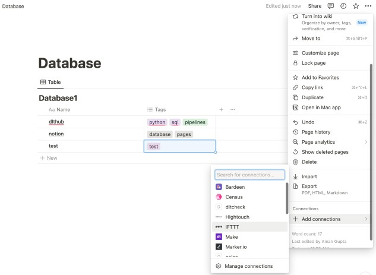

import Header from './_source-info-header.md';

# Notion

<Header/>

[Notion](https://www.notion.so/) is a flexible workspace tool for organizing personal and
professional tasks, offering customizable notes, documents, databases, and more.

This Notion `dlt` verified source and
[pipeline example](https://github.com/dlt-hub/verified-sources/blob/master/sources/notion_pipeline.py)
loads data using the “Notion API” to the destination of your choice.

Sources that can be loaded using this verified source are:

| Name             | Description                           |
|------------------|---------------------------------------|
| notion_databases | Retrieves data from Notion databases. |

## Setup guide

### Grab credentials

1. If you don't already have a Notion account, please create one.
1. Access your Notion account and navigate to
   [My Integrations](https://www.notion.so/my-integrations).
1. Click "New Integration" on the left and name it appropriately.
1. Finally, click on "Submit" located at the bottom of the page.


### Add a connection to the database

1. Open the database that you want to load to the destination.

1. Click on the three dots located in the top right corner and choose "Add connections".

   

1. From the list of options, select the integration you previously created and click on "Confirm".

> Note: The Notion UI, which is described here, might change.
The full guide is available at [this link.](https://developers.notion.com/docs/authorization)


### Initialize the verified source

To get started with your data pipeline, follow these steps:

1. Enter the following command:

   ```sh
   dlt init notion duckdb
   ```

   [This command](../../reference/command-line-interface) will initialize
   [the pipeline example](https://github.com/dlt-hub/verified-sources/blob/master/sources/notion_pipeline.py)
   with Notion as the [source](../../general-usage/source) and [duckdb](../destinations/duckdb.md)
   as the [destination](../destinations).

1. If you'd like to use a different destination, simply replace `duckdb` with the name of your
   preferred [destination](../destinations).

1. After running this command, a new directory will be created with the necessary files and
   configuration settings to get started.

For more information, read the guide on [how to add a verified source.](../../walkthroughs/add-a-verified-source)

### Add credentials

1. In the `.dlt` folder, there's a file called `secrets.toml`. It's where you store sensitive
   information securely, like access tokens. Keep this file safe. Here's its format for service
   account authentication:

   ```toml
   # Put your secret values and credentials here
   # Note: Do not share this file and do not push it to GitHub!
   [source.notion]
   api_key = "set me up!" # Notion API token (e.g. secret_XXX...)
   ```

1. Replace the value of `api_key` with the one that [you copied above](notion.md#grab-credentials).
   This will ensure that your data-verified source can access your Notion resources securely.

1. Next, follow the instructions in [Destinations](../destinations/duckdb) to add credentials for
   your chosen destination. This will ensure that your data is properly routed to its final
   destination.

For more information, read the [General usage: Credentials.](../../general-usage/credentials)

## Run the pipeline

1. Before running the pipeline, ensure that you have installed all the necessary dependencies by
   running the command:
   ```sh
   pip install -r requirements.txt
   ```
2. You're now ready to run the pipeline! To get started, run the following command:
   ```sh
   python notion_pipeline.py
   ```
3. Once the pipeline has finished running, you can verify that everything loaded correctly by using
   the following command:
   ```sh
   dlt pipeline <pipeline_name> show
   ```
   For example, the `pipeline_name` for the above pipeline example is `notion`, you may also use any
   custom name instead.

For more information, read the guide on [how to run a pipeline](../../walkthroughs/run-a-pipeline).

## Sources and resources

`dlt` works on the principle of [sources](../../general-usage/source) and
[resources](../../general-usage/resource).

### Source `notion_databases`

This function loads notion databases from Notion into the destination.

```py
@dlt.source
def notion_databases(
    database_ids: Optional[List[Dict[str, str]]] = None,
    api_key: str = dlt.secrets.value,
) -> Iterator[DltResource]:
   ...
```

`database_ids`: A list of dictionaries, each containing a database ID and a name.

`api_key`: The Notion API secret key.

> If "database_ids" is None, the source fetches data from all integrated databases in your Notion
> account.

It is important to note that the data is loaded in “replace” mode where the existing data is
completely replaced.


## Customization
### Create your own pipeline

If you wish to create your own pipelines, you can leverage source and resource methods from this
verified source.

1. Configure the pipeline by specifying the pipeline name, destination, and dataset as follows:

   ```py
   pipeline = dlt.pipeline(
      pipeline_name="notion",  # Use a custom name if desired
      destination="duckdb",  # Choose the appropriate destination (e.g., duckdb, redshift, post)
      dataset_name="notion_database"  # Use a custom name if desired
   )
   ```

   To read more about pipeline configuration, please refer to our
   [documentation](../../general-usage/pipeline).

2. To load all the integrated databases:

   ```py
   load_data = notion_databases()
   load_info = pipeline.run(load_data)
   print(load_info)
   ```

3. To load the custom databases:

   ```py
   selected_database_ids = [{"id": "0517dae9409845cba7d","use_name":"db_one"}, {"id": "d8ee2d159ac34cfc"}]
   load_data = notion_databases(database_ids=selected_database_ids)
   load_info = pipeline.run(load_data)
   print(load_info)
   ```

   The Database ID can be retrieved from the URL. For example, if the URL is:

   ```sh
   https://www.notion.so/d8ee2d159ac34cfc85827ba5a0a8ae71?v=c714dec3742440cc91a8c38914f83b6b
   ```

   > The database ID in the given Notion URL is: "d8ee2d159ac34cfc85827ba5a0a8ae71".

The database ID in a Notion URL is the string right after notion.so/, before any question marks. It
uniquely identifies a specific page or database.

The database name ("use_name") is optional; if skipped, the pipeline will fetch it from Notion
automatically.

<!--@@@DLT_TUBA notion-->

