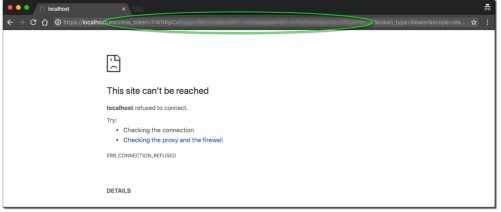

import Header from './_source-info-header.md';

# Zendesk

<Header/>

[Zendesk](https://www.zendesk.com/) is a cloud-based customer service and support platform. It offers a range of features,
including ticket management, self-service options, knowledge base management, live chat, customer
analytics, and talks.

This Zendesk `dlt` verified source and
[pipeline example](https://github.com/dlt-hub/verified-sources/blob/master/sources/zendesk_pipeline.py)
loads data using the “Zendesk Support API”, "Zendesk Chat API", and "Zendesk Talk API" to the destination
of your choice.

Endpoints that can be loaded using this verified source are:

| Name                       | Description                                                                                                                                                                                                                                                                                                                                                                                  |
| -------------------------- | -------------------------------------------------------------------------------------------------------------------------------------------------------------------------------------------------------------------------------------------------------------------------------------------------------------------------------------------------------------------------------------------- |
| SUPPORT_ENDPOINTS          | "users", "sla_policies", "groups", "organizations", "brands"                                                                                                                                                                                                                                                                                                                                 |
| SUPPORT_EXTRA_ENDPOINTS    | "activities", "automations", "custom_agent_roles", "dynamic_content", "group memberships",<br/> "job_status", "macros", "organization_fields", "organization memberships", "recipient_addresses", <br/> "requests", "satisfaction_ratings", "sharing_agreements", "skips", "suspended_tickets", "targets", <br/> "ticket_forms", "ticket_metrics", "triggers", "user_fields", "views", "tags" |
| TALK_ENDPOINTS             | "calls", "addresses", "greeting_categories", "greetings", "ivrs", <br/> "phone_numbers", "settings", "lines", "agents_activity"                                                                                                                                                                                                                                                              |
| INCREMENTAL_TALK_ENDPOINTS | "calls", "logs"                                                                                                                                                                                                                                                                                                                                                                              |

> To get the complete list of endpoints, please refer to
> ["zendesk/settings.py".](https://github.com/dlt-hub/verified-sources/blob/master/sources/zendesk/settings.py)

## Setup guide

### Grab credentials

You can load data from three types of Zendesk services, which are:

- Zendesk Support
- Zendesk Chat
- Zendesk Talk

### Zendesk support

Zendesk support can be authenticated using one of the following three methods:

- Method 1 ([subdomain](#subdomain) + email address + password)
- Method 2 ([subdomain](#subdomain) + email address + [API token](#grab-zendesk-support-api-token))
- Method 3 ([subdomain](#subdomain) + [OAuth token](#zendesk-support-oauth-token))

The simplest way to authenticate is via subdomain + email address + password, since these details
are already available and you don't have to generate any tokens. Alternatively, you can also use API
tokens or OAuth tokens.

#### Grab subdomain

1. Log into Zendesk to find your subdomain in the URL. E.g., for https://www.dlthub.zendesk.com, the
   subdomain is "dlthub".

#### Grab Zendesk support API token

1. In Zendesk (top right), select Admin Center.
1. Choose "Apps and Integrations".
1. Navigate to APIs and select Zendesk API. Activate “Password access” & “Token access”.
1. Click “Add API token”, add a description, and note down the API token.
1. The token displays just once; note it safely.

#### Grab Zendesk support OAuth token

To get the OAuth token, see the
[documentation](https://developer.zendesk.com/documentation/ticketing/working-with-oauth/creating-and-using-oauth-tokens-with-the-api/).
Here's a summarized version:

1. Obtain client ID via Zendesk API: send
   [this curl](https://developer.zendesk.com/documentation/ticketing/working-with-oauth/creating-and-using-oauth-tokens-with-the-api/#using-a-zendesk-api-request)
   request and note the response's client ID.

1. Alternatively, fetch client ID via OAuth [using
   this](https://developer.zendesk.com/documentation/ticketing/working-with-oauth/creating-and-using-oauth-tokens-with-the-api/#getting-an-oauth-clients-id).

1. To get the full token using the client ID obtained above, you can follow the [instructions
   here](https://developer.zendesk.com/documentation/ticketing/working-with-oauth/creating-and-using-oauth-tokens-with-the-api/#creating-the-access-token).

   ```sh
    curl https://{subdomain}.zendesk.com/api/v2/oauth/tokens.json \
   -X POST \
   -v -u {email_address}:{password} \
   -H "Content-Type: application/json" \
   -d '{
     "token": {
       "client_id": 223443,
       "scopes": [
         "read"
       ]
     }
   }'
   ```

   > We've set the scope as 'read', but you can customize the scope as needed.

1. In response to the above request, you'll get a full token which can be used to configure Zendesk
   support.

### Zendesk chat

Zendesk chat can be authenticated using this method:

- Method 1 ([subdomain](#subdomain-1) + [Chat OAuth token](#zendesk-chat-oauth-token))
  > Note: OAuth tokens for Zendesk chat and support differ, requiring separate generation
  > procedures.

#### Subdomain

Log into Zendesk to find your subdomain in the URL. E.g., for https://www.dlthub.zendesk.com, the
subdomain is "dlthub".

#### Grab Zendesk chat OAuth token

To generate a Zendesk chat OAuth token, please refer to this
[documentation](https://support.zendesk.com/hc/en-us/articles/4408828740762-Chat-API-tutorial-Generating-an-OAuth-token-integrated-Chat-accounts-#:~:text=Create%20the%20OAuth%20API%20client,-First%20of%20all&text=Go%20to%20Zendesk%20Chat%20%3E%20Account,Client%20to%20finish%20the%20setup)
. Below is a summary of the steps:

1. Access Zendesk Chat directly or through the top right "Chat" option in Zendesk product.
1. Navigate to "Settings" > "Account" > "API" > "Add API client".
1. Fill in the client name, company, and redirect URLs (default: http://localhost:8080).
1. Record the "CLIENT_ID" and "SUBDOMAIN".
1. Format the below URL with your own CLIENT_ID and SUBDOMAIN, paste it into a new browser tab, and
   press Enter.
   ```sh
   https://www.zopim.com/oauth2/authorizations/new?response_type=token&client_id=CLIENT_ID&scope=read%20write&subdomain=SUBDOMAIN
   ```
1. The call will be made, possibly asking you to log in and select 'Allow' to generate the token.
1. If the call succeeds, your browser's address field will contain your new OAuth token (returned as
   the access_token value).
1. Despite the seeming error message displayed in the browser's main window, if 'access_token' is
   returned in the browser's URL field then it worked!
   
1. Safely store the OAuth token to authenticate Zendesk Chat for retrieving data.
1. There are several other methods to obtain a Zendesk chat token as given in the full
   [documentation here.](https://support.zendesk.com/hc/en-us/articles/4408828740762-Chat-API-tutorial-Generating-an-OAuth-token-integrated-Chat-accounts-#:~:text=Create%20the%20OAuth%20API%20client,-First%20of%20all&text=Go%20to%20Zendesk%20Chat%20%3E%20Account,Client%20to%20finish%20the%20setup.)

### Zendesk talk

Zendesk Talk fetches the data using the Zendesk Talk API.

1. Obtaining credentials for Zendesk Talk mirrors the process for
   [Zendesk support](#zendesk-support).
1. Use existing Zendesk support credentials or create new ones.


> Note: The Zendesk UI, which is described here, might change.
The full guide is available at [this link.](https://developer.zendesk.com/documentation/ticketing/working-with-oauth/creating-and-using-oauth-tokens-with-the-api/)

### Initialize the verified source

To get started with your data pipeline, follow these steps:

1. Enter the following command:

   ```sh
   dlt init zendesk duckdb
   ```

   [This command](../../reference/command-line-interface) will initialize
   [the pipeline example](https://github.com/dlt-hub/verified-sources/blob/master/sources/zendesk_pipeline.py)
   with Zendesk as the [source](../../general-usage/source) and [duckdb](../destinations/duckdb.md)
   as the [destination](../destinations).

1. If you'd like to use a different destination, simply replace `duckdb` with the name of your
   preferred [destination](../destinations).

1. After running this command, a new directory will be created with the necessary files and
   configuration settings to get started.

For more information, read the guide on [how to add a verified source.](../../walkthroughs/add-a-verified-source).

### Add credentials

1. In the `.dlt` folder, there's a file called `secrets.toml`. It's where you store sensitive
   information securely, like access tokens. Keep this file safe. Here's its format for service
   account authentication:

   ```py
   #Zendesk support credentials
   [sources.zendesk.credentials]
   subdomain = "subdomain" # Zendesk subdomain
   email = "set me up" # Email used to login to Zendesk
   password = "set me up" # Password for Zendesk account
   token = "set me up" # For API token auth
   oauth_token = "set me up" # Use Zendesk support OAuth token or Zendesk chat OAuth token
   ```

    For data retrieval from Zendesk Support or Talk, choose one of the following verification
    methods:

      - Method 1 ([subdomain](#subdomain) + email address + password)
      - Method 2 ([subdomain](#subdomain) + email address + [API token](#grab-zendesk-support-api-token))
      - Method 3 ([subdomain](#subdomain) + [OAuth token](#zendesk-support-oauth-token))

    To load data from Zendesk Chat, use the following method for authentication:
      - Method 1 ([subdomain](#subdomain) + [OAuth token](#grab-zendesk-chat-oauth-token))

   > Note: Use the Zendesk Support OAuth token for configuring Zendesk Support, and for
   > Chat, utilize the OAuth token specific to Zendesk Chat.

1. Finally, enter credentials for your chosen destination as per the [docs](../destinations/).

For more information, read the [General Usage: Credentials.](../../general-usage/credentials)

## Run the pipeline

1. Before running the pipeline, ensure that you have installed all the necessary dependencies by
   running the command:

   ```sh
   pip install -r requirements.txt
   ```

1. You're now ready to run the pipeline! To get started, run the following command:

   ```sh
   python zendesk_pipeline.py
   ```

1. Once the pipeline has finished running, you can verify that everything loaded correctly by using
   the following command:

   ```sh
   dlt pipeline <pipeline_name> show
   ```

   For example, the `pipeline_name` for the above pipeline example is `dlt_zendesk_pipeline`, you
   may also use any custom name instead.

For more information, read the guide on [how to run a pipeline](../../walkthroughs/run-a-pipeline).

## Sources and resources

`dlt` works on the principle of [sources](../../general-usage/source) and
[resources](../../general-usage/resource).

### Source `zendesk_talk`

This function retrieves data from Zendesk Talk for phone calls and voicemails.

```py
@dlt.source(max_table_nesting=2)
def zendesk_talk(
    credentials: TZendeskCredentials = dlt.secrets.value,
    start_date: Optional[TAnyDateTime] = DEFAULT_START_DATE,
    end_date: Optional[TAnyDateTime] = None,
) -> Iterable[DltResource]:
   ...
```

`credentials`: Authentication credentials.

`start_date`: Start time for data range, defaults to January 1st, 2000.

`end_date`: End time for data range. If not provided, only new data is retrieved after the initial
run.

### Resource `talk_resource`

This function loads data from the Zendesk Talk endpoint.

```py
def talk_resource(
    zendesk_client: ZendeskAPIClient,
    talk_endpoint_name: str,
    talk_endpoint: str,
    pagination_type: PaginationType,
) -> Iterator[TDataItem]:
   ...
```

`zendesk_client`: An instance of ZendeskAPIClient for making API calls to Zendesk Talk.

`talk_endpoint_name`: The name of the talk endpoint.

`talk_endpoint`: The actual URL ending of the endpoint.

`pagination_type`: Type of pagination used by the endpoint.

Other functions similar to the source `zendesk_talk` and resources similar to `talk_endpoint` are:

| Function Name             | Type      | Description                                                                                       |
|---------------------------| --------- |---------------------------------------------------------------------------------------------------|
| zendesk_chat              | source    | Retrieves data from Zendesk Chat for chat interactions                                            |
| chats_table_resource      | resource  | Retrieves chats from Zendesk                                                                      |
| talk_incremental_resource | resource  | Retrieves data incrementally from a Zendesk Talk endpoint.                                        |
| zendesk_support           | source    | Retrieves data from Zendesk Support for tickets, users, brands, organizations, and groups         |
| ticket_events             | resource  | Retrieves records of all changes made to a ticket, including state, etc.                          |
| tickets                   | resource  | Retrieves the data for the ticket table, which can be pivoted and columns renamed                 |
| ticket_metric_events      | resource  | Retrieves ticket metric events from the start date, defaulting to January 1st of the current year |
| basic_resource            | resource  | Retrieves basic loader for Zenpy endpoints with pagination support                                |

## Customization

### Create your own pipeline

If you wish to create your own pipelines, you can leverage source and resource methods from this
verified source.

1. Configure the pipeline by specifying the pipeline name, destination, and dataset as follows:

   ```py
   pipeline = dlt.pipeline(
       pipeline_name="dlt_zendesk_pipeline",  # Use a custom name if desired
       destination="duckdb",  # Choose the appropriate destination (e.g., duckdb, redshift, post)
       dataset_name="sample_zendesk_data"  # Use a custom name if desired
   )
   ```

1. To load data related to support, talk, and chat:

   ```py
    # Zendesk support source function
    data_support = zendesk_support(load_all=True)
    # Zendesk chat source function
    data_chat = zendesk_chat()
    # Zendesk talk source function
    data_talk = zendesk_talk()
    # Run pipeline with all 3 sources
    info = pipeline.run([data_support, data_chat, data_talk])
    print(info)
   ```

1. To load data related to support, chat, and talk in incremental mode:

   ```py
   pipeline = dlt.pipeline(
        pipeline_name="dlt_zendesk_pipeline",  # Use a custom name if desired
        destination="duckdb",  # Choose the appropriate destination (e.g., duckdb, redshift, post)
        dev_mode=False,
        dataset_name="sample_zendesk_data"  # Use a custom name if desired
   )
   data = zendesk_support(load_all=True, start_date=start_date)
   data_chat = zendesk_chat(start_date=start_date)
   data_talk = zendesk_talk(start_date=start_date)
   info = pipeline.run(data=[data, data_chat, data_talk])
   print(info)
   ```

   > Supports incremental loading for Support, Chat, and Talk endpoints. By default, it fetches data
   > from the last load time in the dlt state or from 1st Jan 2000 if no prior load. This approach
   > ensures data retrieval since the specified date, while still updating the last load time.

1. To load historical data in weekly ranges from Jan 1st, 2023, then switch to incremental loading
   for new tickets.

   ```py
    # Load ranges of dates between January 1st, 2023, and today
    min_start_date = pendulum.DateTime(year=2023, month=1, day=1).in_timezone("UTC")
    max_end_date = pendulum.today()
    # Generate tuples of date ranges, each with 1 week in between.
    ranges = make_date_ranges(min_start_date, max_end_date, timedelta(weeks=1))

    # Run the pipeline in a loop for each 1-week range
    for start, end in ranges:
        print(f"Loading tickets between {start} and {end}")
        data = zendesk_support(start_date=start, end_date=end).with_resources("tickets")
        info = pipeline.run(data=data)
        print(info)

    # Backloading is done, now we continue loading with incremental state, starting where the backloading left off
    print(f"Loading with incremental state, starting at {end}")
    data = zendesk_support(start_date=end).with_resources("tickets")
    info = pipeline.run(data)
    print(info)
   ```

   > This can be useful to reduce the potential failure window when loading large amounts of historic
   > data. This approach can be used with all incremental Zendesk sources.

<!--@@@DLT_TUBA zendesk-->

