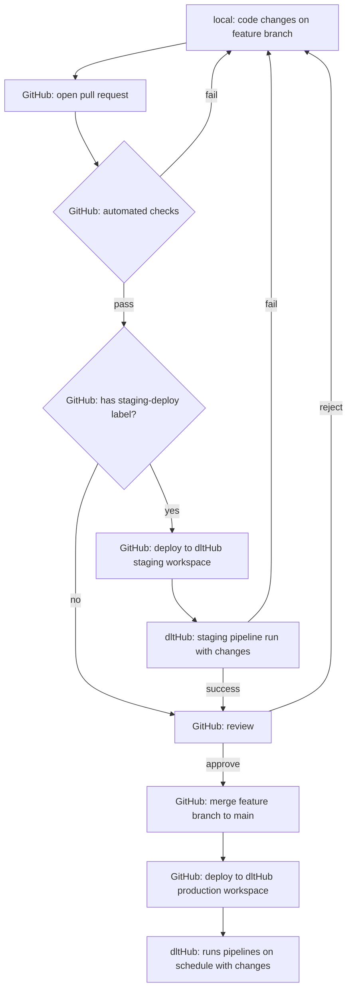

# dltHub CI/CD deployment via GitHub Actions

Follow this guide to manage dltHub workspace deployments using GitHub Actions for CI/CD. By the end, every change to your ELT solution will follow good software development practices: issues, branches, pull requests, reviews, etc.

Benefits:

- Auditable: Everything the workspace does is declared as code, in version control
- Quality control: Every change goes through automated checks and requires human review before reaching production.
- Change isolation: Changes never break production by using isolated workspaces and dedicated destinations.

These properties are essential to enable AI-coding and agents productivity.

:::info
This page assumes basic familiarity with dltHub [profiles](../hub/pipeline-operations/profiles.md), [triggers](../hub/pipeline-operations/triggers.md), and [secrets](../hub/pipeline-operations/secrets-management.md).
:::

## Tutorial

Prerequisites:

- dltHub account
- GitHub account
- [`uv`](https://docs.astral.sh/uv/) package manager installed
- [`gh`](https://cli.github.com/) official GitHub CLI installed

### 1. Set up GitHub repository

1. Clone the blueprint repository, then collapse its commit history into a single commit.

    ```shell
    git clone https://github.com/dlt-hub/dlthub-cicd-blueprint.git
    cd dlthub-cicd-blueprint

    # drop the blueprint's `.git` history and start with a fresh history
    rm -rf .git
    git init -b main
    git add .
    git commit -m "Initial commit from dltHub CI/CD blueprint"
    ```

2. Create your own GitHub repository from the clone, and push it

    ```shell
    # creates the repo on GitHub
    gh repo create <your-org>/<your-repo> --private
    git remote add origin https://github.com/<your-org>/<your-repo>
    git push -u origin main
    ```

### 2. Configure dltHub workspaces

1. Login to dltHub. The command will open a browser page for you to authenticate.

    ```shell
    cd workspace
    uv run dlthub login
    ```

    :::info
    You may need to upgrade the dltHub client. Run this command, then rerun the above:

    ```shell
    uv sync --upgrade-package dlthub-client
    ```

    :::

2. Create the `staging` workspace and set its `workspace_id` in `workspace/.dlt/stg.config.toml`

    ```toml
    # workspace/.dlt/stg.config.toml
    [runtime]
    workspace_id = "<staging-workspace-id>"
    ```

3. Get a dltHub [workspace API key](../hub/platform-capabilities/settings.md#workspace-api-keys) and set it on the GitHub repository

    ```shell
    gh api repos/{owner}/{repo}/environments/staging --method PUT
    gh secret set DLTHUB_API_KEY --env staging --body "<staging-workspace-api-key>"
    ```

4. Create the `production` workspace and set its `workspace_id` in `workspace/.dlt/prod.config.toml`

    ```toml
    # workspace/.dlt/prod.config.toml
    [runtime]
    workspace_id = "<production-workspace-id>"
    ```

5. Get a dltHub [workspace API key](../hub/platform-capabilities/settings.md#workspace-api-keys) and set it on the GitHub repository

    ```shell
    gh api repos/{owner}/{repo}/environments/production --method PUT
    gh secret set DLTHUB_API_KEY --env production --body "<production-workspace-api-key>"
    ```

5. Commit configurations and push to GitHub.

    ```shell
    git add .
    git commit -m "configured dlthub workspaces"
    git push
    ```

If everything is set up properly, the push to `main` will trigger GitHub Actions to check the code and deploy to dltHub. It takes around 1min to complete.


:::info
We suggest setting **branch protection rules** on GitHub to make sure that failing automated checks block PR from being mergeable and require at least 1 pull request review before merging.
:::

## Development lifecycle

This section starts with a flowchart of the dltHub + GitHub development workflow. It is followed by an illustrative scenario.



### Scenario: how to fix a pipeline

1. Branch off `main`.

    ```shell
    git checkout -b <feature-branch-name>
    ```

2. Make your changes (make a source incremental, add a pipeline, enable schema contract, etc.)
3. Commit your code. Code quality checks and tests will run locally. This enables fast iterations for you and your agents.

    ```shell
    git commit -m "made quickbooks source incremental"
    ```

4. Push your code and open a pull request. This will trigger GitHub Actions to run automated checks remotely.

    ```shell
    git push
    # include `--label` to trigger staging deployment
    gh pr create --fill --label staging-deploy
    ```

5. Add the `staging-deploy` label on the GitHub pull request to trigger deployment to the staging dltHub workspace. Then, you can run pipelines on dltHub with small data loads.

   

6. Get a pull request review of the code and the run results on the staging workspace.
7. Merge to `main`. This will deploy the new `main` branch to the production dltHub workspace.

## Teams using dltHub

This approach allows team to scale from 10s to 100s to 1000s of pipelines without frictions. Good practices and hard requirements are codified. When something fails, you trace the issue to specific code changes.

This guide is a starting point. The workflow can be tailored to your organization. `<CTA>`

- **Add a source**: Create the source under `workspace/sources`. Then, define the pipeline in `workspace/__deployment__.py` and register it in `__all__`.
- **Manage Python dependencies**: Avoid Python dependency conflicts or slow pipeline jobs by creating dependency groups in `workspace/pyproject.toml`. Then, individual pipelines can specify `@run.pipeline(..., require= {"dependency_groups": ["<group-name>"]}`)
- **Add a more environment**: Tailor your workflow and add environments as you need. Simply add another `.dlt/<env>.config.toml` with matching dltHub workspace and GitHub environment.
- **Promote via tags instead of `main`**: Manually deploy to `main` by using an explicit release step rather than deploying every merge. Edit `prod-deploy.yaml` to trigger on commits with specific tags.

## Repository content

Here's an overview of the files found in the repository:

```text
├── .github/workflows/           # GitHub Actions workflows
│   ├── pr-checks.yaml           # lint, type-check, test; optional staging deploy
│   └── prod-deploy.yaml         # deploy to production on push to `main`
├── workspace/                   # dltHub workspace
│   ├── .dlt/                    # workspace configuration
│   │   ├── .workspace           
│   │   ├── config.toml          # config shared by all profiles
│   │   ├── prod.config.toml     # production-specific config
│   │   └── stg.config.toml      # staging-specific config
│   ├── sources/                 # dlt source definitions
│   ├── notebooks/               # notebooks definitions
│   ├── __deployment__.py        # production deployment: defines all pipelines
│   ├── __staging__.py           # staging deployment: sets limits for staging runs
│   └── pyproject.toml           # configure Python runtime and dependencies
├── tests/                       # tests for sources, pipelines, deployments
├── justfile                     # developer commands
├── pyproject.toml               # configure developer tooling
└── uv.lock                      # single lockfile for workspace + development
```

Key design decisions:

- Separate developer tooling and dltHub workspace. Only the content of `workspace/` is deployed to dltHub. The developer tooling, tests, and CI/CD automations are defined outside of it. This handled using [`uv` workspaces](https://docs.astral.sh/uv/concepts/projects/workspaces/) and the files `pyproject.toml` and `workspace/pyproject.toml`.

- dltHub workspace configurations committed to the repository `workspace/.dlt/{prod,stg}.config.toml`. Non-sensitive configuration changes are versioned-controlled, tested, and reviewed along the code. Sensitive credentials (i.e., secrets) are set on the dltHub platform or via an external secret provider.

- `workspace/__deployment__.py` is the single reviewable source of truth for the dltHub workspace. It includes all the pipelines, jobs, and data apps definitions. `workspace/__staging__.py` reads its content and applies additional configuration for staging (e.g., remove scheduling, set data load limit)

## Next steps

- [Deployments](../hub/pipeline-operations/deployments.md) — the manifest model behind `dlthub deploy`
- [Profiles](../hub/pipeline-operations/profiles.md) — how `dev`, `prod`, and `access` profiles work
- [Secrets management](../hub/pipeline-operations/secrets-management.md) — vaults and access controls for production secrets
- [Triggers and scheduling](../hub/pipeline-operations/triggers.md) — cron, intervals, follow-ups, freshness
- [Environment variables](../hub/pipeline-operations/environment-variables.md) — workspace- and profile-scoped process environment
- [Monitoring and debugging](../hub/pipeline-operations/monitoring.md) — logs, dashboards, and failed-run diagnostics
- [Workspace API keys](../hub/platform-capabilities/settings.md#workspace-api-keys)
