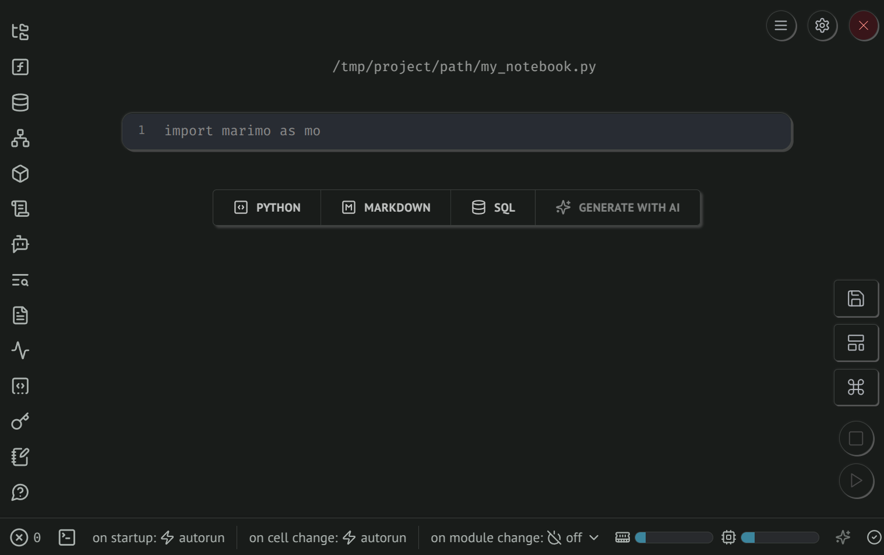
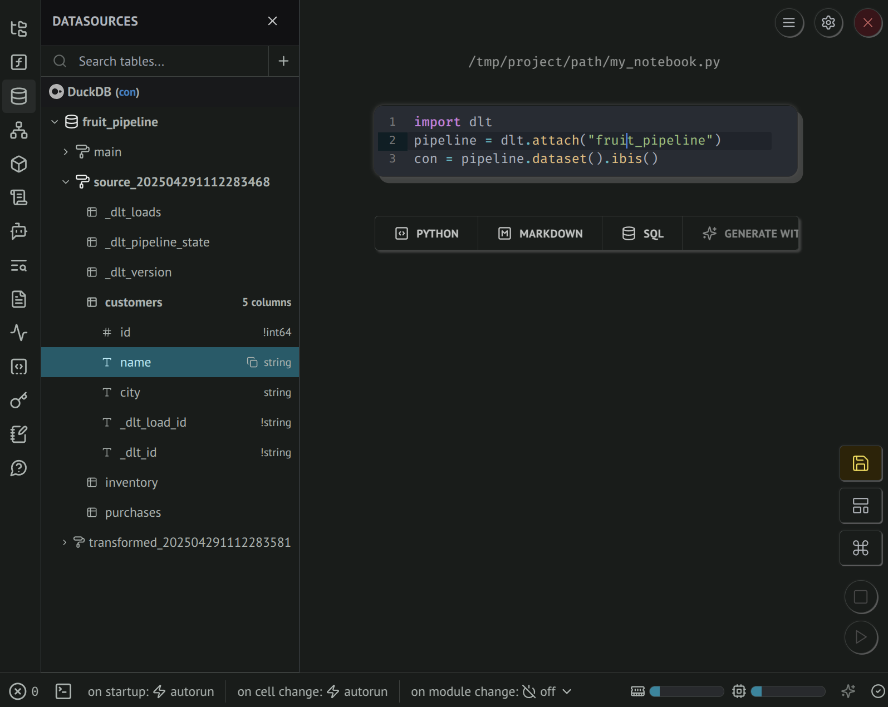
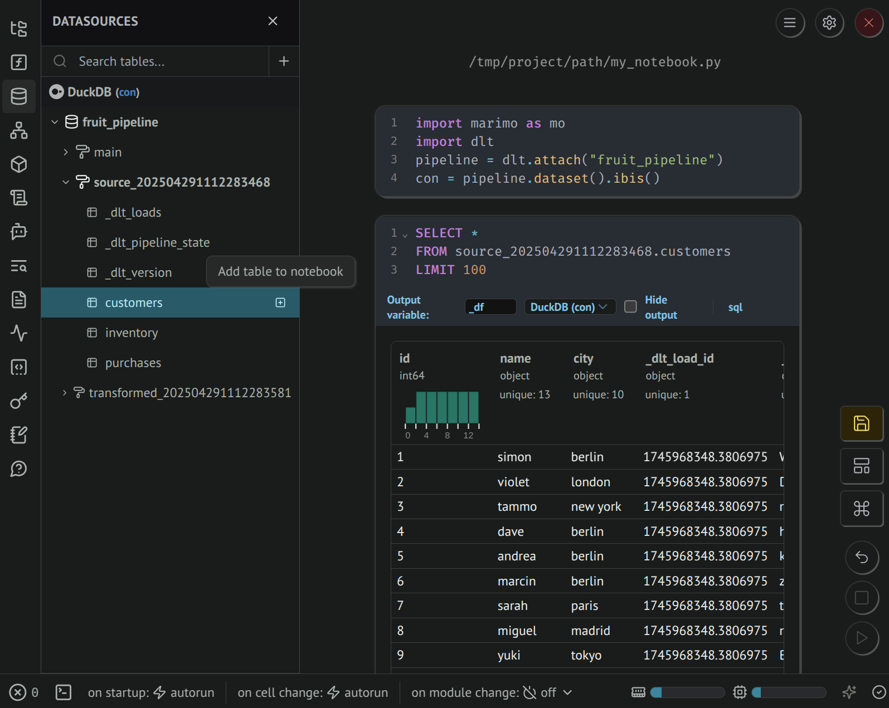
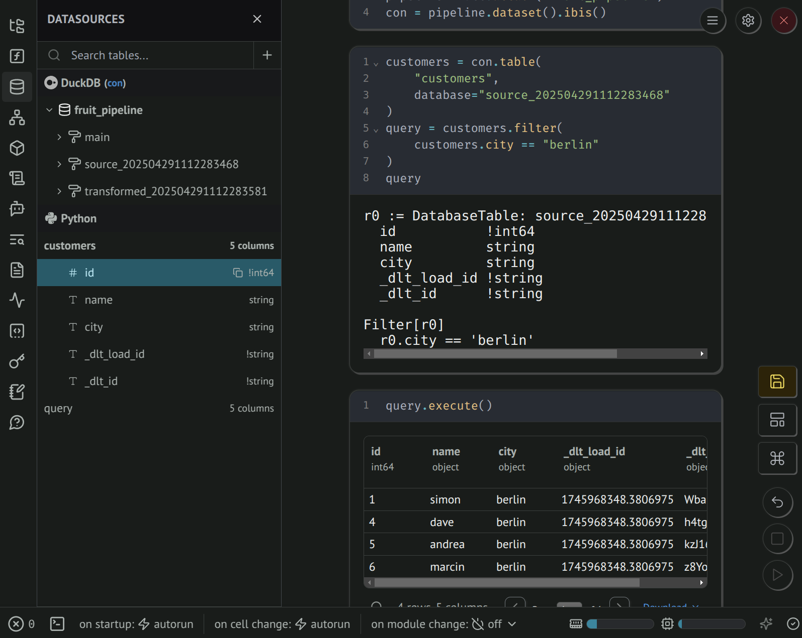

# Access loaded data in Python

This guide explains how to access and manipulate data that has been loaded into your destination using the `dlt` Python library. After running your pipelines and loading data, you can use the `pipeline.dataset()` and data frame expressions, Ibis or SQL to query the data and read it as records, Pandas frames or Arrow tables.

## Quick start example

Here's a full example of how to retrieve data from a pipeline and load it into a Pandas DataFrame or a PyArrow Table.

<!--@@@DLT_SNIPPET ./dataset_snippets/dataset_snippets.py::quick_start_example-->

## Getting started

Assuming you have a `Pipeline` object (let's call it `pipeline`), you can obtain a `Dataset` which contains the credentials and schema to your destination dataset. You can construct a query and execute it on the dataset to retrieve a `Relation` which you may use to retrieve data from the `Dataset`.

**Note:** The `Dataset` and `Relation` objects are **lazy-loading**. They will only query and retrieve data when you perform an action that requires it, such as fetching data into a DataFrame or iterating over the data. This means that simply creating these objects does not load data into memory, making your code more efficient.


### Access the dataset

<!--@@@DLT_SNIPPET ./dataset_snippets/dataset_snippets.py::getting_started-->

### Access tables as dataset

The simplest way of getting a Relation from a Dataset is to get a full table relation:

<!--@@@DLT_SNIPPET ./dataset_snippets/dataset_snippets.py::accessing_tables-->

### Creating relations with sql query strings

<!--@@@DLT_SNIPPET ./dataset_snippets/dataset_snippets.py::custom_sql-->

## Reading data

Once you have a `Relation`, you can read data in various formats and sizes.

### Fetch the entire table

:::warning
Loading full tables into memory without limiting or iterating over them can consume a large amount of memory and may cause your program to crash if the table is too large. It's recommended to use chunked iteration or apply limits when dealing with large datasets.
:::

#### As a Pandas DataFrame

<!--@@@DLT_SNIPPET ./dataset_snippets/dataset_snippets.py::fetch_entire_table_df-->

#### As a PyArrow Table

<!--@@@DLT_SNIPPET ./dataset_snippets/dataset_snippets.py::fetch_entire_table_arrow-->

#### As a list of Python tuples

<!--@@@DLT_SNIPPET ./dataset_snippets/dataset_snippets.py::fetch_entire_table_fetchall-->

## Lazy loading behavior

The `Dataset` and `Relation` objects are **lazy-loading**. This means that they do not immediately fetch data when you create them. Data is only retrieved when you perform an action that requires it, such as calling `.df()`, `.arrow()`, or iterating over the data. This approach optimizes performance and reduces unnecessary data loading.

## Iterating over data in chunks

To handle large datasets efficiently, you can process data in smaller chunks.

### Iterate as Pandas DataFrames

<!--@@@DLT_SNIPPET ./dataset_snippets/dataset_snippets.py::iterating_df_chunks-->

### Iterate as PyArrow Tables

<!--@@@DLT_SNIPPET ./dataset_snippets/dataset_snippets.py::iterating_arrow_chunks-->

### Iterate as lists of tuples

<!--@@@DLT_SNIPPET ./dataset_snippets/dataset_snippets.py::iterating_fetch_chunks-->

The methods available on the Relation correspond to the methods available on the cursor returned by the SQL client. Please refer to the [SQL client](./sql-client.md#supported-methods-on-the-cursor) guide for more information.

## Connection Handling

For every call that actually fetches data from the destination, such as `df()`, `arrow()`, `fetchall()` etc., the dataset will open a connection and close it after it has been retrieved or the iterator is completed. You can keep the connection open for multiple requests with the dataset context manager:

<!--@@@DLT_SNIPPET ./dataset_snippets/dataset_snippets.py::context_manager-->

## Special queries

You can use the `row_counts` method to get the row counts of all tables in the destination as a DataFrame.

<!--@@@DLT_SNIPPET ./dataset_snippets/dataset_snippets.py::row_counts-->

## Modifying queries

You can refine your data retrieval by limiting the number of records, selecting specific columns, sorting the results, filtering rows, aggregating minimum and maximum values on a specific column, or chaining these operations.

### Limit the number of records

<!--@@@DLT_SNIPPET ./dataset_snippets/dataset_snippets.py::limiting_records-->

#### Using `head()` to get the first 5 records

<!--@@@DLT_SNIPPET ./dataset_snippets/dataset_snippets.py::head_records-->

### Select specific columns

<!--@@@DLT_SNIPPET ./dataset_snippets/dataset_snippets.py::select_columns-->

### Sort results

<!--@@@DLT_SNIPPET ./dataset_snippets/dataset_snippets.py::order_by-->

### Filter rows

<!--@@@DLT_SNIPPET ./dataset_snippets/dataset_snippets.py::filter-->

### Aggregate data

<!--@@@DLT_SNIPPET ./dataset_snippets/dataset_snippets.py::aggregate-->

### Join related tables

Use `join()` to navigate dlt's schema references between related tables, such as parent/child tables created from nested data, or tables where you explicitly annotate the relationship. Joined columns are prefixed with the joined table name, or with the alias you provide.

<!--@@@DLT_SNIPPET ./dataset_snippets/dataset_snippets.py::join_related_tables-->

### Chain operations

You can combine `select`, `limit`, and other methods.

<!--@@@DLT_SNIPPET ./dataset_snippets/dataset_snippets.py::chain_operations-->

## Modifying queries with ibis expressions

If you install the amazing [ibis](https://ibis-project.org/) library, you can use ibis expressions to modify your queries.

```sh
pip install ibis-framework
```

dlt will then allow you to get an `ibis.Table` for each table which you can use to build a query with ibis expressions, which you can then execute on your dataset.

:::warning
A previous version of dlt allowed to use ibis expressions in a slightly different way, allowing users to directly execute and retrieve data on ibis Unbound tables. This method does not work anymore. See the migration guide below for instructions on how to update your code.
:::

<!--@@@DLT_SNIPPET ./dataset_snippets/dataset_snippets.py::ibis_expressions-->

You can learn more about the available expressions on the [ibis for sql users](https://ibis-project.org/tutorials/ibis-for-sql-users) page.


### Migrating from the previous dlt / ibis implementation

As describe above, the new way to use ibis expressions is to first get one or many `Table` objects and construct your expression. Then, you can pass it `Dataset` to get a `Relation` to execute the full query and retrieve data.

An example from our previous docs for joining a customers and a purchase table was this:

```py
# get two relations
customers_relation = dataset["customers"]
purchases_relation = dataset["purchases"]

# join them using an ibis expression
joined_relation = customers_relation.join(
    purchases_relation, customers_relation.id == purchases_relation.customer_id
)

# ... do other ibis operations

# directly fetch the data on the expression we have built
df = joined_relation.df()
```

The migrated version looks like this:

```py
# we convert the dlt.Relation an Ibis Table object
customers_expression = dataset.table("customers").to_ibis()
purchases_expression = dataset.table("purchases").to_ibis()

# join them using an ibis expression, same code as above
joined_epxression = customers_expression.join(
    purchases_expression, customers_expression.id == purchases_expression.customer_id
)

# ... do other ibis operations, would be same as before

# now convert the expression to a relation
joined_relation = dataset(joined_epxression)

# execute as before
df = joined_relation.df()
```


## Supported destinations

All SQL and filesystem destinations supported by `dlt` can utilize this data access interface.

### Reading data from filesystem
For filesystem destinations, `dlt` [uses **DuckDB** under the hood](./sql-client.md#the-filesystem-sql-client) to create views on iceberg and delta tables or from Parquet, JSONL and csv files. This allows you to query data stored in files using the same interface as you would with SQL databases. If you plan on accessing data in buckets or the filesystem a lot this way, it is advised to load data into delta or iceberg tables, as **DuckDB** is able to only load the parts of the data actually needed for the query to work.

:::tip
By default `dlt` will not autorefresh views created on iceberg tables and files when new data is loaded. This prevents wasting resources on
file globbing and reloading iceberg metadata for every query. You can [change this behavior](sql-client.md#control-data-freshness) with `always_refresh_views` flag.

Note: `delta` tables are by default on autorefresh which is implemented by delta core and seems to be pretty efficient.
:::

## Examples

### Fetch one record as a tuple

<!--@@@DLT_SNIPPET ./dataset_snippets/dataset_snippets.py::fetch_one-->

### Fetch many records as tuples

<!--@@@DLT_SNIPPET ./dataset_snippets/dataset_snippets.py::fetch_many-->

### Iterate over data with limit and column selection

**Note:** When iterating over filesystem tables, the underlying DuckDB may give you a different chunk size depending on the size of the parquet files the table is based on.

<!--@@@DLT_SNIPPET ./dataset_snippets/dataset_snippets.py::iterating_with_limit_and_select-->

## Advanced usage

### Loading a `Relation` into a pipeline table

Since the `iter_arrow` and `iter_df` methods are generators that iterate over the full `Relation` in chunks, you can use them as a resource for another (or even the same) `dlt` pipeline:

<!--@@@DLT_SNIPPET ./dataset_snippets/dataset_snippets.py::loading_to_pipeline-->

Learn more about [transforming data in Python with Arrow tables or DataFrames](../../dlt-ecosystem/transformations/python).

### Datasets with multiple schemas

When a pipeline loads data from several [sources](../../general-usage/source.md), each source produces its own schema. By default, all schemas share one physical dataset and `pipeline.dataset()` includes every schema automatically, so tables from all sources are queryable together. If two schemas define a table with the same name, dlt merges their columns and combines rows from both — missing columns are filled with `NULL`.

:::note
Multi-schema datasets are not recommended for most use cases. They arise naturally when multiple sources are loaded into one pipeline, and dlt handles them transparently. You can restrict the dataset to a single schema with `pipeline.dataset(schema="source_name")` or pass a list of schemas to select a subset. Load history is tracked per schema — use `dataset.load_ids(schema_name="...")` to query a specific one.
:::

#### Breaking changes

:::caution Breaking changes introduced in dlt 1.25.0
The following changes affect existing code that uses `pipeline.dataset()`:

**`pipeline.dataset()` now includes all schemas by default.** Previously, calling `pipeline.dataset()` without a `schema` argument returned only the default schema's tables. Now, when `use_single_dataset` is enabled (the default) and the pipeline has multiple schemas, all schemas are included automatically. Code that assumed only one schema's tables are visible may now see additional tables or extra rows in shared table names. To restore the previous single-schema behavior, pass the schema explicitly:

```py
# Before (implicit single schema):
ds = pipeline.dataset()

# After (explicit single schema, equivalent to the old behavior):
ds = pipeline.dataset(schema=pipeline.default_schema_name)
```
:::


## Staging dataset

So far, we've been using the `append` write disposition in our example pipeline. This means that each time we run the pipeline, the data is appended to the existing tables. When you use the [merge write disposition](../incremental-loading.md), dlt creates a staging database schema for staging data. This schema is named `<dataset_name>_staging` [by default](../../dlt-ecosystem/staging#staging-dataset) and contains the same tables as the destination schema. When you run the pipeline, the data from the staging tables is loaded into the destination tables in a single atomic transaction.

Let's illustrate this with an example. We change our pipeline to use the `merge` write disposition:

```py
import dlt

@dlt.resource(primary_key="id", write_disposition="merge")
def users():
    yield [
        {'id': 1, 'name': 'Alice 2'},
        {'id': 2, 'name': 'Bob 2'}
    ]

pipeline = dlt.pipeline(
    pipeline_name='quick_start',
    destination='duckdb',
    dataset_name='mydata'
)

load_info = pipeline.run(users)
```

Running this pipeline will create a schema in the destination database with the name `mydata_staging`.
If you inspect the tables in this schema, you will find the `mydata_staging.users` table identical to the `mydata.users` table in the previous example.

Here is what the tables may look like after running the pipeline:

**mydata_staging.users**

| id | name | _dlt_id | _dlt_load_id |
| --- | --- | --- | --- |
| 1 | Alice 2 | wX3f5vn801W16A | 2345672350.98417 |
| 2 | Bob 2 | rX8ybgTeEmAmmA | 2345672350.98417 |

**mydata.users**

| id | name | _dlt_id | _dlt_load_id |
| --- | --- | --- | --- |
| 1 | Alice 2 | wX3f5vn801W16A | 2345672350.98417 |
| 2 | Bob 2 | rX8ybgTeEmAmmA | 2345672350.98417 |
| 3 | Charlie | h8lehZEvT3fASQ | 1234563456.12345 |

Notice that the `mydata.users` table now contains the data from both the previous pipeline run and the current one.

## `dev_mode` (versioned datasets)

When you set the `dev_mode` argument to `True` in the `dlt.pipeline` call, dlt creates a versioned dataset.
This means that each time you run the pipeline, the data is loaded into a new dataset (a new database schema).
The dataset name is the same as the `dataset_name` you provided in the pipeline definition with a datetime-based suffix.

We modify our pipeline to use the `dev_mode` option to see how this works:

```py
import dlt

data = [
    {'id': 1, 'name': 'Alice'},
    {'id': 2, 'name': 'Bob'}
]

pipeline = dlt.pipeline(
    pipeline_name='quick_start',
    destination='duckdb',
    dataset_name='mydata',
    dev_mode=True # <-- add this line
)
load_info = pipeline.run(data, table_name="users")
```

Every time you run this pipeline, a new schema will be created in the destination database with a datetime-based suffix. The data will be loaded into tables in this schema.
For example, the first time you run the pipeline, the schema will be named `mydata_20230912064403`, the second time it will be named `mydata_20230912064407`, and so on.

## Internal `dlt` tables

dlt automatically creates internal tables in the destination schema to track pipeline runs, support incremental loading, and manage schema versions. These tables use the `_dlt_` prefix.

### `_dlt_loads`
This table records each pipeline run. Every time you execute a pipeline, a new row is added to this table with a unique `load_id`. This table tracks which loads have been completed and supports chaining of transformations.


| Column name          | Type      | Description                               |
|----------------------|-----------|-------------------------------------------|
| `load_id`            | STRING    | Unique identifier for the load job        |
| `schema_name`        | STRING    | Name of the schema used during the load   |
| `schema_version_hash`| STRING    | Hash of the schema version                |
| `status`             | INTEGER   | Load status. Value `0` means completed    |
| `inserted_at`        | TIMESTAMP | When the load was recorded                |

Only rows with `status = 0` are considered complete. Other values represent incomplete or interrupted loads. The status column can also be used to coordinate multi-step transformations.

### `_dlt_pipeline_state`
This table stores the internal state of the pipeline for each run. This state enables incremental loading and allows the pipeline to resume from where it left off if a previous run was interrupted.


| Column name       | Type            | Description                                          |
|-------------------|------------------|------------------------------------------------------|
| `version`         | INTEGER          | Version of this state entry                         |
| `engine_version`  | INTEGER          | Version of the dlt engine used                      |
| `pipeline_name`   | STRING           | Name of the pipeline                                |
| `state`           | STRING or BLOB   | Serialized Python dictionary of pipeline state      |
| `created_at`      | TIMESTAMP        | When this state entry was created                   |
| `version_hash`    | STRING           | Hash to detect changes in the state                 |
| `_dlt_load_id`    | STRING           | Reference to related load in `_dlt_loads`           |
| `_dlt_id`         | STRING           | Unique identifier for the pipeline state row        |
 

The state column contains a serialized Python dictionary that includes:

    - Incremental progress (e.g. last item or timestamp processed).
    - Checkpoints for transformations.
    - Source-specific metadata and settings.

This allows dlt to resume interrupted pipelines, avoid reloading already processed data, and ensure pipelines are idempotent and efficient.

The `version_hash` is recalculated on each update. dlt uses this table to implement last-value incremental loading. If a run fails or stops, this table ensures the next run picks up from the correct checkpoint.

### `_dlt_version`
This table tracks the history of all schema versions used by the pipeline. Every time dlt updates the schema. For example, when new columns or tables are added, a new entry is written to this table.

| Column name     | Type            | Description                                      |
|------------------|------------------|--------------------------------------------------|
| `version`        | INTEGER          | Numeric version of the schema                   |
| `engine_version` | INTEGER          | Version of the dlt engine used                  |
| `inserted_at`    | TIMESTAMP        | Time the schema version entry was created       |
| `schema_name`    | STRING           | Name of the schema                              |
| `version_hash`   | STRING           | Unique hash representing the schema content     |
| `schema`         | STRING or JSON   | Full schema in JSON format                      |

By keeping previous schema definitions, `_dlt_version` ensures that:

- Older data remains readable
- New data uses updated schema rules
- Backward compatibility is maintained

This table also supports troubleshooting and compatibility checks. It lets you track which schema and engine version were used for any load. This helps with debugging and ensures safe evolution of your data model.

## Ibis

Ibis is a powerful portable Python dataframe library. Learn more about what it is and how to use it in the [official documentation](https://ibis-project.org/).

`dlt` provides an easy way to hand over your loaded dataset to an Ibis backend connection.

:::tip
Not all destinations supported by `dlt` have an equivalent Ibis backend. Natively supported destinations include DuckDB (including Motherduck), Postgres (Redshift is supported via the Postgres backend for Ibis versions lower than 10.4.0), Snowflake, Clickhouse, MSSQL (including Synapse), and BigQuery. The filesystem destination is supported via the [Filesystem SQL client](./sql-client#the-filesystem-sql-client); please install the DuckDB backend for Ibis to use it. Mutating data with Ibis on the filesystem will not result in any actual changes to the persisted files.
:::

### Prerequisites

To use the Ibis backend, you will need to have the `ibis-framework` package with the correct Ibis extra installed. The following example will install the DuckDB backend:

```sh
pip install ibis-framework[duckdb]
```

### Get an Ibis connection from your dataset

`dlt` datasets have a helper method to return an Ibis connection to the destination they live on. The returned object is a native Ibis connection to the destination, which you can use to read and even transform data. Please consult the [Ibis documentation](https://ibis-project.org) to learn more about what you can do with Ibis.

:::caution Breaking change in dlt 1.25.0
`dataset.ibis()` now passes all schemas from the dataset to the Ibis backend. On filesystem destinations, this means Ibis will see tables from every schema in the dataset and not just the default one. If two schemas define the same table name, the Ibis table will contain rows from both schemas combined. To get the previous single-schema behavior, create the dataset with an explicit schema: `pipeline.dataset(schema="my_schema").ibis()`.
:::

```py
# get the dataset from the pipeline
dataset = pipeline.dataset()
dataset_name = pipeline.dataset_name

# get the native ibis connection from the dataset
ibis_connection = dataset.ibis()

# list all tables in the dataset
# NOTE: You need to provide the dataset name to ibis, in ibis datasets are named databases
print(ibis_connection.list_tables(database=dataset_name))

# get the items table
table = ibis_connection.table("items", database=dataset_name)

# print the first 10 rows
print(table.limit(10).execute())

# Visit the ibis docs to learn more about the available methods
```

## Marimo

[marimo](https://github.com/marimo-team/marimo) is a reactive Python notebook. It completely revamps the Jupyter notebook experience. Whenever code is executed or you interact with a UI element, dependent cells are re-executed ensuring consistency between code and displayed outputs.

This page shows how dlt + marimo + [ibis](./ibis-backend.md) provide a rich environment to explore loaded data, write data transformations, and create data applications.

### Prerequisites

To install marimo and ibis with the duckdb extras, run the following command:

```sh
pip install marimo "ibis-framework[duckdb]"
```

### Launch marimo

Use this command to launch marimo (replace `my_notebook.py` with desired name). It will print a link to access the notebook web app.

```sh
marimo edit my_notebook.py

> Edit my_notebook.py in your browser 📝
>   ➜  URL: http://localhost:2718?access_token=Qfo_Hj2RbXqiqM4VT3XOwA 
```

Here's a screenshot of the interface you should see:




### Features

#### Use custom dlt widgets

Inside your marimo notebook, you can use composable widgets built and maintained by the dlt team. This requires the `mowidgets` package (Python 3.11+).

Import them from `dlt.helpers.marimo` and pass them to the `render()` function:

```py
#%% cell 1
from dlt.helpers.marimo import render, load_package_viewer, pipeline_selector

#%% cell 2
render(pipeline_selector)

#%% cell 3
render(load_package_viewer, pipeline_path="/path/to/pipeline")
```

Available widgets: `pipeline_selector`, `load_package_viewer`, `schema_viewer`.


#### View dataset tables and columns

After loading data with dlt, you can access it via the dataset interface, including a [native ibis connection](#ibis).

In marimo, the **Datasources** panel provides a GUI to explore data tables and columns. When a cell contains a variable that's an ibis connection, it is automatically registered.



#### Accessing data with SQL

Clicking on the **Add table to notebook** button will create a new SQL cell that you can use to query data. The output cell provides a rich and interactive results dataframe.

:::note
The **Datasources** displays a limited range of data types.
:::




#### Accessing data with Python

You can also retrieve Ibis tables (lazy expressions) using Python. The **Datasources** panel will show under **Python** the output schema of your Ibis query, and the cell output will display detailed query planning.

Use `.execute()`, `.to_pandas()`, `.to_polars()`, or `.to_pyarrow()` to execute the Ibis expression and retrieve data that can displayed in a rich and interactive dataframe.

:::note
The **Datasources** displays a limited range of data types.
:::



#### Create a dashboard and data apps

marimo notebooks can be [deployed as web applications with interactive UI and charts](https://docs.marimo.io/guides/apps/) and the code hidden. Try adding [marimo UI input elements](https://docs.marimo.io/guides/interactivity/), rich markdown, and charts (matplotlib, plotly, altair, etc.). Combined, dlt + marimo + ibis make it easy to build a simple dashboard on top of fresh data.


### Further reading

- [Learn about marimo dataframe and SQL features](https://docs.marimo.io/guides/working_with_data/)
- [Explore databases using the marimo GUI](https://docs.marimo.io/guides/coming_from/streamlit/)
- [Learn about marimo if you're coming from Streamlit](https://docs.marimo.io/guides/coming_from/streamlit/)

## Important considerations

- **Memory usage:** Loading full tables into memory without iterating or limiting can consume significant memory, potentially leading to crashes if the dataset is large. Always consider using limits or chunked iteration.

- **Lazy evaluation:** `Dataset` and `Relation` objects delay data retrieval until necessary. This design improves performance and resource utilization.

- **Custom SQL queries:** When executing custom SQL queries, remember that additional methods like `limit()` or `select()` won't modify the query. Include all necessary clauses directly in your SQL statement.
