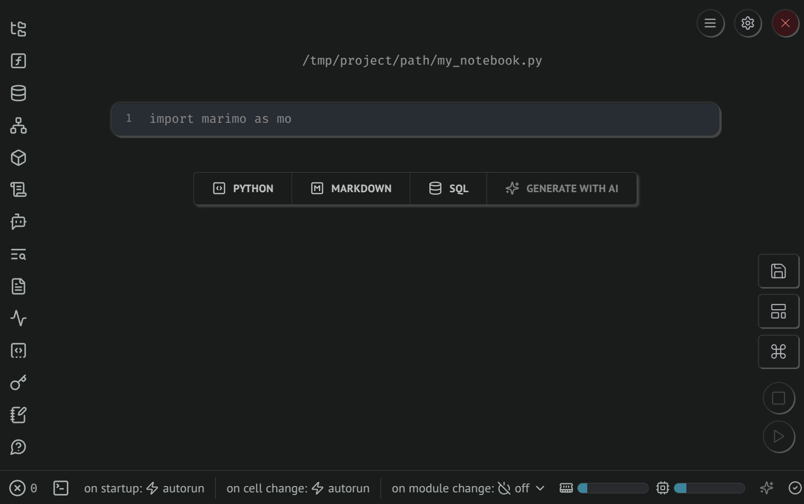
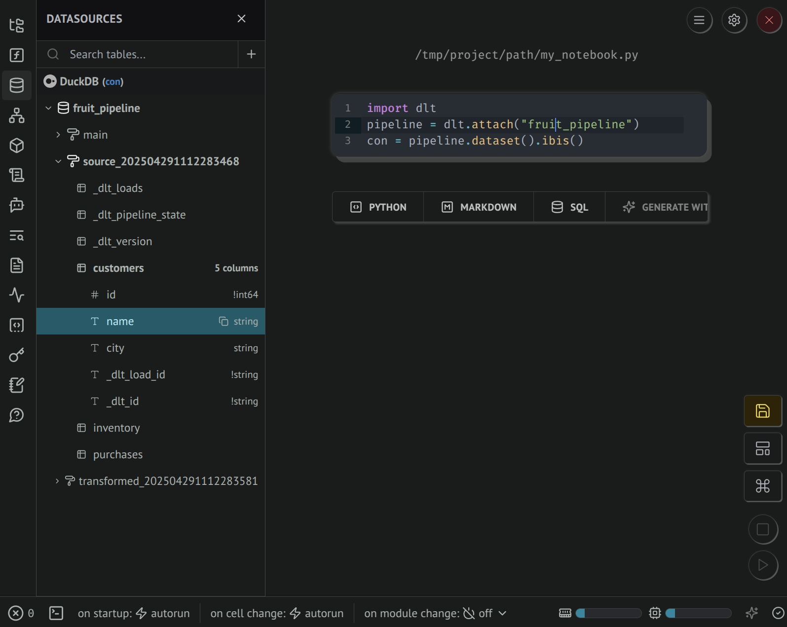
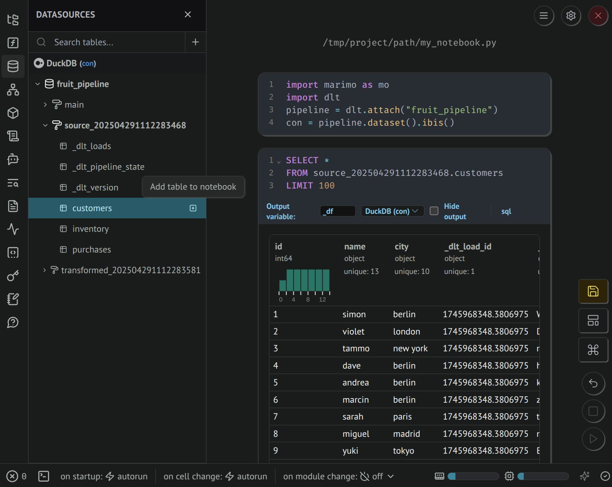
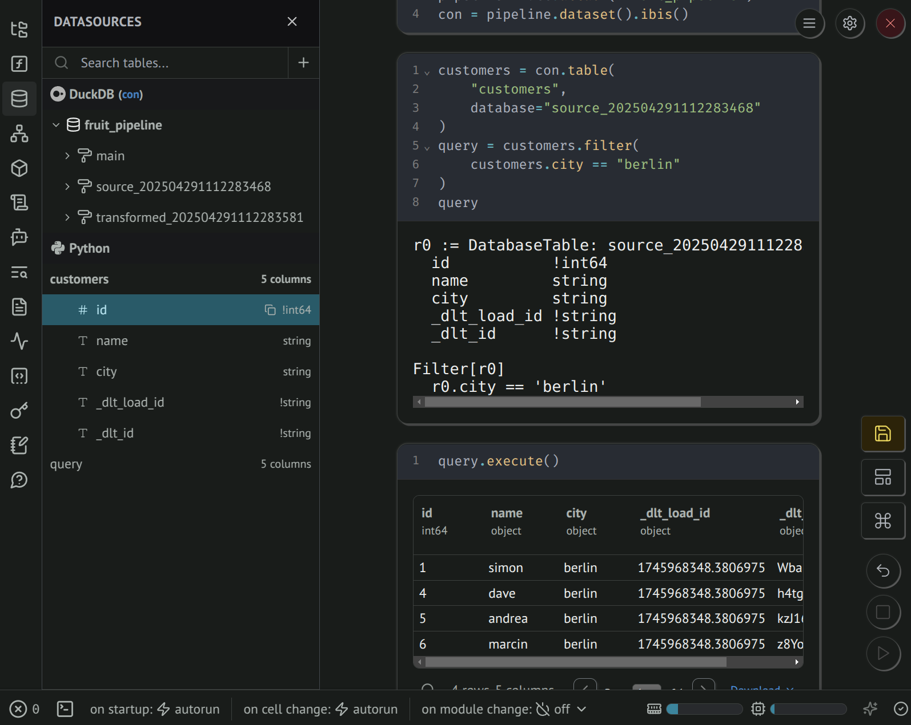

# Access loaded data in Python

This guide explains how to access and change data that dlt loaded into your destination. After a pipeline run, use `pipeline.dataset()` to query the data. You can build the query with data frame expressions, Ibis, or SQL. You can read the result as records, Pandas frames, or Arrow tables.

## Quick start example

This example reads data from a pipeline into a Pandas DataFrame or a PyArrow Table.

<!--@@@DLT_SNIPPET ./dataset_snippets/dataset_snippets.py::quick_start_example-->

## Getting started

A `Pipeline` object gives you a `Dataset`, which holds the credentials and the schema of your destination dataset. Build a query on the dataset to get a `Relation`. The `Relation` reads the data.

**Note:** The `Dataset` and `Relation` objects defer their work. They query the destination only when you take an action that needs the data, for example a read into a DataFrame. See [Deferred query execution](#deferred-query-execution).


### Access the dataset

<!--@@@DLT_SNIPPET ./dataset_snippets/dataset_snippets.py::getting_started-->

### Access tables as relations

The simplest `Relation` is a full table:

<!--@@@DLT_SNIPPET ./dataset_snippets/dataset_snippets.py::accessing_tables-->

### Create relations with SQL query strings

<!--@@@DLT_SNIPPET ./dataset_snippets/dataset_snippets.py::custom_sql-->

## Reading data

Once you have a `Relation`, you can read data in various formats and sizes.

### Fetch the entire table

:::warning
If a table is large, apply a limit or iterate in chunks. A full table read can exhaust memory and stop your program.
:::

#### As a Pandas DataFrame

<!--@@@DLT_SNIPPET ./dataset_snippets/dataset_snippets.py::fetch_entire_table_df-->

#### As a PyArrow Table

<!--@@@DLT_SNIPPET ./dataset_snippets/dataset_snippets.py::fetch_entire_table_arrow-->

#### As a list of Python tuples

<!--@@@DLT_SNIPPET ./dataset_snippets/dataset_snippets.py::fetch_entire_table_fetchall-->

## Deferred query execution

The `Dataset` and `Relation` objects read no data when you create them. The read happens when you take an action that needs the data, for example a call to `.df()` or `.arrow()`. An iteration over the relation also triggers the read. A relation you build but never read sends no query.

## Iterating over data in chunks

To handle large datasets efficiently, you can process data in smaller chunks.

### Iterate as Pandas DataFrames

<!--@@@DLT_SNIPPET ./dataset_snippets/dataset_snippets.py::iterating_df_chunks-->

### Iterate as PyArrow Tables

<!--@@@DLT_SNIPPET ./dataset_snippets/dataset_snippets.py::iterating_arrow_chunks-->

### Iterate as lists of tuples

<!--@@@DLT_SNIPPET ./dataset_snippets/dataset_snippets.py::iterating_fetch_chunks-->

The methods on the Relation match the methods on the cursor that the SQL client returns. See the [SQL client](../../dlt-ecosystem/transformations/sql.md#supported-methods-on-the-cursor) guide.

## Connection handling

Some calls read data from the destination, for example `df()`, `arrow()`, and `fetchall()`. For each of these calls, the dataset opens a connection. The dataset closes the connection after the read completes or the iterator ends. To keep one connection open across several calls, use the dataset context manager:

<!--@@@DLT_SNIPPET ./dataset_snippets/dataset_snippets.py::context_manager-->

## Special queries

You can use the `row_counts` method to get the row counts of all tables in the destination as a DataFrame.

<!--@@@DLT_SNIPPET ./dataset_snippets/dataset_snippets.py::row_counts-->

## Modifying queries

You can change a query in these ways:

- limit the number of records
- select specific columns
- sort the results
- filter rows
- aggregate the minimum and maximum of a column
- chain these operations

### Limit the number of records

<!--@@@DLT_SNIPPET ./dataset_snippets/dataset_snippets.py::limiting_records-->

#### Using `head()` to get the first 5 records

<!--@@@DLT_SNIPPET ./dataset_snippets/dataset_snippets.py::head_records-->

### Select specific columns

<!--@@@DLT_SNIPPET ./dataset_snippets/dataset_snippets.py::select_columns-->

### Sort results

<!--@@@DLT_SNIPPET ./dataset_snippets/dataset_snippets.py::order_by-->

### Filter rows

<!--@@@DLT_SNIPPET ./dataset_snippets/dataset_snippets.py::filter-->

### Aggregate data

<!--@@@DLT_SNIPPET ./dataset_snippets/dataset_snippets.py::aggregate-->

### Filter to an incremental cursor

`Relation.incremental(incremental)` adds a `WHERE` clause derived from a `dlt.sources.incremental` cursor so a relation only sees rows in the cursor window.

```py
import dlt
from dlt.common.pendulum import pendulum

dataset = pipeline.dataset()

# bounded read: all rows in [2026-01-01, 2026-02-01)
cursor = dlt.sources.incremental(
    "created_at",
    initial_value=pendulum.datetime(2026, 1, 1, tz="UTC"),
    end_value=pendulum.datetime(2026, 2, 1, tz="UTC"),
)
rows = dataset.table("events").incremental(cursor).fetchall()
```

Or pass it directly on `dataset.table(..., incremental=...)`:

```py
rows = dataset.table("events", incremental=cursor).fetchall()
```

`Relation.incremental()` accepts cursor paths in two forms:

- `column` — filters on a column of the relation's base table.
- `table.column` — automatically joins `table` via the dataset schema and filters on the joined column. The joined table's columns are not added to the projection. If the same table is already joined, the existing join is reused.

#### Cursor on an auto-joined column

A dotted `cursor_path` of the form `table.column` auto-joins `table` and filters on the joined column. This form uses the same schema-reference resolution as [`Relation.join()`](#join-related-tables). The dlt schema must connect `table` to the current relation's base table through parent/child references. dlt does not add the joined columns to the projection. dlt reuses an existing JOIN to the same table.

A common case is filtering any user table by dlt load time via `_dlt_loads`:

```py
# only rows from loads that happened after 2026-01-01
cursor = dlt.sources.incremental(
    "_dlt_loads.inserted_at",
    initial_value=pendulum.datetime(2026, 1, 1, tz="UTC"),
)
events = dataset.table("events", incremental=cursor)
```

The translation from `Incremental` to SQL follows these rules:

- `last_value_func` must be `max` or `min`. Custom callables can't be pushed down to SQL.
- `range_start` / `range_end` decide endpoint inclusivity (`"closed"` -> `>=`/`<=`, `"open"` -> `>`/`<`). Operator direction follows `last_value_func`.
- `on_cursor_value_missing="include"` translates to `... OR cursor IS NULL`. `"exclude"` translates to `... AND cursor IS NOT NULL`. `"raise"` cannot raise mid-query in SQL pushdown, so it falls back to `IS NOT NULL`. It emits a warning unless the schema marks the cursor column as not nullable.
- dlt applies `lag` to the lower bound, exactly as it does during a resource extraction.

See [Incremental transformations](../../hub/transformations/index.md#incremental-transformations) to use this in `@dlt.hub.transformation`. That page covers stateful cursors, scheduler-owned windows, and `_dlt_loads.inserted_at` load-time cursors.

### Join related tables

The `join()` method appends a related table to the current relation. It works in two modes:

- [Auto-join via schema references](#auto-join-via-schema-references): dlt builds the join condition from parent/child relationships dlt creates during loading, plus any `references` you declared on a resource.
- [Explicit `on` predicate](#explicit-join-condition): when you pass `on=`, you write the join condition yourself. Use it for any join the auto mode cannot do. This includes [joins across two datasets](#cross-dataset-joins) in the same data location.

By default, `join()` creates an `inner` join. To choose another SQL join type, pass `kind="left"`, `"right"`, or `"full"`.

Without an `alias`, joined columns take the target table name as their prefix. For example, `dataset["users"].join("users__orders")` adds columns such as `users__orders__order_id`. With `alias="orders"`, the same column becomes `orders__order_id`. Pass an `alias` to shorten result column names or to avoid a name conflict.

#### Auto-join via schema references

With no `on` argument, `join()` follows relationships already defined in the dlt schema. It resolves direct schema references between tables. It also resolves multi-hop parent/child paths when one table is an ancestor or descendant of the other. The auto mode therefore suits nested tables that dlt created, and tables connected by explicit references. dlt appends columns from the target table only, under the target table name or the alias you provide.

<!--@@@DLT_SNIPPET ./dataset_snippets/dataset_snippets.py::join_related_tables-->

The auto mode works on relations from `dataset[name]` or `dataset.table(name)`. It also works on relations chained from them with `where()`, `select()`, `order_by()`, and similar methods. It does not work on relations from `dataset.query("...")`. For those relations, use the explicit form below.

The auto mode does not support:

- arbitrary join conditions
- joins on columns that you pick yourself
- self-joins
- joins across different datasets
- joins between tables that are only related indirectly through a shared ancestor or another non-linear schema path

In practice, this means the auto mode supports ancestor/descendant navigation, but not general graph traversal across the schema:

- `dataset["users__orders__items"].join("users")` works because `users` is an ancestor in the nested table hierarchy
- two sibling tables that both descend from `users` do not join
- two tables do not join on a custom predicate such as `orders.customer_email = customers.email`. Use the explicit form below.

The auto mode can need intermediate tables to build the path to the target table. dlt uses those tables for the path only. dlt appends columns from the joined target table alone.

#### Explicit join condition

Pass `on=` to write the join condition yourself, as a SQL string or a `sqlglot` expression. If the auto mode does not work for your tables, use this form. One example is a join between two top-level tables with no parent/child relationship.

<!--@@@DLT_SNIPPET ./dataset_snippets/dataset_snippets.py::join_explicit_on-->

The right-hand side can be a table name, a table relation, or a relation you already transformed with `select()` or `where()`. When you pass a transformed relation, its filters and column selection carry over to the joined result.

In `on`, refer to the right-hand side by its source qualifier. The qualifier is the joined table's name, or the alias you gave it in a `dataset.query(...)`. Some relations have no identifiable source, for example a constant `dataset.query("SELECT 1 AS id")` with no `FROM`. dlt exposes those under the qualifier `subquery`, so write `subquery.<column>` in `on`.

The left-hand side can be a table relation, or a relation chained from one with `where()`, `select()`, `order_by()`, and similar methods. It can also be a `dataset.query("...")` that reads from a single table. An aliased derived table also works (for example `FROM (SELECT ...) AS totals`).

:::note
In `on`, dlt reads column and table names as dlt schema names. These are the normalized identifiers you pass to `dataset.table(...)` and see in the dataset's schema, not the original field names from your source. Under the default snake_case naming the two forms usually match. Under a name-mutating [naming convention](../naming-convention.md) only the normalized form works.
:::

Self-joins work with explicit `on`. The two instances of the table need distinct SQL qualifiers, so that the predicate can tell them apart. Alias one side with a `dataset.query(...)`. Then refer to that alias in `on`:

```py
# attach each employee's manager from the same table
managers = dataset.query("SELECT * FROM employees AS managers")
with_managers = dataset["employees"].join(
    managers, on="employees.manager_id = managers.id", kind="left"
)
```

dlt rejects a join from a base table directly to itself, as in `dataset["employees"].join("employees", ...)`, because both sides share the `employees` qualifier.

#### Cross-dataset joins

When you pass `on`, the right-hand side can be a `Relation` from a different `dlt.Dataset`. Both datasets must share the same data location. Two pipelines that write to the same DuckDB file share one data location. Two datasets on one database server, under different schema names, also share one.

<!--@@@DLT_SNIPPET ./dataset_snippets/dataset_snippets.py::join_cross_dataset-->

Cross-dataset joins:

- require an explicit `on` condition: the auto mode does not span datasets
- are rejected when the two relations live in different data locations. DuckDB query engines are the exception — see [Cross-destination joins with DuckDB](#cross-destination-joins-with-duckdb)
- are not supported on SQLite (via the `sqlalchemy` destination)
- work on filesystem destinations only for protocols DuckDB can authenticate with SQL: `file`, `s3`, `az`, `abfss`, and `hf`

Two datasets can share a table name, for example a `users` table in each. Then give one side a stable alias, with `dataset.query("SELECT * FROM users AS alias_name")`. Refer to that alias in `on`. Without an alias, `join()` cannot tell the two tables apart and raises.

#### Cross-destination joins with DuckDB

The [cross-dataset joins](#cross-dataset-joins) above require both datasets in the same data location. dlt can also join datasets in **different** data locations. Both datasets must use **DuckDB as their query engine**:

- `duckdb`, `motherduck`, `ducklake`, `lance`, `lancedb`
- `filesystem`, for the protocols listed above, including Hugging Face `hf://` buckets
- the `delta` and `iceberg` open table formats

dlt runs the join in one DuckDB engine: the engine of the relation you call `join()` on. dlt attaches the other dataset into that engine. Like all cross-dataset joins, this join needs an explicit `on`.

Two engines carry extra conditions. An in-memory `duckdb` database and an externally supplied connection cannot be attached. A `motherduck` dataset can attach anything except a database in another MotherDuck account.

Reading a joined relation runs the query immediately and returns the result to your process:

<!--@@@DLT_SNIPPET ./dataset_snippets/dataset_snippets.py::join_cross_destination_eager-->

To write a cross-destination join into a new table, use a transformation. See [Transformations of multiple datasets](../../hub/transformations/index.md#transformations-of-multiple-datasets). That page covers read-only engines (`filesystem`, `lance`), engines that can also write (`duckdb`, `ducklake`, `motherduck`), and the credentials dlt stores for the attach.


### Chain operations

You can combine `select`, `limit`, and other methods.

<!--@@@DLT_SNIPPET ./dataset_snippets/dataset_snippets.py::chain_operations-->

## Modifying queries with ibis expressions

If you install the [ibis](https://ibis-project.org/) library, you can use ibis expressions to modify your queries.

```sh
pip install ibis-framework
```

You can then get an `ibis.Table` for each table. Build a query from these tables with ibis expressions, then execute it on your dataset.

:::warning
A previous version of dlt let you execute and read data directly on ibis unbound tables. This method no longer works. The migration guide below shows how to update your code.
:::

<!--@@@DLT_SNIPPET ./dataset_snippets/dataset_snippets.py::ibis_expressions-->

You can learn more about the available expressions on the [ibis for sql users](https://ibis-project.org/tutorials/ibis-for-sql-users) page.


### Migrating from the previous dlt / ibis implementation

As described above, first get one or many `Table` objects and construct your expression. Then pass the expression to the `Dataset` to get a `Relation`. The `Relation` executes the full query and reads the data.

An example from our previous docs for joining a customers and a purchase table was this:

```py
# get two relations
customers_relation = dataset["customers"]
purchases_relation = dataset["purchases"]

# join them using an ibis expression
joined_relation = customers_relation.join(
    purchases_relation, customers_relation.id == purchases_relation.customer_id
)

# ... do other ibis operations

# directly fetch the data on the expression we have built
df = joined_relation.df()
```

The migrated version looks like this:

```py
# we convert the dlt.Relation to an Ibis Table object
customers_expression = dataset.table("customers").to_ibis()
purchases_expression = dataset.table("purchases").to_ibis()

# join them using an ibis expression, same code as above
joined_expression = customers_expression.join(
    purchases_expression, customers_expression.id == purchases_expression.customer_id
)

# ... do other ibis operations, same as before

# now convert the expression to a relation
joined_relation = dataset(joined_expression)

# execute as before
df = joined_relation.df()
```


## Supported destinations

Every SQL and filesystem destination that `dlt` supports can use this interface.

### Reading data from filesystem
For filesystem destinations, `dlt` [uses **DuckDB** internally](../../dlt-ecosystem/transformations/sql.md#the-filesystem-sql-client) to create views on iceberg and delta tables, and on Parquet, JSONL, and csv files. You query these files with the same interface you use for SQL databases. For frequent reads, load the data into delta or iceberg tables. On those formats DuckDB reads only the parts the query needs.

:::tip
By default `dlt` does not autorefresh views created on iceberg tables and files when new data is loaded. This saves the cost of file globbing and of an iceberg metadata reload on every query. You can [change this behavior](../../dlt-ecosystem/transformations/sql.md#control-data-freshness) with the `always_refresh_views` flag.

Note: `delta` tables autorefresh by default. Delta core implements this refresh.
:::

## Examples

### Fetch one record as a tuple

<!--@@@DLT_SNIPPET ./dataset_snippets/dataset_snippets.py::fetch_one-->

### Fetch many records as tuples

<!--@@@DLT_SNIPPET ./dataset_snippets/dataset_snippets.py::fetch_many-->

### Iterate over data with limit and column selection

**Note:** On filesystem tables, DuckDB can give you a different chunk size. The size depends on the parquet files behind the table.

<!--@@@DLT_SNIPPET ./dataset_snippets/dataset_snippets.py::iterating_with_limit_and_select-->

## Advanced usage

### Loading a `Relation` into a pipeline table

The `iter_arrow` and `iter_df` methods are generators that walk the full `Relation` in chunks. You can pass either one as a resource to another `dlt` pipeline, or to the same one:

<!--@@@DLT_SNIPPET ./dataset_snippets/dataset_snippets.py::loading_to_pipeline-->

See [transforming data in Python with Arrow tables or DataFrames](../../dlt-ecosystem/transformations/python).

### Datasets with multiple schemas

When a pipeline loads data from several [sources](../../general-usage/source.md), each source produces its own schema. By default, all schemas share one data location. `pipeline.dataset()` includes every schema, so you can query tables from all sources together. If two schemas define a table with the same name, dlt merges their columns and combines rows from both. Missing columns hold `NULL`.

:::note
Most use cases do not need multi-schema datasets. They arise when one pipeline loads several sources, and dlt handles them without extra configuration. `pipeline.dataset(schema="source_name")` restricts the dataset to a single schema, and a list of schemas selects a subset. dlt tracks load history per schema, so `dataset.load_ids(schema_name="...")` returns the history of one schema.
:::

#### Breaking changes

:::caution Breaking changes introduced in dlt 1.25.0
The following changes affect existing code that uses `pipeline.dataset()`:

**`pipeline.dataset()` now includes all schemas by default.** To keep the previous single-schema behavior, pass the schema explicitly. Before this release, `pipeline.dataset()` without a `schema` argument returned only the default schema's tables. Now it includes every schema, when `use_single_dataset` is enabled (the default) and the pipeline has several schemas. Code that expected one schema's tables can now see extra tables, or extra rows in shared table names.

```py
# Before (implicit single schema):
ds = pipeline.dataset()

# After (explicit single schema, equivalent to the old behavior):
ds = pipeline.dataset(schema=pipeline.default_schema_name)
```
:::


## Staging dataset

The example pipeline above uses the `append` write disposition, so every run adds data to the existing tables. With the [merge write disposition](../incremental-loading.md), dlt creates a staging database schema instead. This schema is named `<dataset_name>_staging` [by default](../../dlt-ecosystem/staging#staging-dataset) and holds the same tables as the destination schema. Each run then loads the staging tables into the destination tables in a single atomic transaction.

The next example changes the pipeline to the `merge` write disposition:

```py
import dlt

@dlt.resource(primary_key="id", write_disposition="merge")
def users():
    yield [
        {'id': 1, 'name': 'Alice 2'},
        {'id': 2, 'name': 'Bob 2'}
    ]

pipeline = dlt.pipeline(
    pipeline_name='quick_start',
    destination='duckdb',
    dataset_name='mydata'
)

load_info = pipeline.run(users)
```

Running this pipeline will create a schema in the destination database with the name `mydata_staging`.
If you inspect the tables in this schema, you will find the `mydata_staging.users` table identical to the `mydata.users` table in the previous example.

After a pipeline run the tables can look like this:

**mydata_staging.users**

| id | name | _dlt_id | _dlt_load_id |
| --- | --- | --- | --- |
| 1 | Alice 2 | wX3f5vn801W16A | 2345672350.98417 |
| 2 | Bob 2 | rX8ybgTeEmAmmA | 2345672350.98417 |

**mydata.users**

| id | name | _dlt_id | _dlt_load_id |
| --- | --- | --- | --- |
| 1 | Alice 2 | wX3f5vn801W16A | 2345672350.98417 |
| 2 | Bob 2 | rX8ybgTeEmAmmA | 2345672350.98417 |
| 3 | Charlie | h8lehZEvT3fASQ | 1234563456.12345 |

The `mydata.users` table now contains the data from both pipeline runs.

## `dev_mode` (versioned datasets)

When you set the `dev_mode` argument to `True` in the `dlt.pipeline` call, dlt creates a versioned dataset.
This means that each time you run the pipeline, the data is loaded into a new dataset (a new database schema).
The dataset name is the same as the `dataset_name` you provided in the pipeline definition with a datetime-based suffix.

The next example adds the `dev_mode` option to the pipeline:

```py
import dlt

data = [
    {'id': 1, 'name': 'Alice'},
    {'id': 2, 'name': 'Bob'}
]

pipeline = dlt.pipeline(
    pipeline_name='quick_start',
    destination='duckdb',
    dataset_name='mydata',
    dev_mode=True # <-- add this line
)
load_info = pipeline.run(data, table_name="users")
```

Every run of this pipeline creates a new schema in the destination database with a datetime-based suffix. dlt loads the data into tables in this schema.
The first run names the schema `mydata_20230912064403`, the second run names it `mydata_20230912064407`, and so on.

## Internal `dlt` tables

dlt automatically creates internal tables in the destination schema to track pipeline runs, support incremental loading, and manage schema versions. These tables use the `_dlt_` prefix.

### `_dlt_loads`
This table records each pipeline run. Every run adds a new row with a unique `load_id`. The table tracks which loads are complete and supports chaining of transformations.


| Column name          | Type      | Description                               |
|----------------------|-----------|-------------------------------------------|
| `load_id`            | STRING    | Unique identifier for the load job        |
| `schema_name`        | STRING    | Name of the schema used during the load   |
| `schema_version_hash`| STRING    | Hash of the schema version                |
| `status`             | INTEGER   | Load status. Value `0` means completed    |
| `inserted_at`        | TIMESTAMP | When the load was recorded                |

Only rows with `status = 0` are complete. Other values mark incomplete or interrupted loads. The status column also coordinates multi-step transformations.

### `_dlt_pipeline_state`
This table stores the internal state of the pipeline for each run. The state drives incremental loading. After an interrupted run, the pipeline resumes from this state.


| Column name       | Type            | Description                                          |
|-------------------|------------------|------------------------------------------------------|
| `version`         | INTEGER          | Version of this state entry                         |
| `engine_version`  | INTEGER          | Version of the dlt engine used                      |
| `pipeline_name`   | STRING           | Name of the pipeline                                |
| `state`           | STRING or BLOB   | Serialized Python dictionary of pipeline state      |
| `created_at`      | TIMESTAMP        | When this state entry was created                   |
| `version_hash`    | STRING           | Hash to detect changes in the state                 |
| `_dlt_load_id`    | STRING           | Reference to related load in `_dlt_loads`           |
| `_dlt_id`         | STRING           | Unique identifier for the pipeline state row        |


The state column contains a serialized Python dictionary that includes:

    - Incremental progress, for example the last item or timestamp processed.
    - Checkpoints for transformations.
    - Source-specific metadata and config.

With this state dlt resumes interrupted pipelines and skips data it already processed. A rerun of the same pipeline therefore produces the same result.

dlt recalculates the `version_hash` on each update. dlt uses this table for last-value incremental loading. After a failed or stopped run, the next run reads the correct checkpoint from this table.

### `_dlt_version`
This table tracks the history of all schema versions the pipeline used. Every time dlt updates the schema, for example when a source adds columns or tables, dlt writes a new entry to this table.

| Column name     | Type            | Description                                      |
|------------------|------------------|--------------------------------------------------|
| `version`        | INTEGER          | Numeric version of the schema                   |
| `engine_version` | INTEGER          | Version of the dlt engine used                  |
| `inserted_at`    | TIMESTAMP        | Time the schema version entry was created       |
| `schema_name`    | STRING           | Name of the schema                              |
| `version_hash`   | STRING           | Unique hash representing the schema content     |
| `schema`         | STRING or JSON   | Full schema in JSON format                      |

`_dlt_version` keeps previous schema definitions, so that:

- Older data stays readable
- New data uses updated schema rules
- Backward compatibility holds

This table also supports troubleshooting and compatibility checks. For any load, you can read which schema and engine version dlt used. This record makes a change to your data model safe to trace.

## Ibis

Ibis is a portable Python dataframe library. The [official documentation](https://ibis-project.org/) explains what it is and how to use it.

`dlt` hands your loaded dataset over to an Ibis backend connection.

:::tip
Not every destination that `dlt` supports has an equivalent Ibis backend. Natively supported destinations include DuckDB (including Motherduck), Postgres (Redshift is supported via the Postgres backend for Ibis versions lower than 10.4.0), Snowflake, Clickhouse, MSSQL (including Synapse), and BigQuery. The filesystem destination works through the [Filesystem SQL client](../../dlt-ecosystem/transformations/sql.md#the-filesystem-sql-client). It needs the DuckDB backend for Ibis. Ibis cannot change the persisted files on the filesystem.
:::

### Prerequisites

Install the `ibis-framework` package with the Ibis extra for your destination. This example installs the DuckDB backend:

```sh
pip install ibis-framework[duckdb]
```

### Get an Ibis connection from your dataset

`dlt` datasets have a helper method that returns an Ibis connection to their destination. The returned object is a native Ibis connection, so you can read and transform data with it. See the [Ibis documentation](https://ibis-project.org).

:::caution Breaking change in dlt 1.25.0
`dataset.ibis()` now passes all schemas from the dataset to the Ibis backend. To keep the previous single-schema behavior, create the dataset with an explicit schema: `pipeline.dataset(schema="my_schema").ibis()`. On filesystem destinations, Ibis now sees tables from every schema in the dataset, not only the default one. If two schemas define the same table name, the Ibis table combines rows from both.
:::

```py
# get the dataset from the pipeline
dataset = pipeline.dataset()
dataset_name = pipeline.dataset_name

# get the native ibis connection from the dataset
ibis_connection = dataset.ibis()

# list all tables in the dataset
# NOTE: You need to provide the dataset name to ibis, in ibis datasets are named databases
print(ibis_connection.list_tables(database=dataset_name))

# get the items table
table = ibis_connection.table("items", database=dataset_name)

# print the first 10 rows
print(table.limit(10).execute())

# Visit the ibis docs to learn more about the available methods
```

## Marimo

[marimo](https://github.com/marimo-team/marimo) is a reactive Python notebook. When a cell runs, or when you interact with a UI element, marimo reruns the dependent cells. The code and the displayed output therefore always match.

This page shows how dlt, marimo, and [ibis](../../dlt-ecosystem/transformations/python.md#using-ibis) work together. You can explore loaded data, write data transformations, and create data applications.

### Prerequisites

To install marimo and ibis with the duckdb extras, run the following command:

```sh
pip install marimo "ibis-framework[duckdb]"
```

### Launch marimo

Run this command to launch marimo. Replace `my_notebook.py` with the name you want. The command prints a link to the notebook web app.

```sh
marimo edit my_notebook.py

> Edit my_notebook.py in your browser 📝
>   ➜  URL: http://localhost:2718?access_token=Qfo_Hj2RbXqiqM4VT3XOwA
```

The interface looks like this:




### Features

#### Use custom dlt widgets

Inside your marimo notebook, you can use composable widgets built and maintained by the dlt team. This requires the `mowidgets` package (Python 3.11+).

Import the widgets from `dlt.helpers.marimo`. Then pass a widget to the `render()` function:

```py
#%% cell 1
from dlt.helpers.marimo import render, load_package_viewer, pipeline_selector

#%% cell 2
render(pipeline_selector)

#%% cell 3
render(load_package_viewer, pipeline_path="/path/to/pipeline")
```

Available widgets: `pipeline_selector`, `load_package_viewer`, `schema_viewer`.


#### View dataset tables and columns

After loading data with dlt, you can access it via the dataset interface, including a [native ibis connection](#ibis).

In marimo, the **Datasources** panel provides a GUI to explore data tables and columns. marimo registers any cell variable that holds an ibis connection.



#### Access data with SQL

The **Add table to notebook** button creates a new SQL cell that you can use to query data. The output cell holds an interactive results dataframe.

:::note
The **Datasources** panel displays a limited range of data types.
:::




#### Access data with Python

You can also read Ibis tables (deferred expressions) with Python. Under **Python**, the **Datasources** panel shows the output schema of your Ibis query. The cell output displays the query plan.

Use `.execute()`, `.to_pandas()`, `.to_polars()`, or `.to_pyarrow()` to run the Ibis expression. marimo displays the result as an interactive dataframe.

:::note
The **Datasources** panel displays a limited range of data types.
:::



#### Create a dashboard and data apps

You can [deploy marimo notebooks as web applications with interactive UI and charts](https://docs.marimo.io/guides/apps/), with the code hidden. Add [marimo UI input elements](https://docs.marimo.io/guides/interactivity/), markdown, and charts from matplotlib, plotly, or altair. Together, dlt, marimo, and ibis build a dashboard on top of fresh data.


### Further reading

- [Learn about marimo dataframe and SQL features](https://docs.marimo.io/guides/working_with_data/)
- [Explore databases using the marimo GUI](https://docs.marimo.io/guides/coming_from/streamlit/)
- [Learn about marimo if you come from Streamlit](https://docs.marimo.io/guides/coming_from/streamlit/)

## Important considerations

- **Memory usage:** A full table read can exhaust memory and stop your program. If a table is large, apply a limit or iterate in chunks.

- **Deferred reads:** `Dataset` and `Relation` objects read data only when you take an action that needs it. See [Deferred query execution](#deferred-query-execution).

- **Custom SQL queries:** `limit()` and `select()` do not change a query you wrote yourself. Put every clause you need in the SQL statement.
