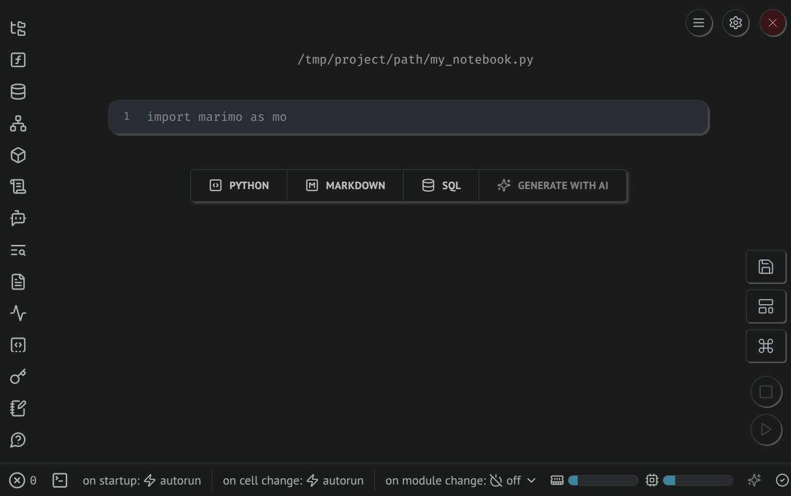
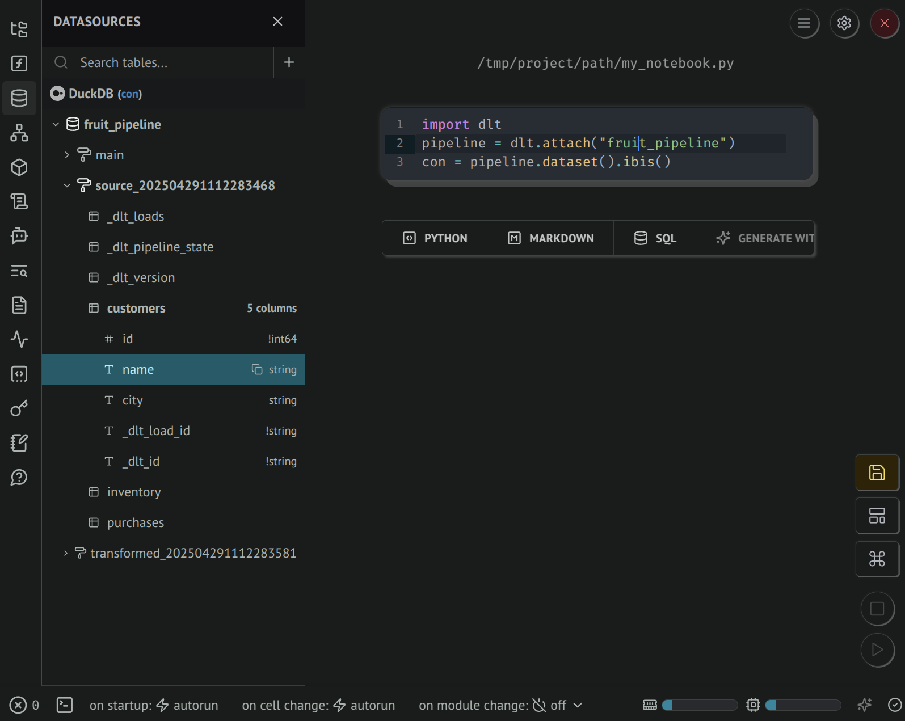
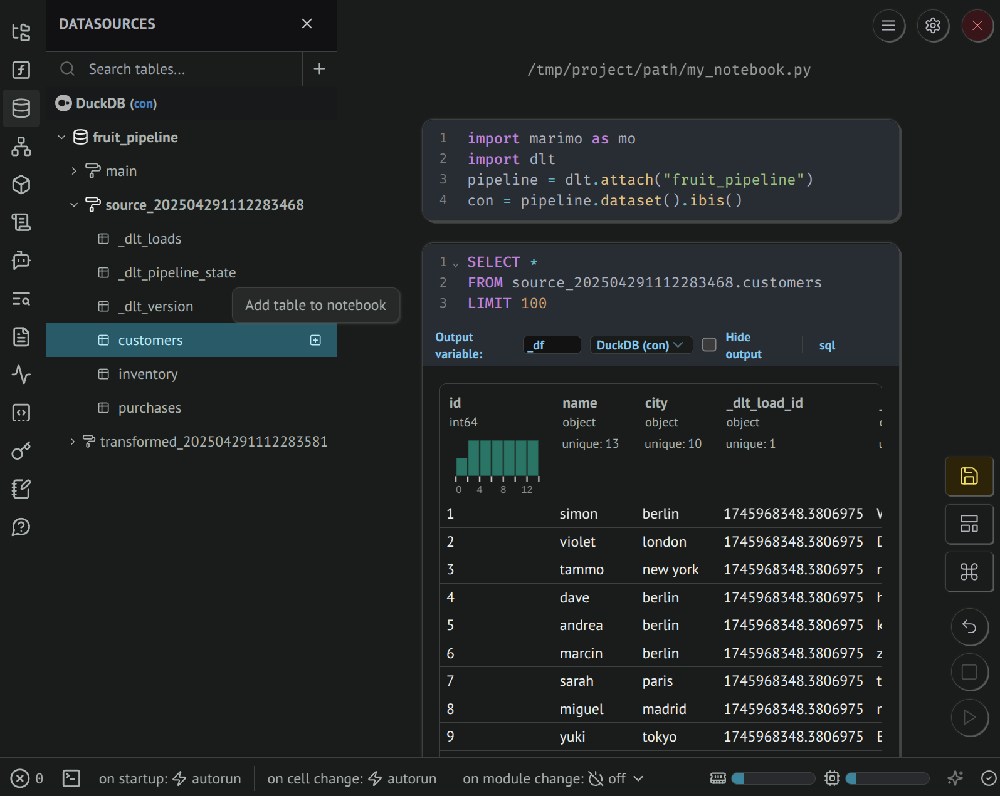
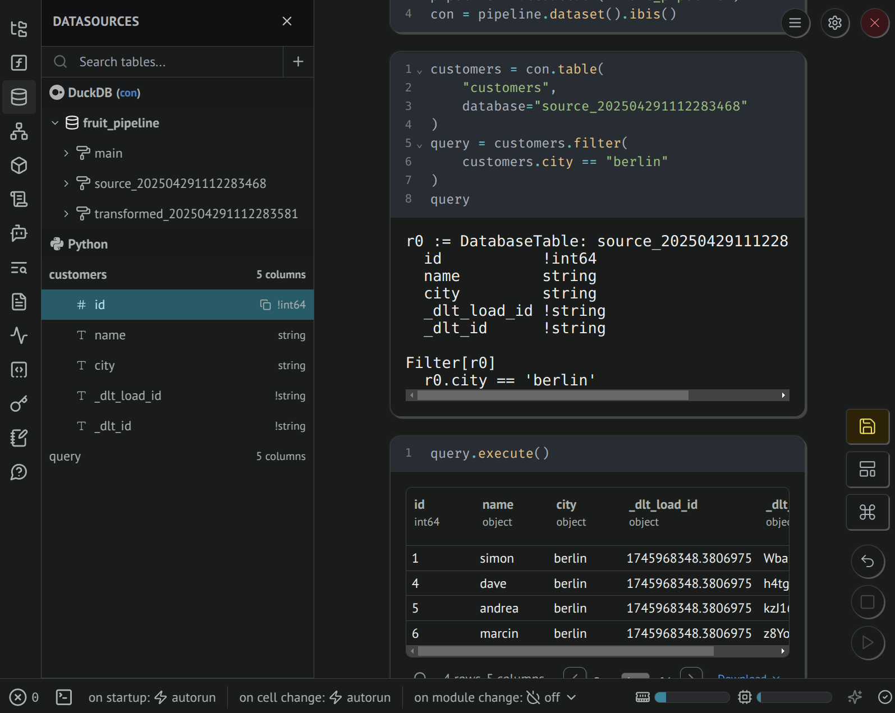

# Explore your data with marimo

[marimo](https://github.com/marimo-team/marimo) is a reactive Python notebook. It completely revamps the Jupyter notebook experience. Whenever code is executed or you interact with a UI element, dependent cells are re-executed ensuring consistency between code and displayed outputs.

This page shows how dlt + marimo + [ibis](./ibis-backend.md) provide a rich environment to explore loaded data, write data transformations, and create data applications.

## Prerequisites

To install marimo and ibis with the duckdb extras, run the following command: 

```sh
pip install marimo "ibis-framework[duckdb]"
```

## Launch marimo

Use this command to launch marimo (replace `my_notebook.py` with desired name). It will print a link to access the notebook web app.

```sh
marimo edit my_notebook.py

> Edit my_notebook.py in your browser 📝
>   ➜  URL: http://localhost:2718?access_token=Qfo_Hj2RbXqiqM4VT3XOwA 
```

Here's a screenshot of the interface you should see:




## Features

### Use custom dlt widgets

Inside your marimo notebook, you can use widgets built and maintained by the dlt team.

Simply import them from `dlt.helpers.marimo` and pass them to the `render()` function. Note that `render()` is asynchronous and must be awaited with `await`.

```py
#%% cell 1
import marimo as mo
from dlt.helpers.marimo import render, load_package_viewer

#%% cell 2
await render(load_package_viewer)
```


### View dataset tables and columns

After loading data with dlt, you can access it via the [dataset interface](./dataset.md), including a [native ibis connection](./ibis-backend.md).

In marimo, the **Datasources** panel provides a GUI to explore data tables and columns. When a cell contains a variable that's an ibis connection, it is automatically registered.



### Accessing data with SQL

Clicking on the **Add table to notebook** button will create a new SQL cell that you can use to query data. The output cell provides a rich and interactive results dataframe. 

:::note
The **Datasources** displays a limited range of data types.
:::




### Accessing data with Python

You can also retrieve Ibis tables (lazy expressions) using Python. The **Datasources** panel will show under **Python** the output schema of your Ibis query, and the cell output will display detailed query planning.

Use `.execute()`, `.to_pandas()`, `.to_polars()`, or `.to_pyarrow()` to execute the Ibis expression and retrieve data that can displayed in a rich and interactive dataframe.

:::note
The **Datasources** displays a limited range of data types.
:::



### Create a dashboard and data apps

marimo notebooks can be [deployed as web applications with interactive UI and charts](https://docs.marimo.io/guides/apps/) and the code hidden. Try adding [marimo UI input elements](https://docs.marimo.io/guides/interactivity/), rich markdown, and charts (matplotlib, plotly, altair, etc.). Combined, dlt + marimo + ibis make it easy to build a simple dashboard on top of fresh data.


## Further reading

- [Access loaded data in Python using dlt datasets](./dataset.md).
- [Learn about marimo dataframe and SQL features](https://docs.marimo.io/guides/working_with_data/)
- [Explore databases using the marimo GUI](https://docs.marimo.io/guides/coming_from/streamlit/)
- [Learn about marimo if you're coming from Streamlit](https://docs.marimo.io/guides/coming_from/streamlit/)