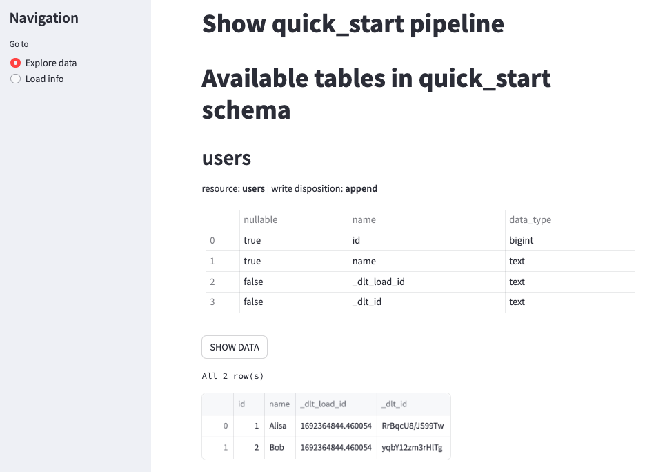
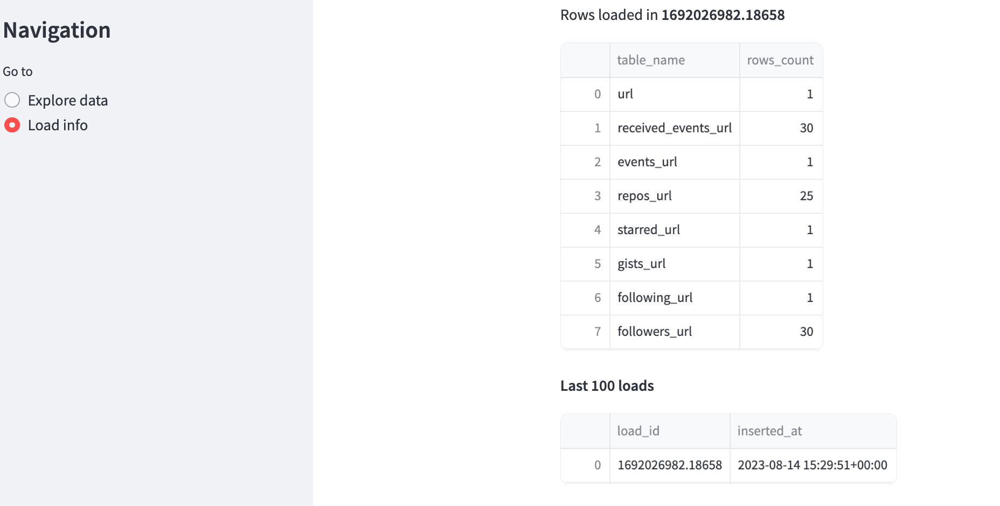

import Tabs from '@theme/Tabs';
import TabItem from '@theme/TabItem';


# Getting Started

## Overview

`dlt` is an open-source library that enables you to create a data
[pipeline](../general-usage/glossary#pipeline) in a Python script. Once set up,
it will automatically load any [source](../general-usage/glossary#source) (e.g.
an API) into a live dataset stored in
the [destination](../general-usage/glossary#destination) of your choice.

## Installation

Official releases of `dlt` can be installed from [PyPI](https://pypi.org/project/dlt/):

```bash
pip install dlt
```

The primary invocation of `pip` will load `dlt`, along with any of its mandatory dependencies. For
installation of optional dependencies, like `duckdb` (which you can use as a destination), use the
following command:

```bash
pip install dlt[duckdb]
```

Please see the [installation page](../reference/installation) for details.

## Quick start

Once you have `dlt` installed, you’re ready to get started. To test it out, you might want to upload
a test data example to the `duckdb` database as a destination:

```python
import dlt

data = [
    {'id': 1, 'name': 'Alisa'},
    {'id': 2, 'name': 'Bob'}
]

pipeline = dlt.pipeline(
    pipeline_name='quick_start',
    destination='duckdb',
    dataset_name='mydata'
)
load_info = pipeline.run(data, table_name="users")
print(load_info)
```

You're now ready to run the pipeline!

If you use Jupyter Notebook, then run this cell as usual.

Otherwise, save this python script with the name `quick_start_pipeline.py` and run the following
command:

```bash
python3 quick_start_pipeline.py
```

The output should look like:

```bash
Pipeline quick_start completed in 0.59 seconds
1 load package(s) were loaded to destination duckdb and into dataset mydata_20230818012044
The duckdb destination used duckdb:////home/user-name/quick_start/quick_start.duckdb location to store data
Load package 1692364844.460054 is LOADED and contains no failed jobs
```

Now explore your data!

To see the schema of your created database, run Streamlit command:

```bash
dlt pipeline <pipeline_name> show
```

For example above pipeline name is “quick_start”, so run:

```bash
dlt pipeline quick_start show
```

[This command](../reference/command-line-interface#show-tables-and-data-in-the-destination) generates
and launches a simple Streamlit app that you can use to inspect the schemas and data in the
destination.


Streamlit Explore data. Schema and data for a test pipeline “quick_start”.

What is next?

- What is a data pipeline?
  [General usage: Pipeline.](../general-usage/pipeline)
- How to create your own pipeline?
  [Walkthrough: Create a pipeline](../walkthroughs/create-a-pipeline).
- How to configure DuckDB?
  [Destinations: DuckDB.](../dlt-ecosystem/destinations/duckdb)
- [The full list of available destinations.](../dlt-ecosystem/destinations/)
- Visualisation:
  [Exploring the data](../dlt-ecosystem/visualizations/exploring-the-data).
- What happens after loading?
  [Understanding the tables](../dlt-ecosystem/visualizations/understanding-the-tables).
- Are there existed pipelines?
  [Walkthrough: Add a verified sources.](../walkthroughs/add-a-verified-source)
- [Try the Colab Demo.](../getting-started/try-in-colab)

## Basics

As described above, `dlt` is intended for quick and easy creation of data pipelines to automatically
load data from any [source](../general-usage/glossary#source) into a chosen
[destination](../general-usage/glossary#destination).

Let's look at simple examples of loading data from various sources.

### Simple data loading

Examples:

<Tabs
  groupId="source-type"
  defaultValue="json"
  values={[
    {"label": "from json", "value": "json"},
    {"label": "from CSV", "value": "csv"},
    {"label": "from API", "value": "api"},
    {"label": "from Database", "value":"database"}
]}>
  <TabItem value="json">

```python
import json
import dlt

def load_json(file_path):
  with open(file_path, 'r') as file:
      data = json.load(file)
  yield data

pipeline = dlt.pipeline(
  pipeline_name='quick_start',
  destination='duckdb',
  dataset_name='mydata'
)
load_info = pipeline.run(load_json("path/to.json"), table_name="json_data")
print(load_info)
```

  </TabItem>
  <TabItem value="csv">

```python
import dlt
import pandas as pd

def load_csv(file_path):
  yield pd.read_csv(file_path).to_dict(orient='records')

pipeline = dlt.pipeline(
  pipeline_name='quick_start',
  destination='duckdb',
  dataset_name='mydata'
)
load_info = pipeline.run(load_csv("path/to.csv"), table_name="csv_data")
print(load_info)
```

  </TabItem>
  <TabItem value="api">

```python
import dlt
import requests

def get_user_repo(username: str) -> dict:
  # url to request
  url = f"https://api.github.com/users/{username}"
  # make the request and return the json
  user_data = requests.get(url).json()
  yield user_data

pipeline = dlt.pipeline(
  pipeline_name='quick_start',
  destination='duckdb',
  dataset_name='mydata'
)
load_info = pipeline.run(get_user_repo("dlt-hub"))
print(load_info)
```

  </TabItem>
  <TabItem value="database">

This script connects to your DuckDB database file (`duckdb_database.duckdb` in this case, replace
it with your database file), executes a SQL query (`SELECT * FROM your_table` in this case,
replace it with your query), fetches all the result and then closes the connection. Make sure to
replace `your_table` with your actual table name in the DuckDB database.

```python
import dlt
import duckdb

def load_data_from_duckdb(db_name, query):
  # connect to the DuckDB
  con = duckdb.connect(db_name)
  # execute SQL query and fetch result
  result = con.execute(query).fetch_df()
  # close the connection
  con.close()
  yield result.to_dict(orient="records")

db_name = "path_to_your_db"  # Replace this with the path to your DuckDB database file
sql_query = "SELECT * FROM your_table"  # Replace with your SQL query

data = load_data_from_duckdb(db_name, sql_query)

pipeline = dlt.pipeline(
  pipeline_name='quick_start',
  destination='duckdb',
  dataset_name='mydata'
)
load_info = pipeline.run(data)
print(load_info)
```

  </TabItem>
</Tabs>

### Use dlt source and resource decorators

Why use them?

- A source is a function decorated with `@dlt.source` that returns one or more resources.
- A source can optionally define a [schema](../general-usage/schema) with
  tables, columns, performance hints and more.
- The source Python module typically contains optional customizations and data transformations.
- The source Python module typically contains the authentication and pagination code for particular
  API.

Examples:

- json

  Create dynamic tables

  ```python
  import json
  from glob import glob
  from typing import Sequence

  import dlt

  def load_json(file_path: str) -> dict:
      with open(file_path, 'r') as file:
          data = json.load(file)
      return data

  @dlt.source
  def json_source(folders: Sequence[str] = dlt.secrets.value):
      for folder in folders:
          yield dlt.resource(json_resource, name=folder.split("/")[-1])(folder)

    def json_resource(folder: str) -> dict:
        files = glob(f'{folder}/**/*.json', recursive=True)
        for file_path in files:
            yield load_json(file_path)

  pipeline = dlt.pipeline(
      pipeline_name='quick_start',
      destination='duckdb',
      dataset_name='mydata',
      full_refresh=True,
  )

  data = json_source(["./folder_1", "./folder_2"])
  load_info = pipeline.run()
  print(load_info)
  ```

- API

  Endpoints as different resources

  ```python
  import dlt
  import requests

  @dlt.source
  def get_user_repo(username: str) -> dict:
      # url to request
      url = f"https://api.github.com/users/{username}"
      # make the request and return the json
      user_data = requests.get(url).json()
      for k, v in user_data.items():
          if "url" in k:
              yield dlt.resource(get_details, name=k)(v)

  def get_details(url: str) -> dict:
      try:
          details = requests.get(url).json()
          yield details
      except requests.exceptions.JSONDecodeError:
          yield None

  pipeline = dlt.pipeline(
      pipeline_name='quick_start',
      destination='duckdb',
      dataset_name='mydata',
      full_refresh=True
  )
  load_info = pipeline.run(get_user_repo("dlt-hub"))
  print(load_info)
  ```

  
  Streamlit Load info. Created tables with all available info about dlt-hub repository on GitHub.

Read more:

- Glossary: [source](../general-usage/glossary#source) and
  [resource](../general-usage/glossary#resource).
- General usage: [source](../general-usage/source) and
  [resource](../general-usage/resource).
- [Walkthrough: Create a pipeline](../walkthroughs/create-a-pipeline).
- [Walkthrough: Run a pipeline](../walkthroughs/run-a-pipeline).

### Use existed verified sources

To use existed verified source, just run
the `dlt init` [command](../reference/command-line-interface#dlt-init).

List all verified
sources:

```bash
dlt init --list-verified-sources
```

Shows all available verified sources and their short descriptions. For each source, checks if your
local `dlt` version requires update and prints the relevant warning.

Consider an example of a pipeline for an online platform [chess.com](http://chess.com) that loads
data about players and games.

This command will
initialize [the pipeline example](https://github.com/dlt-hub/verified-sources/blob/master/sources/asana_dlt_pipeline.py) with
Chess as the source and `duckdb` as
the [destination](../dlt-ecosystem/destinations):

```bash
dlt init chess duckdb
```

Read more:

- [Glossary: Verified source](../general-usage/glossary#verified-source).
- [The full list of existed sources.](../dlt-ecosystem/verified-sources/)
- CLI: [`dlt init` command](../reference/command-line-interface#dlt-init)
- [Walkthrough: Add a verified sources.](../walkthroughs/add-a-verified-source)
- [Walkthrough: Run a pipeline](../walkthroughs/run-a-pipeline).
- [Build a pipeline: from basic to advanced.](../getting-started/build-a-data-pipeline)

## Improve your pipeline sources

If you want to take full advantage of the `dlt` library, then we strongly suggest that you build
your sources out of existing **building blocks:**

- Declare your [resources](../general-usage/resource) and group them in
  [sources](../general-usage/source) using Python decorators.
- [Connect the transformers to the resources](../general-usage/resource#feeding-data-from-one-resource-into-another)
  to load additional data or enrich it.
- [Create your resources dynamically from data](../general-usage/source#create-resources-dynamically).
- [Append, replace and merge your tables](../general-usage/incremental-loading).
- [Transform your data before loading](../general-usage/resource#customize-resources)
  and see some
  [examples of customizations like column renames and anonymization](../general-usage/customising-pipelines/renaming_columns).
- [Set up "last value" incremental loading](../general-usage/incremental-loading#incremental-loading-with-last-value).
- [Dispatch data to several tables from a single resource](../general-usage/resource#dispatch-data-to-many-tables).
- [Set primary and merge keys, define the columns nullability and data types](../general-usage/resource#define-schema).
- [Pass config and credentials into your sources and resources](../general-usage/credentials).
- Use google oauth2 and service account credentials, database connection strings and define your own
  complex credentials: see examples below.

Concepts to grasp:

- [Credentials](../general-usage/credentials) and their
  ["under the hood"](https://github.com/dlt-hub/dlt/blob/devel/docs/technical/secrets_and_config.md).
- [Incremental loading.](../general-usage/incremental-loading)
- [Schemas, naming conventions and data normalization](../general-usage/schema).
- [How we distribute sources to our users](https://github.com/dlt-hub/verified-sources/blob/master/docs/DISTRIBUTION.md).
