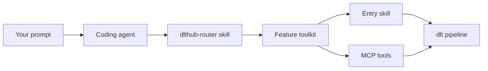

# Introduction

The dltHub AI Harness is a set of skills, rules, and MCP servers that turn a coding agent (Claude Code, Cursor, or Codex) into a dlt-aware data engineer. It draws from [dltHub Context](https://dlthub.com/context), a hub of deeply researched context on REST APIs across SaaS sources, databases, and destinations, so your agent pulls exactly what it needs to code any dlt pipeline.

You describe what you want, the agent picks the right toolkit and writes the pipeline code, and dltHub runs it end to end: ingestion, validation, transformation, deployment, and observation. Agents propose, humans validate, deterministic tooling enforces the boundaries.

## Agentic workflows

The AI Harness kicks in whenever you describe a data-engineering goal to your agent. A few examples:

- "I want to ingest pull requests and issues from the GitHub REST API."
- "Load CSVs from an S3 bucket into DuckDB."
- "Explore data from the pipeline I just ran and build a marimo dashboard."
- "Deploy this pipeline and schedule it to run every day at 6 AM."

Each prompt maps to a toolkit, whose skills guide the agent through the workflow end to end.

## Toolkit components

The AI Harness bundles four kinds of artifacts into installable units called [**toolkits**](toolkits.md):

| Artifact | What it is | Example |
| --- | --- | --- |
| Skill | Step-by-step procedure the agent follows for a specific task | `find-source`, `debug-pipeline`, `prepare-deployment` |
| Rule | Always-on context the agent loads every session | Coding conventions, security constraints |
| Workflow | Ordered sequence of skills with a fixed entry point, loaded as a rule so it's always active | REST API pipeline workflow, Deploy workflow |
| MCP server | Tools the agent can call from inside a session | `dlt-workspace-mcp` exposes pipeline, schema, and secrets tools |

Every [dltHub workspace](../getting-started/installation.md#what-is-a-dlthub-workspace) starts with one toolkit, `init`, which ships an MCP server (`dlt-workspace-mcp`) and a router skill called `dlthub-router`. From there, feature toolkits (`rest-api-pipeline`, `sql-database-pipeline`, `filesystem-pipeline`, `transformations`, `data-quality`, `dlthub-platform`, and more) are added as you need them.

`dlthub-router` is what makes the flow feel natural: it reads your intent, automatically installs the right feature toolkit, and hands off to that toolkit's entry skill.

## Iterative data engineering development

Data pipelines evolve in loops. You build locally, refine on real data, deploy, watch the results in production, and feed those observations back into the next iteration. The AI Harness is designed around this loop and makes each turn faster.

**Faster build cycles.** The agent scaffolds a pipeline from your prompt, runs it, and iterates. Skills like `/validate-data`, `/view-data`, and the `data-quality` toolkit's checks let it inspect what actually landed at the destination after each change, so the next fix is based on the real data via `dlt-workspace-mcp` rather than assumptions about it.

**One workspace across phases.** Ingestion, transformation, exploration, and deployment toolkits all layer onto the same workspace. When a dashboard surfaces a bad number in production, the same harness that built the ingestion pipeline can adjust the upstream source or add a data-quality check to prevent it from recurring.

**Progressive complexity.** You start with `rest-api-pipeline` for a first ingestion, add `data-quality` when you need checks, `transformations` when the raw shape isn't enough, and `dlthub-platform` when you're ready for production. The router installs each toolkit on demand as the work calls for it.

## What's next

- [Toolkits](toolkits.md): catalog of toolkits and where each fits in the development cycle.
- [Installation](installation.md): set up a workspace, in one command or step-by-step.
- [Deployment](deployment.md): take a pipeline to production with the `dlthub-platform` toolkit.
