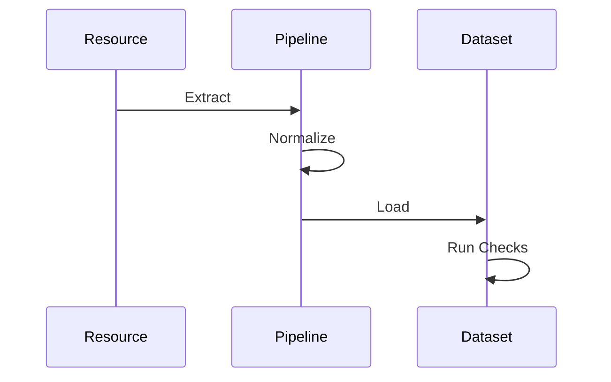
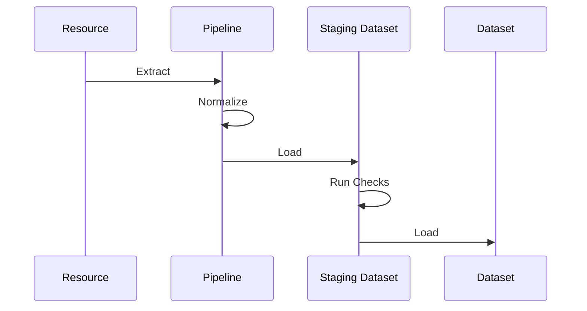
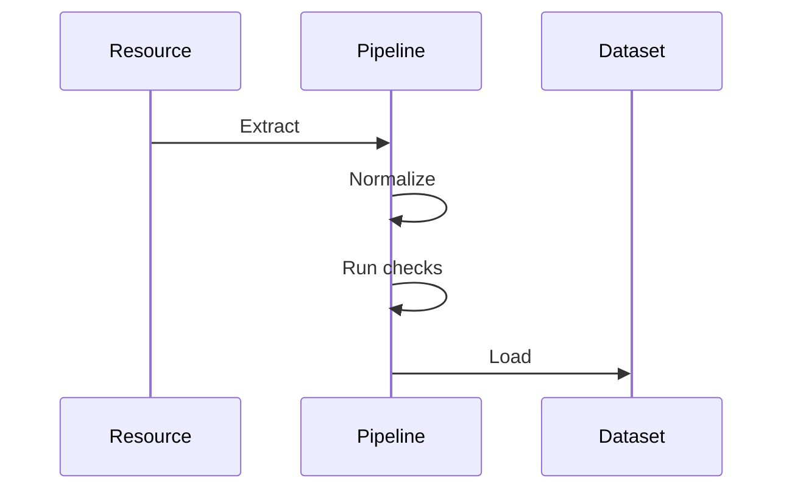

:::warning
🚧 This feature is under development. Interested in becoming an early tester? [Join dltHub early access](https://info.dlthub.com/waiting-list).
:::

dltHub data quality features include metrics for monitoring dataset properties over time, and checks to validate them against expectations. Metrics are quantitative measures (e.g., max value, row count, distinct value count) and checks are rules with pass / fail outcomes (e.g., "does column `order_id` contain unique values?"). Together, they offer visibility and allow to catch data issues early

Metrics and checks are defined via Python code. The extensive configuration allows you to specify what to monitor and validate, when, how, and where to store results.


## Metrics

A **data quality metric** or **metric** a function applied to data that returns a scalar value describing a property of the data. A metric can take as input a column, a table, or the full dataset (i.e., all tables and historical metrics).

### Available metrics

Here's the list of built-in metrics:

```python
from dlt.hub import data_quality as dq

# column-level
dq.metrics.column.maximum("col")
dq.metrics.column.minimum("col")
dq.metrics.column.mean("col")
dq.metrics.column.median("col")
dq.metrics.column.mode("col")
dq.metrics.column.sum("col")
dq.metrics.column.standard_deviation("col")
dq.metrics.column.quantile("col", quantile=0.95)
dq.metrics.column.null_count("col")
dq.metrics.column.null_rate("col")
dq.metrics.column.unique_count("col")
dq.metrics.column.average_length("col")
dq.metrics.column.minimum_length("col")
dq.metrics.column.maximum_length("col")

# table-level
dq.metrics.table.row_count()  # Number of rows in table
dq.metrics.table.unique_count()  # Number of distinct / unique rows in table
dq.metrics.table.null_row_count()  # Number of rows where all columns are null

# dataset-level
dq.metrics.dataset.total_row_count()  # Total number of rows
dq.metrics.dataset.load_row_count()  # Rows added in latest load
dq.metrics.dataset.latest_loaded_at()  # Timestamp of most recent load
```

:::note
If you have built-in metrics requests, let us know. Custom metrics are planned.
:::

### Define metrics
#### Static

You can define metrics along your `@dlt.resource` via the new decorato `@with_metrics`. It is available under the `dlt.hub.data_quality` module, commonly imported as `dq`. Inside the decorator, you can set the individual metrics available through `dq.metrics.column.`, `dq.metrics.table.`, or `dq.metrics.dataset.`.

The next snippet defines 3 metrics on the `customers` resource: the mean of the `amount` column, the number of null values in the `email` column, and the total number of rows in the table. 

:::note
Only column-level and table-level metrics can be defined on a `@dlt.resource`. To set dataset-level metrics, use `@with_metrics` on the `@dlt.source`.
:::


```python
import dlt
from dlt.hub import data_quality as dq

@dq.with_metrics(
    dq.metrics.column.mean("amount"),
    dq.metrics.column.null_count("email"),
    dq.metrics.table.row_count()
)
@dlt.resource
def customers():
    yield data
```

The next snippet shows how to add dataset-level metrics to a source. The `total_row_count` is added on the `crm` source.

```python
import dlt
from dlt.hub import data_quality as dq

@dq.with_metrics(
    dq.metrics.column.mean("amount"),
    dq.metrics.column.null_count("email"),
    dq.metrics.table.row_count()
)
@dlt.resource
def customers():
    yield data


@dq.with_metrics(
    dq.metrics.dataset.total_row_count()
)
@dlt.source
def crm():
    return [customers]
```

#### Dynamic

Similar to the static approach, you can add metrics to an instantiated resource or source object using `with_metrics`. This is particularly useful when using built-in sources and resources like `filesystem`, `rest_api` or `sql_database`.

```python
import dlt
from dlt.hub import data_quality as dq

@dlt.resource
def customers():
    yield data

# later
customers = dq.with_metrics(
    customers,
    dq.metrics.column.mean("amount"),
    dq.metrics.column.null_count("email"),
    dq.metrics.table.row_count()
)
```

### Compute metrics

After loading data, compute metrics by running the special data quality metrics source:

```python
pipeline = dlt.pipeline("my_pipeline", destination=dlt.destinations.duckdb())
pipeline.run(customers())
dq.run_metrics(pipeline)
```

This executes all metrics defined on your resources and stores results in the `_dlt_dq_metrics` table.

### Read metrics

The convenience function `dq.read_metric()` allows you to retrieve stored metrics with some metadata. This makes it easy to build reporting, dashboard, or analytics over this data.

The function produces a `dlt.Relation` which can be converted to a list, pandas dataframe, arrow table, etc.

```python
dataset = pipeline.dataset()
# column-level `mean` as pandas.DataFrame
dq.read_metric(
    dataset, 
    table="customers", 
    column="amount", 
    metric="mean"
).df()

# table-level `row_count` as list of tuples
dq.read_metric(
    dataset, 
    table="customers", 
    metric="row_count"
).fetchall()

# dataset-level `total_row_count` as pyarrow.Table
dq.read_metric(
    dataset, 
    metric="total_row_count"
).arrow()
```


## Checks
A **data quality check** or **check** is a function applied to data that returns a **check result** or **result** (can be boolean, integer, float, etc.). The result that is converted to a success / fail **check outcome** or **outcome** (boolean) based on a **decision**.

:::info
A **test** verifies that **code** behaves as expected. A **check** verifies that the **data** meets some expectations. Code tests enable you to make changes with confidence and data checks help monitor your live systems.
:::

For example, the check `is_in(column_name, accepted_values)` verifies that the column only includes accepted values. Running the check counts successful records to compute the success rate (**result**). The **outcome** will be a success if success rate is 100%, i.e., all records succeeded the check (**decision**).

This snippet shows a single `is_in()` check being ran against the `orders` table in the `point_of_sale` dataset.

```py
import dlt
from dlt.hub import data_quality as dq

dataset = dlt.dataset("duckdb", "point_of_sale")
checks = [
    dq.checks.is_in("payment_methods", ["card", "cash", "voucher"])
]

# prepare a query to execute all checks
check_plan = dq.prepare_checks(dataset["orders"], checks=checks)
# execute checks and get results in-memory
check_plan.df()
```


### Check level
The **check level** indicates the granularity of the **check result**. For instance:
- **Row-level** checks produce a result per record. It's possible to inspect which specific records pass / failed the check.

- **Table-level** checks produce a result per table (e.g., result is "the number of unique values" and decision is "is this greater than 5?"). 

    These checks can often be rewritten as row-level checks (e.g., "is this value unique?")

- **Dataset-level** checks produce a result per dataset. This typically involves multiple tables, temporal comparisons, or pipeline information (e.g., "the number of rows in 'orders' is higher than the number of rows in 'customers')

:::important
Notice that the **check level** relates to the result and not the **input data** of the check. For instance, a row-level check can involve multiple tables as input.
:::


### Built-in checks
The library `dlthub` includes many built-in checks: `is_in()`, `is_unique()`, `is_primary_key()`, and more. The built-in `case()` and `where()` simplify custom row and table-level checks respectively.

For example, the following are equivalent:

```py
from dlt.hub import data_quality as dq

dq.checks.is_unique("foo")
dq.checks.case("COUNT(*) OVER (PARTITION BY foo) > 1")
```


### Custom checks (WIP)
Can be implemented as a `dlt.hub.transformation` that matches a specific schema or as subclass of `_BaseCheck` for full control. This allows to use any language supported by transformations, allowing eager/lazy and in-memory/on-backend execution.

Notes:
- Should have utilities to statically validate check definitions (especially lazy)
- Should have testing utilities that makes it easy to unit test checks (same utilities as transformations)


## Data quality lifecycle
Data quality checks can be executed at different stages of the pipeline lifecycle. This choice has several impacts, including:
- the **input data** available for the check
- the compute resources used
- the **actions** available (e.g., drop invalid load)

<!--How does this affect transactions? How do we handle errors in the data quality part-->

#### Post-load
The post-load execution is the simplest option. The pipeline goes through `Extract -> Normalize -> Load` as usual. Then, the checks are executed on the destination.

Properties:
- Failed records can't be dropped or quarantined before load. All records must be written, checked, and then handled. This only works with `write_disposition="append"` or destinations supporting snapshots (e.g. `iceberg`, `ducklake`).
- Checks have access to the full dataset. This includes current and past loads + internal dlt tables.
- Computed directly on the destination. This scales well with the size of the data and the complexity of the checks.
- Results and outcome are directly stored on the dataset. No data movement is required.



#### Pre-load (staging)
The pre-load execution via staging dataset allows to execute checks on the destination and trigger actions before data is loaded into the dataset. This is effectively using **post-load** checks before a 2nd load phase.

:::info
`dlt` uses staging datasets for other features such as `merge` and `replace` write dispositions.
:::

Properties:
- Failed records can be dropped or quarantined before load. This works with all `write_disposition`
- Requires a destination that supports staging datasets.
- Checks have access to the current load. 
    - If the staging dataset is on the same destination, checks can access the full dataset. 
    - If the staging dataset is on a different destination, communication between the staging dataset and the dataset.
- Computed on the staging destination.  This scales well with the size of the data and the complexity of the checks.
- Data and checks results & outcome can be safely stored on the staging dataset until review. This helps human-in-the-loop workflows without reprocessing the full pipeline.





#### Pre-load (in-memory)

The pre-load execution in-memory will execute checks using `duckdb` against the load packages (i.e., temporary files) stored on the machine that runs `dlt`. This allows to trigger actions before data is loaded into the destination.

:::note
This is equivalent to using a staging destination that is the local filesystem. This section highlights the trade-offs of this choice.
:::

Properties:
- Failed records can be dropped or quarantined before load. This works with all `write_disposition
- Checks only have access to the current load. Checking against the full dataset requires communication between the staging destination and the main destination.
- Computed on the machine running the pipeline. The resource need to match the compute requirements.
- Data and checks results & outcome may be lost if the runtime is ephemeral (e.g., AWS Lambda timeout). In this case, the pipeline must process the data again.



## Migration and versioning (WIP)

As the real-world change, their can be addition, removal, or modification of data quality checks for your pipeline / dataset. This is require for proper auditing.

For example, the check `is_in("division", ["europe", "america"])` defined in 2024 could evolve to `is_in("division", ["europe", "america", "asia"])` in 2026.

Notes:
- checks need to be serialized and hashed (trivial for lazy checks)
- checks can be stored on schema (consequently on the destination too)
- this is the same challenge as versioning transformations

## Action (WIP)
After running checks, **actions** can be triggered based on the **check result** or **check outcome**. 

Notes:
- actions can be configured globally or per-check
- planned actions: drop data, quarantine data (move to a special dataset), resolve (e.g., fill value, set default, apply transformation), fail (prevents load), raise/alert (sends notification)
- This needs to be configurable from outside the source code (e.g., via `config.toml`). The same checks would require different action during development vs. prod


## Metrics


