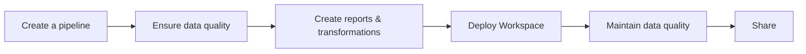

## What is dltHub?

dltHub is an LLM-native data engineering platform that lets any Python developer build, run, and operate production-grade data pipelines, and deliver end-user-ready insights without managing infrastructure.

dltHub is built around the open-source library [dlt](../intro.md). It uses the same core concepts (sources, destinations, pipelines) and extends the extract-and-load focus of `dlt` with:

* Enhanced developer experience
* Transformations
* Data quality
* AI-assisted (“agentic”) workflows
* Managed runtime

dltHub supports both local and managed cloud development. A single developer can deploy and operate pipelines, transformations, and notebooks directly from a dltHub Workspace, using a single command.
The dltHub Runtime, customizable workspace dashboard, and validation tools make it straightforward to monitor, troubleshoot, and keep data reliable throughout the whole end-to-end data workflow:

In practice, this means any Python developer can:

* Build and customize data pipelines quickly (with LLM help when desired).
* Derisk data insights by keeping data quality high with checks, tests, and alerts.
* Ship fresh dashboards, reports, and data apps.
* Scale the data workflows easily without babysitting infra, schema drift, and silent failures.

:::tip
Want to see it end-to-end? Watch the dltHub [Workspace demo](https://youtu.be/rmpiFSCV8aA).
:::

To get started quickly, follow the [installation instructions](getting-started/installation.md).

## Overview

### Key capabilities

1. **[LLM-native workflow](../dlt-ecosystem/llm-tooling/llm-native-workflow)**: accelerate pipeline authoring and maintenance with guided prompts and copilot experiences.
2. **[Transformations](features/transformations/index.md)**: write Python or SQL transformations with `@dlt.hub.transformation`, orchestrated within your pipeline.
3. **[Data quality](features/quality/data-quality.md)**: define correctness rules, run checks, and fail fast with actionable messages.
4. **[Data apps & sharing](../general-usage/dataset-access/marimo)**: build lightweight, shareable data apps and notebooks for consumers.
5. **[AI agentic support](features/mcp-server.md)**: use MCP servers to analyze pipelines and datasets.
6. **Managed runtime**: deploy and run with a single command—no infra to provision or patch.
7. **[Storage choice](ecosystem/iceberg.md)**: pick managed Iceberg-based lakehouse, DuckLake, or bring your own storage.

### How dltHub fits with dlt (OSS)

dltHub embraces the dlt library, not replaces it:
* dlt (OSS): Python library focused on extract & load with strong typing and schema handling.
* dltHub: Adds transformations, quality, agentic tooling, managed runtime, and storage choices, so you can move from local dev to production seamlessly.

dltHub extends the dlt developer experience with new [local workspace layout](workspace/init.md), [configuration profiles](core-concepts/profiles-dlthub.md), [additional CLI commands](command-line-interface.md), workspace dashboard, [MCP server](features/mcp-server.md) and more. 
Those developer experience improvements belong to **dltHub Free tier** and are distributed side by side with the `dlt` under [Apache 2.0 license](https://github.com/dlt-hub/dlt?tab=Apache-2.0-1-ov-file#readme). You can use **dltHub Free tier** right away - like you use regular `dlt`. 

All features that require a license are part of dltHub paid tiers (i.e. Basic tier) and are clearly marked as such in this documentation. Those features are shipped via `dlthub` Python package (available on [PyPI](https://pypi.org/project/dlthub/)) which is not open source and can be used with a valid license.

## dltHub products
dltHub consists of three main products. You can use them together or compose them based on your needs.

### Workspace

**[Workspace](workspace/overview.md) [Public preview]** - the unified environment for building, running, and maintaining data workflows end-to-end.

* Scaffolding and LLM helpers for faster pipeline creation.
* Integrated transformations (`@dlt.hub.transformation` decorator).
* Data quality rules, test runs, and result surfacing.
* Notebook and data apps (e.g., Marimo) for sharing insights.
* Visual dashboards for pipeline health and run history.

### Runtime

**Runtime [Private preview]** - a managed cloud runtime operated by dltHub:

* Scalable execution for pipelines and transformations.
* APIs, web interfaces, and auxiliary services.
* Secure, multi-tenant infrastructure with upgrades and patching handled for you.

:::tip
Prefer full control? See [Enterprise](#tiers--licensing) below for self-managed options.
:::

### Storage

**[Storage](ecosystem/iceberg.md) [In development]**. Choose where your data lives:

* Managed lakehouse: Iceberg open table format (or DuckLake) managed by dltHub.
* Bring your own storage: connect to your own lake/warehouse when needed.

## Tiers & licensing

Some of the features described in this documentation are free to use. Others require a paid plan. Latest pricing & full feature matrix can be found live on our website.
Most features support a self-guided trial right after install, check the [installation instructions](getting-started/installation.md) for more information.

| Tier                  | Best for                                                                                        | Runtime                        | Typical use case                                                              | Notes                                           | Availability    |
| --------------------- |-------------------------------------------------------------------------------------------------| ------------------------------ |-------------------------------------------------------------------------------|-------------------------------------------------|-----------------|
| **dltHub Free**       | Developers running **dlt ingestion pipelines** in production on **self-managed infrastructure** | Local Runtime (self-managed)   | Run and maintain ingestion pipelines in production on your own infrastructure | Ideal for self-hosted and ingestion-only setups | Public preview  |
| **dltHub Basic**      | Solo developers or small teams owning a **single pipeline + dataset + reports** end-to-end      | Managed dltHub Runtime         | Set up a pipeline quickly, add tests and transformations, share a simple app  | Optimized for velocity with minimal setup       | Private preview |
| **dltHub Scale**      | Data teams building **composable data platforms** with governance and collaboration             | Managed dltHub Runtime         | Multiple pipelines, shared assets, team workflows, observability              | Team features and extended governance           | Alpha           |
| **dltHub Enterprise** | Organizations needing **enterprise control** or **self-managed runtime**                        | Managed or self-hosted Runtime | On-prem/VPC deployments, custom licensing, advanced security                  | Enterprise features and deployment flexibility  | In development  |

### Who is dltHub for?

* Python developers who want production outcomes without becoming infra experts.
* Lean data teams standardizing on dlt and wanting integrated quality, transforms, and sharing.
* Organizations that prefer managed operations but need open formats and portability.

:::note
* You can start on Basic and upgrade to Scale or Enterprise later, no code rewrites.
* We favor open formats and portable storage (e.g., Iceberg), whether you choose our managed lakehouse or bring your own.
* For exact features and pricing, check the site; this section is meant to help you choose a sensible starting point.
:::
