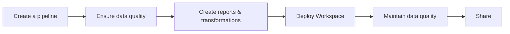

# Introduction

## What is dltHub?

dltHub is an LLM-native data engineering platform that lets any Python developer build, run, and operate production-grade data pipelines, and deliver end-user-ready insights without managing infrastructure.

dltHub is built around the open-source library [dlt](../intro.md). It uses the same core concepts (sources, destinations, pipelines) and extends the extract-and-load focus of `dlt` with:

* Enhanced developer experience
* Transformations
* Data quality
* AI-assisted ("agentic") workflows
* Managed dltHub platform

dltHub supports both local and managed cloud development. A single developer can deploy and operate pipelines, transformations, and notebooks directly from a dltHub Workspace, using a single command.
The dltHub platform, customizable workspace dashboard, and validation tools make it straightforward to monitor, troubleshoot, and keep data reliable throughout the whole end-to-end data workflow:

In practice, this means any Python developer can:

* Build and customize data pipelines quickly (with LLM help when desired).
* Derisk data insights by keeping data quality high with checks, tests, and alerts.
* Ship fresh dashboards, reports, and data apps.
* Scale the data workflows easily without babysitting infra, schema drift, and silent failures.

:::tip
Want to see it end-to-end? Watch the dltHub [Workspace demo](https://youtu.be/rmpiFSCV8aA).
:::

To get started quickly, follow the [installation instructions](getting-started/installation.md).

## What you can do with dltHub

dltHub covers the end-to-end data workflow. The capabilities are grouped into six areas — pick the entry point that matches what you're trying to do.

### Ingestion pipeline development

Build extract-and-load pipelines from REST APIs, SQL databases, cloud storage, and Python data structures, with schema inference, normalization, and incremental loading provided by the underlying `dlt` library.

* [Workspace scaffolding](workspace/init.md) — initialize a project structure that fits how `dlt` pipelines are developed and deployed.
* [AI workbench (LLM-native workflow)](../dlt-ecosystem/llm-tooling/llm-native-workflow.md) — generate REST API, SQL database, and filesystem pipelines from prompts using ingestion development toolkits.
* [Premium destinations](ecosystem/iceberg.md) — load to Iceberg lakehouses, [Delta Lake](ecosystem/delta.md), [Snowflake Plus](ecosystem/snowflake_plus.md), or [MS SQL with change tracking](ecosystem/ms-sql.md).

### Transformation pipeline development

Write transformations next to your ingestion pipelines so they share datasets, schemas, and deployment.

* [`@dlt.hub.transformation`](features/transformations/index.md) — Python-decorated transformations that run as part of your pipeline graph.
* [dbt integration](features/transformations/dbt-transformations.md) — run dbt projects with a local cache, schema enforcement, and integrated debugging.
* AI workbench transformation toolkit — generate and refactor Python and SQL transformations from prompts, including incremental transformations and ontology-driven modeling (in development).

### Pipeline operations

Deploy, schedule, and monitor pipelines, transformations, and notebooks without standing up infrastructure.

* [dltHub platform](runtime/overview.md) — one-command deploy of an entire workspace, cron and event-driven triggers, followup jobs, freshness checks, and refresh cascades.
* [Profiles](core-concepts/profiles-dlthub.md) — isolate `dev`, `prod`, and `access` configurations and credentials.
* [Regions](runtime/regions.md) — choose where your data plane runs.
* [Workspace dashboard](../general-usage/dashboard.md) — observe runs, schemas, load history, and lineage from a single UI.

### Data quality & governance

Catch data issues before they reach consumers and keep schemas under control as sources change.

* [Data quality checks](features/quality/data-quality.md) — declarative correctness rules with actionable failure messages.
* [Tests](features/quality/tests.md) and [advanced quality features](features/quality/advanced.md) — author and run tests against your datasets as part of a pipeline.
* Quality metrics in the UI and quarantining of bad records (in development).

### Data discovery & serving

Turn loaded data into something stakeholders can use — notebooks, dashboards, MCP-served context, and shareable links.

* [Datasets](core-concepts/datasets.md) — typed Python and SQL access to loaded data.
* [Marimo notebooks](../general-usage/dataset-access/marimo.md) — build lightweight, shareable data apps.
* [MCP server](features/mcp-server.md) — expose pipelines and datasets to agentic clients (Cursor, Claude, Continue, etc.).
* Public links for interactive jobs — share notebooks and dashboards externally without granting platform access.

### Platform capabilities

Foundations that the rest of the platform builds on.

* GitHub OAuth authentication and small-team workflows.
* [Managed, multi-tenant runtime](runtime/overview.md) with upgrades and patching handled for you.
* Secure secrets management per profile.
* Consumption tracking, billing, and self-serve onboarding (in development).
* Open storage choices — managed Iceberg/DuckLake, or bring your own lake/warehouse.

## How dltHub fits with dlt (OSS)

dltHub embraces the dlt library, not replaces it:

* **dlt (OSS):** Python library focused on extract & load with strong typing and schema handling.
* **dltHub:** Adds transformations, quality, agentic tooling, a managed platform, and storage choices, so you can move from local dev to production seamlessly.

dltHub extends the dlt developer experience with a new [local workspace layout](workspace/init.md), [configuration profiles](core-concepts/profiles-dlthub.md), [additional CLI commands](command-line-interface.md), a workspace dashboard, [MCP server](features/mcp-server.md), and more.
Those developer experience improvements belong to the **dltHub Free tier** and are distributed side by side with `dlt` under the [Apache 2.0 license](https://github.com/dlt-hub/dlt?tab=Apache-2.0-1-ov-file#readme). You can use the **dltHub Free tier** right away — like you use regular `dlt`.

All features that require a license are part of the paid dltHub tiers and are clearly marked as such in this documentation. Those features are shipped via the `dlthub` Python package (available on [PyPI](https://pypi.org/project/dlthub/)), which is not open source and can be used with a valid license.

## Pricing and licensing

Some features are free to use, others require a paid plan. For the up-to-date plan comparison and pricing, see the [dltHub pricing page](https://dlthub.com/pricing).
Most paid features support a self-guided trial right after install — see the [installation instructions](getting-started/installation.md) for details.

### Who is dltHub for?

* Python developers who want production outcomes without becoming infra experts.
* Lean data teams standardizing on dlt and wanting integrated quality, transforms, and sharing.
* Organizations that prefer managed operations but need open formats and portability.

:::note
* You can start on a smaller plan and upgrade later — no code rewrites.
* We favor open formats and portable storage (e.g., Iceberg), whether you choose our managed lakehouse or bring your own.
* For exact features and pricing, check the [pricing page](https://dlthub.com/pricing); this section is meant to help you choose a sensible starting point.
:::
