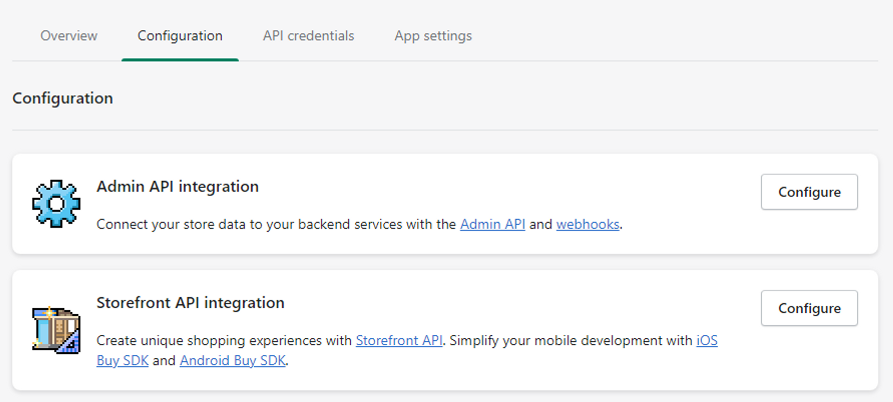
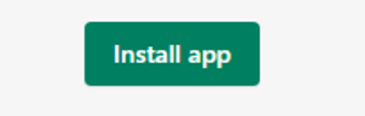

# Shopify pipeline setup guide

Shopify is a user-friendly e-commerce solution that enables anyone to easily create and manage their own online store.

This `dlt` pipeline is designed to efficiently load data from multiple endpoints, including customers, orders, and products, into a destination of your choice. 

## Grab API token

1. Start by logging in to your Shopify account.
2. Click on the settings icon⚙️, located at the bottom left corner of the left-hand menu.
3. Select “Apps and sales channels” from the menu that appears.
4. Click on the “Develop apps” tab.
5. Choose “Create an app” and provide the necessary details, such as the name of your app and its developer.
6. Next, click on the “Configuration” tab and select the “Configure” option for “Admin API integration,” as shown in the image below:

  

7. In the “Admin API access scopes” section, grant read access to the endpoints from which you want to load data.
8. Click on the Save button at the bottom of the Configuration.
9. Click on “Install app” at the top of the page and confirm.

    

10. Finally, click on “reveal the Admin API access token” and copy it. This token will be used in dlt `secrets.toml` for authentication and will be displayed only once, so better keep it safe.

## Initialize the pipeline[](https://dlthub.com/docs/pipelines/github#initialize-the-pipeline)

To get started with your data pipeline, follow these steps:

1. Open up your terminal or command prompt and navigate to the directory where you'd like to create your project.
2. Enter the following command:

```bash

dlt init shopify_dlt bigquery
```

This command will initialize your pipeline with Shopify as the source and BigQuery as the destination. If you'd like to use a different destination, simply replace **`bigquery`** with the name of your preferred destination. You can find supported destinations and their configuration options in our [documentation](https://dlthub.com/docs/destinations/duckdb) 

3. After running this command, a new directory will be created with the necessary files and configuration settings to get started. From here, you can begin configuring your pipeline to suit your specific needs.

```bash
shopify_pipeline
├── .dlt
│   ├── .pipelines
│   ├── config.toml
│   └── secrets.toml
├── shopify_dlt
│   └── __pycache__
│   └── __init__.py
│   └── queries.py
├── .gitignore
├── shopify_dlt_pipeline.py
└── requirements.txt
```

## Add credentials

1. Inside the **`.dlt`** folder, you'll find a file called **`secrets.toml`**, which is where you can securely store your access tokens and other sensitive information. It's important to handle this file with care and keep it safe. The `secrets.toml` looks like this:

```bash
#shopify
[sources.shopify]
private_app_password=" Please set me up !" #Admin API access token copied above

# bigquery
[destination.bigquery.credentials] # the credentials required will change based on the destination
project_id = "Please set me up !" # GCP project ID
private_key = "Please set me up !" # Unique private key (including `BEGINand END PRIVATE KEY`)
client_email = "Please set me up !" # Service account email
location = "Please set me up !" # Project location (e.g. “US”)
```

2. Replace the value of `private_app_password` with the `API access token` that [you copied above](shopify.md#grab-api-token). This will ensure that your data pipeline can access your Shopify resources securely.
3. Inside the **`.dlt`** folder, you'll find another file called **`config.toml`**,  where you can store your shopify url. The `config.toml` looks like this: 

```python
[sources.shopify_dlt]
shop_url = "Please set me up !" # please set me up!
```

4. Replace `shop_url` with the  URL of your Shopify store.  For example
”https://shop-123.myshopify.com/”
5. Finally, follow the instructions in **[Destinations](https://dlthub.com/docs/destinations/duckdb)** to add credentials for your chosen destination. This will ensure that your data is properly routed to its final destination.

## Customize the pipeline

1. Within the file **`shopify_dlt_pipeline.py`**, you will find a **`load`** function that is defined to load data from Shopify to your chosen destination.
2. The **`load`** function defines the pipeline name, destination, and dataset name that will be loaded to the destination. You may keep the defaults or modify them as needed.
3. Below the **`load`** function is the main method, which is written as follows:

```python
if __name__ == "__main__":
    # Add your desired resources to the list...
    resources = ["products", "orders", "customers"]
    load(resources, start_date="2000-01-01")
```

The "load" function above passes two parameters - a list of resources and a start date. Resources can be (products, orders, and customers) starting from the provided start date (January 1st, 2000 in this case).

If you want to change the resources being fetched, you can update the list of resources passed into the function. For example, if you only want to fetch data for orders and customers, and fetch data starting from January 10th, 2020, you would update the function like this:

```python
if __name__ == "__main__":
    # Add your desired resources to the list...
    resources = ["products", "orders""]
    load(resources, start_date="2020-01-10")
```

4. Changing these parameters allows you to control what data is fetched from Shopify and when it is fetched.

## Run the pipeline[](https://dlthub.com/docs/pipelines/strapi#run-the-pipeline)

1. Before running the pipeline, ensure that you have installed all the necessary dependencies by running the command:
    
    **`pip install -r requirements.txt`**
    
2. You're now ready to run the pipeline! To get started, run the following command:
    
    **`python3 shopidy_dlt_pipeline.py`**
    
3. Once the pipeline has finished running, you can verify that everything loaded correctly by using the following command:
    
    **`dlt pipeline <pipeline_name> show`**
    

Note that in the above command, replace **`<pipeline_name>`** with the name of your pipeline. For example, if you named your pipeline "shopify," you would run:

**`dlt pipeline shopify show`**

That's it! Enjoy running your Shopify DLT pipeline!