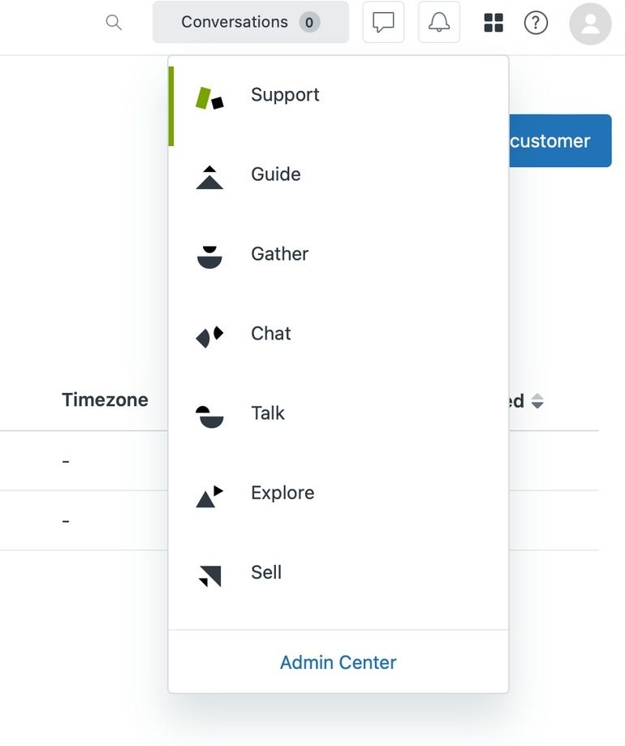
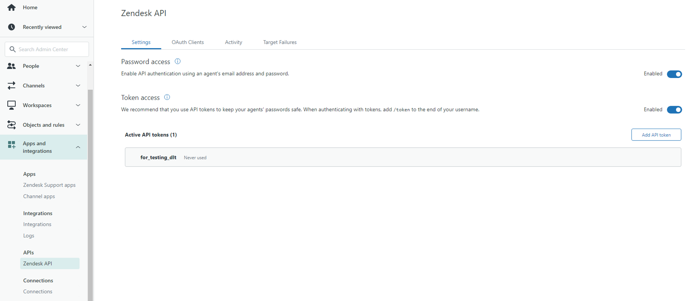

# Zendesk

Zendesk is a cloud-based customer service and support software platform. It offers a range of features, including ticket management, self-service options, knowledge base management, live chat, customer analytics and talks. This pipeline can load data from three Zendesk API clients 

1. Zendesk support 
2. Zendesk chat
3. Zendesk talk

This tutorial gives directions to get credentials for the APIs and set up the pipeline. And, you can also choose to load data from one(API), skip the others, load from two, or  load from all to the destination. 

## Initialize the pipeline

Initialize the pipeline with the following command:

```bash
dlt init zendesk bigquery
```

Here, we chose BigQuery as the destination. To choose a different destination, replace `bigquery` with your choice of destination.

Running this command will create a directory with the following structure:

```bash
zendesk_pipeline
├── .dlt
│   ├── .pipelines
│   ├── config.toml
│   └── secrets.toml
├── zendesk
│   └── helpers
│   └── __init__.py
│   └── running_guide
├── .gitignore
├── zendesk_pipeline.py
└── requirements.txt`
```

## Add Credentials

There are three API clients Zendesk support, chat and talk. Tutorial of adding the credentials for these are as below:


<details>
<summary>Zendesk support credentials</summary>
    
## Grab Zendesk Support credentials

Zendesk support can be authenticated in following three ways 

1. [subdomain](#subdomain) + email address + password
2. [subdomain](#subdomain) + email address + [API token](#zendesk-support-api-token)
3. [subdomain](#subdomain) + [OAuth token](#zendesk-support-oauth-token)

The methods to get the above credentials are below, among the three the simplest and easiest way is to get authenticated via (subdomain + email address + password) because these credentials created by default.  If you need to get authenticated by using methods ‘b’ and ‘c’. Please follow :

### Subdomain
1. Log in to your Zendesk account.
2. Grab your subdomain.
Subdomain is generally the company's name. Like if your company is `dlthub`, then your subdomain will be https://www.dlthub.zendesk.com 

### Zendesk support API token
1. To get the credentials you can follow these steps
2. To get `API_token`
    
    1.  Go to Zendesk products in the top right corner and to Admin Center, 
    
      
        
        
    2. In the Admin center go-to apps and Integrations. 
        
    3. Select Zendesk API from the menu on the left, and enable the “**Password access**” and “**Token access**” as shown below.
        
    
    
    
    4. Go to “**Add API token**” enter a description, and note the `API token`
    
    (***********This token will be displayed only once and should be noted).***********
### Zendesk support OAuth token
To get an `OAuth token` follow these steps
  1. Go to Zendesk products in the top right corner and to Admin Center,
  2. In the Admin center go-to apps and Integrations. 
  3. Go to “OAuth Clients” tab, and click on “Add OAuth Client”.
  4. Add the details like “Client Name”, “Description”, “Company” , “Redirect URL (if any)” 
  5. Click on save, and a secret token will be displayed, copy it.
  6. Now you need to make a curl request using the code as follows
        
          
        
```bash
    curl https://{subdomain}.zendesk.com/oauth/tokens \
      -H "Content-Type: application/json" \
      -d '{"grant_type": "password", "client_id": "{client_name}", 
        "client_secret": "{your_client_secret}", "scope": "read",
        "username": "{zendesk_username}", "password": "{zendesk_password}"}' \
      -X POST
```
        
    you could use the below script to generate the call easier
        
  ```python
    import requests
    import json
    
    subdomain = "d3v-dlthub"
    client_name = "adrian_test"
    client_secret = "set_me_up"
    zendesk_username = "adrian@dlthub.com"
    zendesk_password = "set_me_up"
    
    url = f'https://{subdomain}.zendesk.com/oauth/tokens'
    headers = {'Content-Type': 'application/json'}
    data = {
        'grant_type': 'password',
        'client_id': client_name,
        'client_secret': client_secret,
        'scope': 'read',
        'username': zendesk_username,
        'password': zendesk_password
    }
    response = requests.post(url, headers=headers, data=json.dumps(data))
    
    print(response.json()['access_token'])
  ```
        
    1. In the above code replace the following credentials:
        
  | Credentials | Description |
  | --- | --- |
  | subdomain | Your Zendesk subdomain |
  | client_name  | Unique identifier given to the OAuth client created in step (d) above |
  | client_secret | secret token generated for the OAuth client |
  | zendesk_username  | Your Zendesk email address |
  | zendesk password | Your Zendesk password |
        
1. After running the above curl command in terminal, you will get an access token in the response. 
        
2. The access token generated is the oauth_token to be used in  `dlt` secrets.toml.
        
</details>
<details>
<summary>Zendesk chat credentials</summary>
    
  ## Grab Zendesk chat credentials
Zendesk chat is authenticated using the following credentials 

[subdomain](#subdomain-1) + [OAuth token](#zendesk-chat-oauth-token)

(Please note that a separate OAuth token is to be created for Zendesk chat , that is different from OAuth token for Zendesk support above)

### Subdomain

1. Log in to your Zendesk account.
2. Grab your subdomain.
Subdomain is generally the company's name. Like if your company is `dlthub`, then your subdomain will be https://www.dlthub.zendesk.com

### Zendesk chat OAuth token

1. Login to Zendesk chat. Or go to “Chat” using Zendesk products in the top right corner 
    
  
    
2. In Zendesk chat, go to **settings**(on the left) **> account > API > Add API client.**
3. Enter the details like client name, company, and redirect URLs (if you don’t have redirect URLs; use: [http://localhost:8080](http://localhost:8080/)).
4. A **client ID** and **secret** will be displayed. Note them. ( The `clientID` is required to get an OAuth token for chat )
5. There are two ways to get the Zendesk chat OAuth token as per the documentation here `(https://developer.zendesk.com/documentation/live-chat/getting-started/auth/#authorization-code-grant-flow)`
6. Using the implicit grant flow is preferred as it does not require an authorization code from Zendesk chat.
7. The simplest way to get Zendesk chat `OAuth token` is to use the URL given below. Replace your **client ID** and **subdomain**. (***without curly brackets)*** and paste it into a browser and hit enter.

```bash
https://www.zopim.com/oauth2/authorizations/new?response_type=token&redirect_uri=http%3A%2F%2Flocalhost%3A8080&client_id={client_id}&scope=read&subdomain={subdomain_name}
```

8. Click on Allow. 
9. After the redirect, the secret token will be displayed in the address bar of the browser as below:

```bash
http://localhost:8080/#**access_token=cSWY9agzy9hsgsEdX5F2PCsBlvSu3tDk3lh4xmISIHFhR4lKtpVqqDRVvkiZPqbI**&token_type=Bearer&scope=read

#access token is "**cSWY9agzy9hsgsEdX5F2PCsBlvSu3tDk3lh4xmISIHFhR4lKtpVqqDRVvkiZPqbI"**
```

10. Note the access token.
</details>
<details><summary>Zendesk talk credentials</summary>

## Grab Zendesk talk credentials

Zendesk talk can be authenticated in following three ways 

   subdomain + email address + password
   subdomain + email address + API token
   subdomain + OAuth token

1. You can use the same credentials you got for Zendesk support or can grab new ones for use in Zendesk talk. 
2. The method for getting the credentials for Zendesk talk is the same as for Zendesk support.
3. Find guide to getting Zendesk support credentials [here.](#grab-zendesk-support-credentials)

</details>


## dlt configuration

1. In the `.dlt` folder, you will find `secrets.toml`, in which you can add the credentials for the client as below: (you may add only for the API client you need )

```python
#Zendesk support credentials
[sources.zendesk.zendesk_support.credentials]
password = "set me up" # zendesk password
subdomain = "subdomian" #https://[subdomain].zendesk.com
token = "set me up" # zendesk API token from step 5 in zendesk support configuration
email = "set me up" # Zendesk email Id
oauth_token = "set me up" # Zendesk OAuth token from step 6 in zendesk support configuration

[sources.zendesk.zendesk_chat.credentials]
subdomain = "subdomian". #https://[subdomain].zendesk.com
oauth_token = "set me up" #Zendesk OAuth token from step 9 in zendesk chat configuration

#Zendesk talk credentials
[sources.zendesk.zendesk_talk.credentials]
password = "set me up" # zendesk password
subdomain = "subdomian" #https://[subdomain].zendesk.com
token = "set me up" # zendesk API token from step 5 in zendesk configuration
email = "set me up" # Zendesk email Id
oauth_token = "set me up" # Zendesk OAuth token from step 6 in zendesk configuration

#bigquery credentials
[destination.bigquery.credentials]
project_id = "set me up" # GCP project ID!
private_key = "set me up" # Unique private key !(Must be copied fully including BEGIN and END PRIVATE KEY)
client_email = "set me up" # Email for service account
location = "set me up" #Project location for ex. “US”
```

2. Setup only for the resources and authentications you want to load and **delete** the rest.
3. For email and password; Use your Zendesk credentials.
4. For Subdomain, if the URL is [https://your_company123.zendesk.com](https://your_company123.zendesk.com) then the subdomain is “your_company123”. 
5. Find the guide for getting Zendesk support credentials [here](#add-credentials)) .

6. Procedure for getting [Zendesk talk credentials](#add-credentials) is the same as the Zendesk support.

7.  Add the credentials required by your destination (e.g. [Google BigQuery](http://localhost:3000/docs/destinations#google-bigquery))

## Run the pipeline

1. Install requirements for the pipeline by running the following command:

`pip install -r requirements.txt`

2. Run the pipeline with the following command:

`python3 zendesk_pipeline.py`

3. Use `dlt pipeline zendesk_pipeline show` to make sure that everything loaded as expected.

## Choose which modules the pipeline loads

1. To adjust what is loaded, you can peek into the `zendesk_pipeline.py` file and remove out one or more of the  `data_talk, data_chat or data_support` sources that are passed to the pipeline in `info = pipeline.run(data=[data_support , data_chat, data_talk])`

```python
def load_all():
    """
    Loads all possible tables for Zendesk Support, Chat, Talk
    """
    # FULL PIPELINE RUN
    pipeline = dlt.pipeline(pipeline_name="dlt_zendesk_pipeline", destination="bigquery", full_refresh=True, dataset_name="sample_zendesk_data3")

    # zendesk support source function
    data_support = zendesk_support(load_all=True)
    # zendesk chat source function
    data_chat = zendesk_chat()
    # zendesk talk source function
    data_talk = zendesk_talk()
    # run pipeline with all 3 sources
    info = pipeline.run(data=[data_support , data_chat, data_talk])
    return info
```

# Customisations

Basic dlt pipelines take the information as-is from the source and deliver it without modification.

This pipeline has some custom upgrades to make it more usable.

- **pivot_ticket_fields** is an **OPTIONAL** customisation for zendesk support tickets. Custom fields and their values are emitted as “EAV” model. To load them pivoted so you can use custom fields as columns, pass `pivot_ticket_fields=True`to the zendesk_support function, or use the pipeline function `ticket_pivot_fields`
- **Custom field rename.** This customisation loads the custom fields with their label name. If the label changes between loads, the initial label continues to be used (is persisted in state). To reset the labels, do a full refresh.
