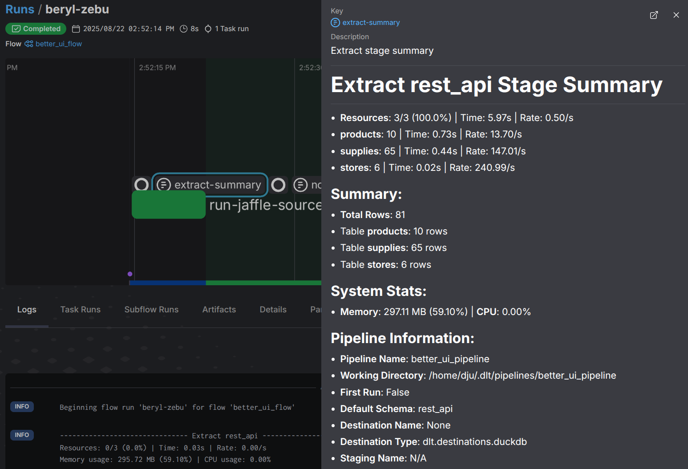
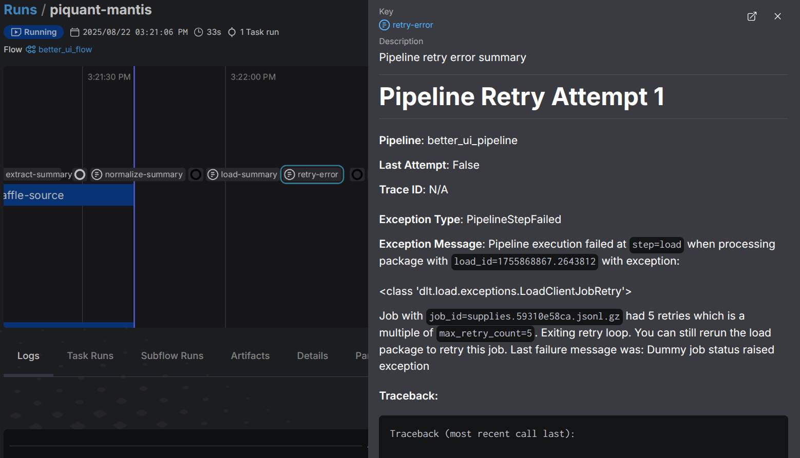

# Prefect Integration

dlt+ offers a few tools and helpers to make running dlt pipelines in prefect a seamless experience.

## Key features

- **Prefect Collector:** a dedicated way to do [progress monitoring], creating summary reports for each pipeline stage
- **Retry integration:** run custom code at relevant points during the pipeline execution
- **Parameterized tasks and flows:** Create tasks and flows that will execute your pipelines with the right settings
- **dlt_task decorator:** parameteriziable prefect-task that reports dlt's progress to the prefect ui


## Prefect Collector

The `PrefectCollector` creates rich artifacts in the Prefect UI to monitor dlt pipeline progress and results. Simply pass it to your pipeline's `progress` parameter to enable detailed monitoring.

```python
from dlt_plus._runner.prefect_collector import PrefectCollector

@task
def my_dlt_task():
    pipeline = dlt.pipeline(
        pipeline_name="my_pipeline",
        destination="duckdb",
        dataset_name="my_dataset",
        progress=PrefectCollector()
    )
    
    load_info = pipeline.run(source)
```

### Progress and Summary Reports

If the task is executed the `PrefectCollector` will create progress artifacts that will update
during a stage as well as summary report after a pipeline step has completed.
For example during extract you will see how many resources have been extracted and once the extract 
is completed you will see how many rows have been processed for each resource: 



Also, each summary report contains basic information about the pipeline, the destination the execution 
environment and system resources (CPU, memory) usage.

### Schema Change Reports

The `PrefectCollector` will also create artifacts when schema changes are detected.
This is useful to see which tables and columns have changed between runs.


## Runner integration

The `PrefectCollector` integrates seamlessly with the [dlt+ runner](../production/pipeline-runner.md). 

If you are running your pipelines with the dlt+ runner, information about the pipelines run configuration and the trace pipeline 
will also be included in the artifacts.

### Pipeline Retries

When running Prefect on distributed infrastructure, prefect's retries may execute on different machines, causing intermediate files to be lost and pipeline have to start over.

Use the dlt+ runner instead to preserve pipeline state and intermediate results across retry attempts.

```python
from dlt_plus import runner
from tenacity import Retrying, stop_after_attempt
from dlt.sources.sql_database import sql_database

MY_RETRY_POLICY = Retrying(stop=stop_after_attempt(3), reraise=True)

@task(log_prints=True) # use log_prints=True to dlt.progress outputs in the logs of the prefect ui
def resilient_pipeline_task():
    pipeline = dlt.pipeline("my_pipeline", destination="duckdb", progress=PrefectCollector())
    source = sql_database(table_names=["items"])
    
    load_info = runner(
        pipeline, 
        retry_policy=MY_RETRY_POLICY,
        retry_pipeline_steps=["extract", "normalize", "load"]
    ).run(source)
    
    return load_info
```

Detailed error artifacts with full tracebacks are automatically created for each retry attempt as well as a final report.



## Source decomposition with Prefect

dlt+ also provides helpers that you can use to create tasks and flows that you can drop 
into your prefect code with the options to parameterize the runner and run the resources in your source
in parallel tasks

```py
import dlt
import dlt_plus
from dlt_plus._runner.prefect_helpers import create_run_pipeline_flow
from prefect.task_runners import ThreadPoolTaskRunner
from prefect import flow, task

@flow(task_runner=ThreadPoolTaskRunner(max_workers=5))
def my_main_flow():
    # define your pipeline and source inside the flow
    pipeline = dlt.pipeline(
        pipeline_name="my_pipeline",
        destination=dlt.destinations.duckdb(destination_name="my_destination"),
        dataset_name="my_dataset",
    )
    source = sql_database(schema="my_schema")

    # create a subflow that will run each resource in a dedicated pipeline
    run_pipeline_with_parallel_tables = create_run_pipeline_flow(
        pipeline=pipeline,
        source=source,
        decompose=True,
        flow_name="my_parallelized_flow",
    )

    # run it, passing args that you would usually pass to the pipeline.run() method
    run_pipeline_with_parallel_tables(write_disposition="append")

if __name__ == "__main__":
    my_main_flow()

```

This will derive a task-pipeline with a deterministic name for each resource in the source and run them in parallel.
Because they have different names, pipelines can run in parallel without interfering with each other.

:::note
For stability reasons, this actually runs one resource alone and then all others in parallel.
This is because otherwise, on the first run, all resources would try to create the same dlt-tables.
:::
:::warning
Currently only the thread pool task runner is supported. This is because the above methods pass pipeline and source objects as arguments, which can not be pickled.
:::


## `@dlt_task` decorator

Prefect doesn't use an explicit DAG, but instead uses control flow of the users code. Units of work are defined by decorating functions with `@task` or `@flow`.
dlt+ provides a customizable `@dlt_task` for decorating methods that executes dlt-pipelines. It will
automatically attach the `PrefectCollector` to the pipeline and report progress to the prefect ui.


