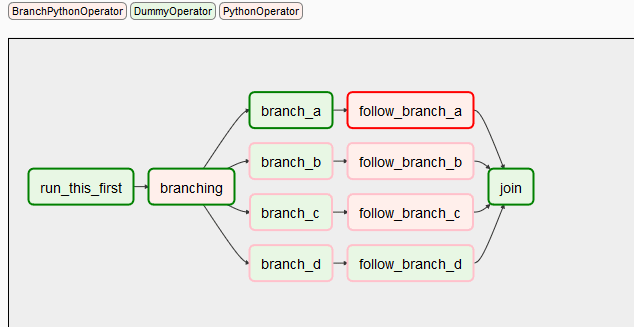

# Monitoring

Monitoring and [alerting](alerting.md) are used together to provide a more complete picture of the
health of a data product. With monitoring, we examine much more information than we consider when
alerting. Monitoring is meant to give a fast, simple overview of the health of the system. How to
best monitor a `dlt` pipeline will depend on your [deployment method](../walkthroughs/deploy-a-pipeline/).

## Run monitoring

### Airflow

In Airflow, at the top level, we can monitor:

- The tasks scheduled to (not) run.
- Run history (e.g., success/failure).

Airflow DAGs:


Airflow DAG tasks:



### GitHub Actions

In GitHub Actions, at the top level, we can monitor:

- The workflows scheduled to (not) run.
- Run history (e.g., success/failure).

GitHub Actions workflows:


GitHub Actions workflow DAG:


### Sentry

Using `dlt` [tracing](tracing.md), you can configure [Sentry](https://sentry.io) DSN to start
receiving rich information on executed pipelines, including encountered errors and exceptions.

## Data monitoring

Data quality monitoring is concerned with ensuring that quality data arrives at the data warehouse
on time. The reason we do monitoring instead of alerting for this is because we cannot easily define
alerts for what could go wrong.

This is why we want to capture enough context to allow a person to decide if the data looks OK or
requires further investigation when monitoring the data quality. A staple of monitoring are line
charts and time-series charts that provide a baseline or a pattern that a person can interpret.

For example, to monitor data loading, consider plotting "count of records by `loaded_at` date/hour",
"created at", "modified at", or other recency markers.

### Rows count
To find the number of rows loaded per table, use the following command:

```sh
dlt pipeline <pipeline_name> trace
```

This command will display the names of the tables that were loaded and the number of rows in each table.
The above command provides the row count for the Chess source. As shown below:

```sh
Step normalize COMPLETED in 2.37 seconds.
Normalized data for the following tables:
- _dlt_pipeline_state: 1 row(s)
- payments: 1329 row(s)
- tickets: 1492 row(s)
- orders: 2940 row(s)
- shipment: 2382 row(s)
- retailers: 1342 row(s)
```

To load this information back to the destination, you can use the following:
```py
# Create a pipeline with the specified name, destination, and dataset
# Run the pipeline

# Get the trace of the last run of the pipeline
# The trace contains timing information on extract, normalize, and load steps
trace = pipeline.last_trace

# Load the trace information into a table named "_trace" in the destination
pipeline.run([trace], table_name="_trace")
```
This process loads several additional tables to the destination, which provide insights into
the extract, normalize, and load steps. Information on the number of rows loaded for each table,
along with the `load_id`, can be found in the `_trace__steps__extract_info__table_metrics` table.
The `load_id` is an epoch timestamp that indicates when the loading was completed. Here's a graphical
representation of the rows loaded with `load_id` for different tables:


### Data load time
Data loading time for each table can be obtained by using the following command:

```sh
dlt pipeline <pipeline_name> load-package
```

The above information can also be obtained from the script as follows:

```py
info = pipeline.run(source, table_name="table_name", write_disposition='append')

print(info.load_packages[0])
```
> `load_packages[0]` will print the information of the first load package in the list of load packages.

