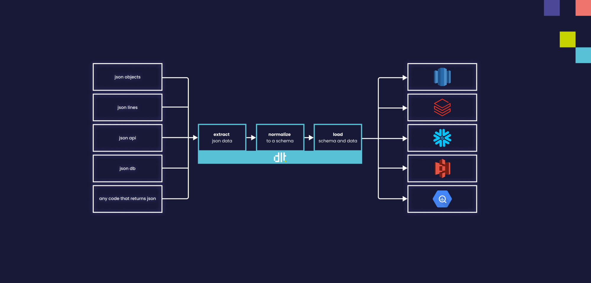
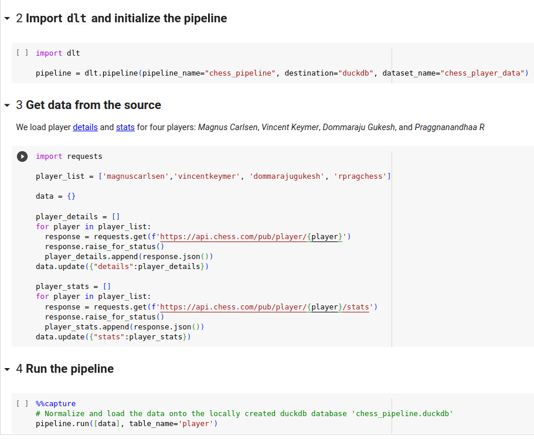
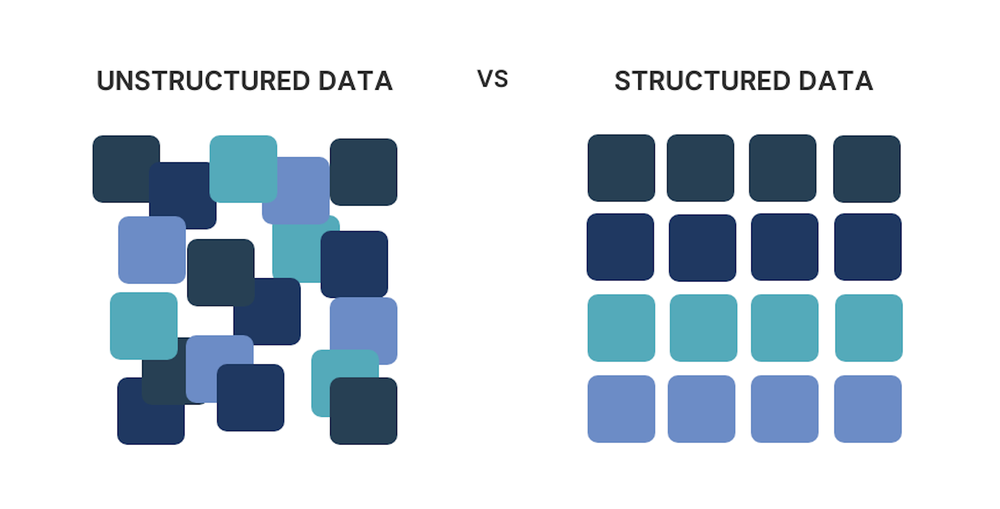

# Data Scientist

Data Load Tool (`dlt`) can be highly useful for Data Scientists in several ways. Here are three
potential use cases:

## Use case #1: Efficient Data Ingestion and Optimized Workflow

Data Scientists often deal with large volumes of data from various sources. `dlt` can help
streamline the process of data ingestion by providing a robust and scalable tool for loading data
into their analytics environment. It can handle diverse data formats, such as CSV, JSON, or database
dumps, and efficiently load them into a data lake or a data warehouse.

By using `dlt`, Data Scientists can save time and effort on data extraction and transformation
tasks, allowing them to focus more on data analysis and models training. The tool is designed as a
library that can be added to their code, making it easy to integrate into existing workflows.

`dlt` can facilitate a seamless transition from data exploration to production deployment. Data
Scientists can leverage `dlt` capabilities to load data in the format that matches the production
environment while exploring and analyzing the data. This streamlines the process of moving from the
exploration phase to the actual implementation of models, saving time and effort. By using `dlt`
throughout the workflow, Data Scientists can ensure that the data is properly prepared and aligned
with the production environment, leading to smoother integration and deployment of their models.

- [Use existed Verified Sources](../walkthroughs/add-a-verified-source) and pipeline examples or create your own quickly. See how to
  [create pipeline](../walkthroughs/create-a-pipeline).

  - [Deploy the pipeline](../walkthroughs/deploy-a-pipeline), so that the data
    is automatically loaded on a schedule.

  - Transform the [loaded data](../dlt-ecosystem/transformations/transforming-the-data) with
    dbt or in Pandas DataFrames.

  - Learn how to [run](../running-in-production/running),
    [monitor](../running-in-production/monitoring), and
    [alert](../running-in-production/alerting) when you put your pipeline in
    production.

  - Use `dlt` when doing exploration in a Jupyter Notebook and move more easily to production. Explore
    our
    [Colab Demo for Chess.com API](https://colab.research.google.com/drive/1NfSB1DpwbbHX9_t5vlalBTf13utwpMGx?usp=sharing)
    to realize how easy it is to create and use `dlt` in your projects:

    

### `dlt` is optimized for local use on laptops

- It offers a seamless
  [integration with Streamlit](../dlt-ecosystem/visualizations/understanding-the-tables#show-tables-and-data-in-the-destination).
  This integration enables a smooth and interactive data analysis experience, where Data Scientists
  can leverage the power of `dlt` alongside Streamlit's intuitive interface and visualization
  capabilities.
- In addition to Streamlit, `dlt` natively supports
  [DuckDB](https://dlthub.com/docs/blog/is-duckdb-a-database-for-ducks), an in-process SQL OLAP
  database management system. This native support ensures efficient data processing and querying
  within `dlt`, leveraging the capabilities of DuckDB. By integrating DuckDB, Data Scientists can
  benefit from fast and scalable data operations, enhancing the overall performance of their
  analytical workflows.
- Moreover, `dlt` provides resources that can directly return data in the form of
  [Pandas DataFrames from an SQL client](../dlt-ecosystem/visualizations/exploring-the-data).
  This feature simplifies data retrieval and allows Data Scientists to seamlessly work with data in
  familiar Pandas DataFrame format. With this capability, Data Scientists can leverage the rich
  ecosystem of Python libraries and tools that support Pandas.

With `dlt`, the transition from local storage to remote is quick and easy.
For example, read the documentation [Share a dataset: DuckDB -> BigQuery](../walkthroughs/share-a-dataset).

## Use case #2:  Structured Data and Enhanced Data Understanding

### Structured data

Data Scientists often prefer structured data lakes over unstructured ones to facilitate efficient
data analysis and modeling. `dlt` can help in this regard by offering seamless integration with
structured data storage systems, allowing Data Scientists to easily load and organize their data in
a structured format. This enables them to access and analyze the data more effectively, improving
their understanding of the underlying data structure.

A `dlt` pipeline is made of a source, which contains resources, and a connection to the destination,
which we call pipeline. So in the simplest use case, you could pass your unstructured data to the
`pipeline` and it will automatically be migrated to structured at the destination. See how to do
that in our [pipeline documentation](../general-usage/pipeline).

Besides strurdiness, this also adds convenience by automatically converting json types to db types,
such as timestamps, etc.

Read more about schema evolution in our blog:
**[The structured data lake: How schema evolution enables the next generation of data platforms](https://dlthub.com/docs/blog/next-generation-data-platform).**

### Data exploration

Data Scientists require a comprehensive understanding of their data to derive meaningful insights
and build accurate models. `dlt` can contribute to this by providing intuitive and user-friendly
features for data exploration. It allows Data Scientists to quickly gain insights into their data by
visualizing data summaries, statistics, and distributions. With `dlt`, data understanding becomes
clearer and more accessible, enabling Data Scientists to make informed decisions throughout the
analysis process.

Besides, having a schema imposed on the data acts as a technical description of the data,
accelerating the discovery process.

See [Understanding the tables](../dlt-ecosystem/visualizations/understanding-the-tables),
[Exploring the data](../dlt-ecosystem/visualizations/exploring-the-data) in our
documentation.

## Use case #3: Data Preprocessing and Transformation

Data preparation is a crucial step in the data science workflow. `dlt` can facilitate data
preprocessing and transformation tasks by providing a range of built-in features. It simplifies
various tasks like data cleaning, anonymizing, handling missing values, data type conversion,
feature scaling, and feature engineering. Data Scientists can leverage these capabilities to clean
and transform their datasets efficiently, making them suitable for subsequent analysis and modeling.

Python-first users can heavily customize how `dlt` sources produce data, as `dlt` supports
selecting,
[filtering](../general-usage/resource#filter-transform-and-pivot-data),
[renaming](../general-usage/customising-pipelines/renaming_columns),
[anonymizing](../general-usage/customising-pipelines/pseudonymizing_columns),
and just about any custom operation.

Compliance is also a case where preprocessing is the way to solve the issue: Besides being
python-friendly, the ability to apply transformation logic before loading data allows us to
separate, filter or transform sensitive data.