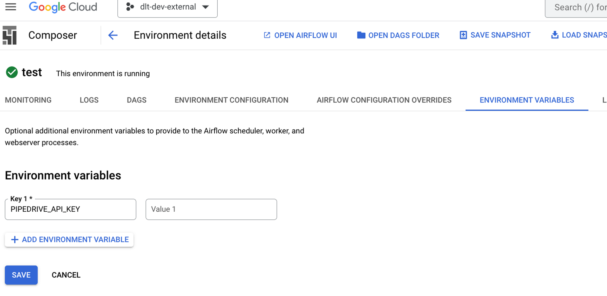
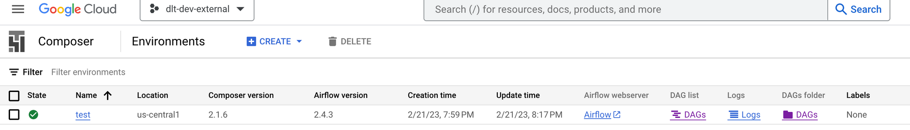
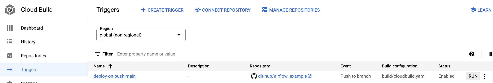

# Deploy a pipeline with Airflow and Google Composer

Before you can deploy a pipeline, you will need to [install dlt](../../reference/installation.md)
and [create a pipeline](../create-a-pipeline.md).

:::tip
While this walkthrough deals specifically with Google Composer, it will generate DAGs and configuration files that you can use on any Airflow deployment. DAGs are generated using **dlt Airflow helper** that maps `dlt` resources into Airflow tasks, provides a clean working environment, retry mechanism, metrics, and logging via Airflow loggers.
:::

## 1. Add your `dlt` project directory to GitHub

You will need a GitHub repository for your project. If you don't have one yet, you need to
initialize a Git repository in your `dlt` project directory and push it to GitHub as described in
[Adding locally hosted code to GitHub](https://docs.github.com/en/get-started/importing-your-projects-to-github/importing-source-code-to-github/adding-locally-hosted-code-to-github).

## 2. Ensure your pipeline works

Before you can deploy, you must run your pipeline locally at least once.

```sh
python3 {pipeline_name}_pipeline.py
```

This should successfully load data from the source to the destination once and allows `dlt` to gather required information for the deployment.

## 3. Initialize deployment

First, you need to add additional dependencies that the `deploy` command requires:
```sh
pip install "dlt[cli]"
```

then:
```sh
dlt deploy {pipeline_name}_pipeline.py airflow-composer
```

This command checks if your pipeline has run successfully before and creates the following folders:

- build

  - This folder contains a file called `cloudbuild.yaml` with a simple configuration for cloud
    deployment. We will use it below.

- dags

  - This folder contains the Python script `dag_{pipeline_name}.py`, which is an example of a simple
    serialized DAG using the Airflow *PipelineTasksGroup* wrapper.

  **Note:** This folder is only needed to store DAG scripts, but it is not the Airflow
  *dags_folder*. Please refer to the
  [Troubleshooting](deploy-with-airflow-composer.md#troubleshooting) section for more information.

By default, the `dlt deploy` command shows you the deployment credentials in ENV format.

<aside>
💡 When you run the dlt deploy command, you will get the relevant info in your CLI about how you can deploy credentials.
</aside>

## Example with the pipedrive pipeline


### 1. Run the deploy command
```sh
dlt deploy pipedrive_pipeline.py airflow-composer
```
where `pipedrive_pipeline.py` is the pipeline script that you just ran and `airflow-composer` is a deployment method. The command will create deployment files and provide instructions to set up the credentials.

```text
Your airflow-composer deployment for the pipedrive pipeline is ready!
* The airflow cloudbuild.yaml file was created in the build directory.
* The dag_pipedrive.py script was created in the dags directory.

You must prepare your repository first:
1. Import your sources in dag_pipedrive.py and change default_task_args if necessary.
2. Run the airflow pipeline locally.
See Airflow getting started: https://airflow.apache.org/docs/apache-airflow/stable/start.html

If you are planning to run the pipeline with Google Cloud Composer, follow the next instructions:

1. Read this doc and set up the environment: https://dlthub.com/docs/walkthroughs/deploy-a-pipeline/deploy-with-airflow-composer
2. Set _BUCKET_NAME up in the build/cloudbuild.yaml file.
3. Add the following toml-string to the Airflow UI as the dlt_secrets_toml variable.

[sources.pipedrive]
pipedrive_api_key = "c66..."
```

The `deploy` command will use an [Airflow variable](#4-add-credentials) called `dlt_secrets_toml` to store all the required secrets as a TOML fragment. You can also use **environment variables** by passing the `--secrets-format env` option:

```sh
dlt deploy pipedrive_pipeline.py airflow-composer --secrets-format env
```
which will output the environment variable names and their values.

```sh
3. Add the following secret values (typically stored in ./.dlt/secrets.toml):
SOURCES__PIPEDRIVE__PIPEDRIVE_API_KEY

in ENVIRONMENT VARIABLES using Google Composer UI

Name:
SOURCES__PIPEDRIVE__PIPEDRIVE_API_KEY
Secret:
c66c..
```

### 2. Modify DAG file

In the directory `dags/`, you can find the file `dag_pipedrive.py` that you need to edit. It has the following structure:

```py
import dlt
from airflow.decorators import dag
from dlt.common import pendulum
from dlt.helpers.airflow_helper import PipelineTasksGroup

# Modify the DAG arguments
default_task_args = {
    'owner': 'airflow',
    'depends_on_past': False,
    'email': 'test@test.com',
    'email_on_failure': False,
    'email_on_retry': False,
    'retries': 0,

}

@dag(
    schedule=None,
    start_date=pendulum.datetime(2021, 1, 1),
    catchup=False,
    max_active_runs=1,
    default_args=default_task_args
)
def load_data():
    # Set `use_data_folder` to True to store temporary data in the `data` bucket.
    # Use only when it does not fit on the local storage
    tasks = PipelineTasksGroup("pipeline_name", use_data_folder=False, wipe_local_data=True)

    # Import your source from the pipeline script
    from pipeline_or_source_script import source

    # Modify the pipeline parameters
    pipeline = dlt.pipeline(
        pipeline_name='pipeline_name',
        dataset_name='dataset_name',
        destination='duckdb',
        dev_mode=False  # Must be false if we decompose
    )
    # Create the source, the "serialize" decompose option
    # will convert dlt resources into Airflow tasks.
    # Use "none" to disable it.
    tasks.add_run(
        pipeline,
        source(),
        decompose="serialize",
        trigger_rule="all_done",
        retries=0,
        provide_context=True
    )

    # The "parallel" decompose option will convert dlt
    # resources into parallel Airflow tasks, except the
    # first one, which will be executed before any other tasks.
    # All the tasks will be executed in the same pipeline state.
    # tasks.add_run(
    #   pipeline,
    #   source(),
    #   decompose="parallel",
    #   trigger_rule="all_done",
    #   retries=0,
    #   provide_context=True
    # )

    # The "parallel-isolated" decompose option will convert dlt
    # resources into parallel Airflow tasks, except the
    # first one, which will be executed before any other tasks.
    # In this mode, all the tasks will use separate pipeline states.
    # tasks.add_run(
    #   pipeline,
    #   source(),
    #   decompose="parallel-isolated",
    #   trigger_rule="all_done",
    #   retries=0,
    #   provide_context=True
    # )

load_data()
```

- Customize the PipelineTaskGroup:

  - Change the name from “pipeline_name” to yours, for example, “pipedrive”.
  - Change runtime settings: data_folder, logging, retry policy, etc. For example, let’s wipe all the data created by the pipeline (`wipe_local_data=True`), redirect the dlt logger into the task logger (`use_task_logger=True`), and set the retry policy as a Retrying class object with three restart attempts.

  ```py
  from tenacity import Retrying, stop_after_attempt

  # Set `use_data_folder` to True to store temporary data in the `data` bucket.
  # Use only when it does not fit on the local storage
  tasks = PipelineTasksGroup(
      pipeline_name="pipedrive",
      use_data_folder=False,
      wipe_local_data=True,
      use_task_logger=True,
      retry_policy=Retrying(stop=stop_after_attempt(3), reraise=True),
  )
  ```
:::tip
When you run the `load_data` DAG above, Airflow will call the `source` function every 30 seconds (by default) to be able to monitor the tasks. Make sure that your source function does not perform any long-lasting operations, e.g., reflecting the source database. In the case of [sql_database](../../dlt-ecosystem/verified-sources/sql_database/index.md), we added an option to delay database reflection until data is accessed by a resource.
:::

### 3. Import sources and move the relevant code from the pipeline script

You should now move your working code from the pipeline script you previously ran to the newly created DAG script.

- Import your sources from your existing pipeline script - after the task group is created:

  ```py
  # Import your source from the pipeline script
  from pipedrive import pipedrive_source
  ```

  If you create your pipeline instance in your source in the "__main__" function in your script, then copy it here. For example, look at the `load_from_start_date` function in `pipedrive_pipeline.py`:

  ```py
  """Example to incrementally load activities limited to items updated after a given date"""

  pipeline = dlt.pipeline(
    pipeline_name="pipedrive", destination='duckdb', dataset_name="pipedrive_data"
  )

  # First source configured to load everything except activities from the beginning
  source = pipedrive_source()
  source.resources["activities"].selected = False

  # Another source configured to load activities starting at the given date (custom_fields_mapping is included to translate custom field hashes to names)
  activities_source = pipedrive_source(
    since_timestamp="2023-03-01 00:00:00Z"
  ).with_resources("activities", "custom_fields_mapping")
  ```

  Copy this part of the code to the `dags/dag_pipedrive.py` script.

  **Note:** Task ids in the task group should still be unique globally, so we have to exclude "custom_fields_mapping" from `activities_source`. See the [Troubleshooting](deploy-with-airflow-composer.md#troubleshooting) section.

- Pass your pipeline instance and source instance to the `add_run` method of tasks.

  **Note**: PipelineTasksGroup can’t handle the list of sources (e.g., data=[source, activities_source]), so we have to add them sequentially. See the [Troubleshooting](deploy-with-airflow-composer.md#troubleshooting) section.

  ```py
  # Create the source,
  # the "serialize" decompose option will convert
  # dlt resources into Airflow tasks.
  # Use "none" to disable it
  tasks.add_run(
      pipeline=pipeline,
      data=source,
      decompose="serialize",
      trigger_rule="all_done",
      retries=0,
      provide_context=True
  )

  # PipelineTasksGroup can’t handle the list of
  # sources (e.g., data=[source, activities_source]),
  # so we have to add them sequentially
  tasks.add_run(
      pipeline=pipeline,
      data=activities_source,
      decompose="serialize",
      trigger_rule="all_done",
      retries=0,
      provide_context=True
  )
  ```

- Customize the name of the Airflow DAG by changing the name of the load_data function to your desired name, for example, to `load_pipedrive_data`.

- Modify the @dag arguments. Set up *schedule, start_date, default_task_args*.

As a result, we will get a script of the following form:

```py
import dlt
from airflow.decorators import dag
from dlt.common import pendulum
from dlt.helpers.airflow_helper import PipelineTasksGroup

# Modify the dag arguments
default_task_args = {
    'owner': 'airflow',
    'depends_on_past': False,
    'email': 'test@test.com',
    'email_on_failure': False,
    'email_on_retry': False,
    'retries': 0,

}

@dag(
    schedule=None,
    start_date=pendulum.datetime(2021, 1, 1),
    catchup=False,
    max_active_runs=1,
    default_args=default_task_args
)
def load_pipedrive_data():
    from tenacity import Retrying, stop_after_attempt

    # Set `use_data_folder` to True to store temporary data on the `data` bucket.
    # Use only when it does not fit on the local storage.
    tasks = PipelineTasksGroup(
        pipeline_name="pipedrive",
        use_data_folder=False,
        wipe_local_data=True,
        use_task_logger=True,
        retry_policy=Retrying(stop=stop_after_attempt(3), reraise=True),
    )

    # Import your source from the pipeline script
    from pipedrive import pipedrive_source

    """Example to incrementally load activities limited to items updated after a given date"""

    pipeline = dlt.pipeline(
        pipeline_name="pipedrive", destination='duckdb', dataset_name="pipedrive_data"
    )

    # First source configured to load everything
    # except activities from the beginning
    source = pipedrive_source()
    source.resources["activities"].selected = False

    # Another source configured to load activities
    # starting at the given date (custom_fields_mapping is included to
    # translate custom field hashes to names)
    activities_source = pipedrive_source(
        since_timestamp="2023-03-01 00:00:00Z"
    ).with_resources("activities")

    # Create the source, the "serialize" decompose option
    # will convert dlt resources into Airflow tasks.
    # Use "none" to disable it.
    tasks.add_run(
        pipeline=pipeline,
        data=source,
        decompose="serialize",
        trigger_rule="all_done",
        retries=0,
        provide_context=True
    )

    # PipelineTasksGroup can’t handle the list of sources
    # (e.g., data=[source, activities_source]),
    # so we have to add them sequentially.
    tasks.add_run(
        pipeline=pipeline,
        data=activities_source,
        decompose="serialize",
        trigger_rule="all_done",
        retries=0,
        provide_context=True
    )

load_pipedrive_data()
```

### 4. Add credentials

There are two ways to pass the credentials:

1. In the `dlt_secrets_toml` Airflow variable.

   - During the execution of the `deploy` command with `--secrets-format toml`, secret variables
     will be displayed in the output:

     ```sh
     3. Add the following TOML-string to the Airflow UI as the dlt_secrets_toml variable.

     [sources.pipedrive]
     pipedrive_api_key = "c66c..."
     ```

   - Launch the Airflow UI, head to the **Admin** top-level menu, and select **Variables**.
   - Add a new variable with the name `dlt_secrets_toml`.
   - Paste the TOML fragment displayed by the `deploy` command.
   - 💡 The content of this variable will be used by the `dlt` Airflow helper instead of the local `secrets.toml` which you are familiar with. If your local secrets file contains anything else you want to access on Airflow, you are good to just copy the local `secrets.toml` content to the `dlt_secrets_toml` variable.

1. As environment variables.

   - During the execution of the `deploy` command with `--secrets-format env` (by default),
     environment variables will be displayed in the output:

     ```sh
     3. Add the following secret values (typically stored in ./.dlt/secrets.toml):
     SOURCES__PIPEDRIVE__PIPEDRIVE_API_KEY

     in ENVIRONMENT VARIABLES using Google Composer UI

     Name:
     SOURCES__PIPEDRIVE__PIPEDRIVE_API_KEY
     Secret:
     c66c...
     ```

   - Copy capitalized variables and add them into Airflow’s env variables, then save it. Now, `dlt` can
     pick it up.

     

### 5. Configure `build/cloudbuild.yaml` to run it with Google Cloud Platform \[[Cloud Composer](https://console.cloud.google.com/composer/environments)\]

- Read our doc
  [How to deploy the main branch of your Airflow project from GitHub to Cloud Composer](../../reference/explainers/airflow-gcp-cloud-composer.md).

  There you can find:

  - How to set up the Cloud Composer Environment.
  - How to create a trigger.
  - How to add the libraries needed.

- Set **\_BUCKET_NAME** up in the `build/cloudbuild.yaml` file.

  The file has the following structure:

  ```yaml
  steps:
  - name: 'gcr.io/google.com/cloudsdktool/cloud-sdk'
    entrypoint: 'bash'
    args:
    - '-c'
    - gsutil -m rsync -d -r ./ gs://${_BUCKET_NAME}/dags

  substitutions:
    _BUCKET_NAME: "set me up!"
  options:
    logging: CLOUD_LOGGING_ONLY
  ```

  This code copies the whole pipeline repository into the bucket’s DAGs folder.

  To fill it, we need to get the name of the DAGs bucket from Cloud Composer, so we know where to
  deploy.

  - Go to [Cloud Composer](https://console.cloud.google.com/composer/environments), click on the
    DAGs folder, and get the bucket name.

    

  - In your `cloudbuild.yaml`, set **\_BUCKET_NAME** up in the `substitutions` section.

    ```yaml
    substitutions:
      _BUCKET_NAME: "set me up!"
    ```

### 6. Finish the Airflow deployment

1. Commit and push the pipeline files to GitHub.

   Add stage deployment files to commit. Use your Git UI or the following command:

   ```sh
   git add dags/dag_pipedrive.py build/cloudbuild.yaml
   ```

   Commit the files above. Use your Git UI or the following command:

   ```sh
   git commit -m 'initiate pipedrive pipeline with Airflow'
   ```

   Push changes to GitHub. Use your Git UI or the following command:

   ```sh
   git push origin
   ```

1. Run the trigger you built (in
   [Cloud Build](https://console.cloud.google.com/cloud-build/dashboard)).

   

1. Wait a minute, and check if your files arrived in the bucket. In our case, we added a whole
   repository with the `pipedrive` project, and we can see it appeared.

## Troubleshooting

This section will cover the most common probable errors and exceptions.

### 1. ModuleNotFoundError: No module named ‘{source_name}’

If you received this error, make sure that your repository has been completely copied to the DAGs folder.

If you are running it locally, check your `airflow.cfg` file (line 4):

```text
# The folder where your airflow pipelines live, most likely a
# subfolder in a code repository. This path must be absolute.
# default: dags_folder = ~/airflow/dags
dags_folder = absolute_path_to_your_project
```

`dags_folder` should not lead to the `absolute_path_to_your_project/dags` folder.

### 2. ValueError: Can only decompose dlt sources

In this case, you perhaps passed a list of sources to the method `add_run` as data or another unacceptable data structure and provided `decompose = "serialize"`.

For example:

```py
tasks.add_run(
    pipeline=pipeline,
    data=[source, activities_source],
    decompose="serialize",
)
```

If `data` is a DltSource and `decompose` is “serialize,” it will decompose the source into disjoint connected components (isolated groups of resources) and execute them one after another as separate Airflow tasks.

PipelineTasksGroup can't handle the list of sources in the “serialize” mode; it can only decompose `DltSource`, so we have to add them sequentially:

```py
tasks.add_run(
    pipeline=pipeline,
    data=source,
    decompose="serialize",
)
tasks.add_run(
    pipeline=pipeline,
    data=activities_source,
    decompose="serialize",
)
```

Or you should set the `decompose = "none"` to run it as one Airflow task.

### 3. DuplicateTaskIdFound: Task id ‘{your_task_id}’ has already been added to the DAG

In the case of the `pipedrive` pipeline, we tried to load data from “custom_fields_mapping” twice.

```py
# First source configured to load everything except activities from the beginning
source = pipedrive_source()
source.resources["activities"].selected = False

# Another source configured to load activities starting at the given date
# (custom_fields_mapping is included to translate custom field hashes to names)
activities_source = pipedrive_source(
    since_timestamp="2023-03-01 00:00:00Z"
).with_resources("activities", "custom_fields_mapping")
```

Because of this, we received the following error:

```sh
airflow.exceptions.DuplicateTaskIdFound:
Task id ‘pipedrive.pipedrive_custom_fields_mapping’ has already been added to the DAG
```

Task ids in the task group should still be unique globally, so in this case, we have to exclude “custom_fields_mapping” from `activities_source`. “Custom_fields_mapping” will be taken from the current state to translate custom field hashes to names:

```py
activities_source = pipedrive_source(
    since_timestamp="2023-03-01 00:00:00Z"
).with_resources("activities")
```

