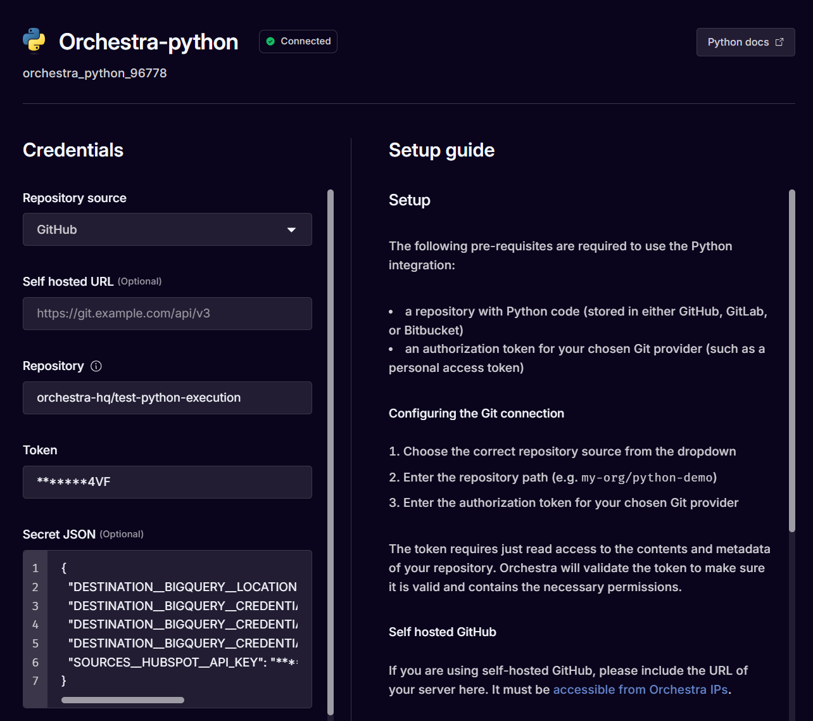
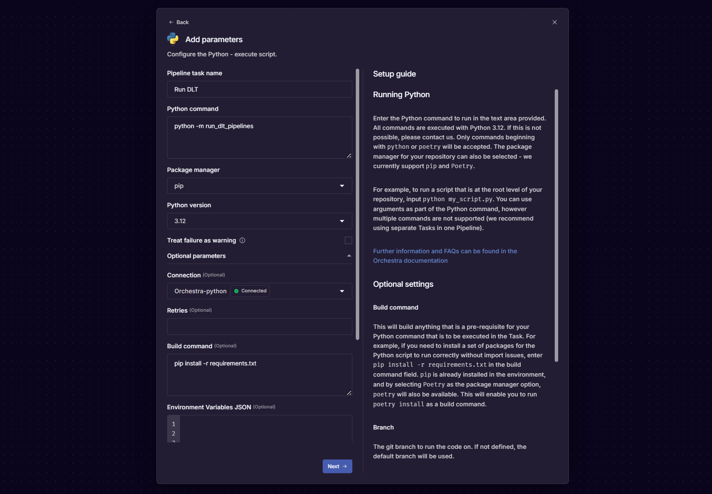
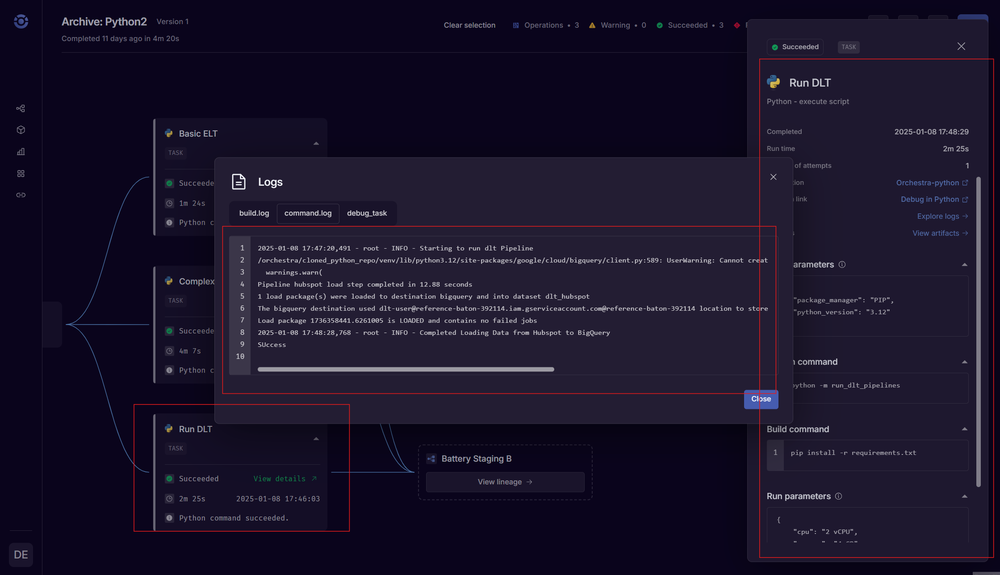

# Deploy with Orchestra

## What is Orchestra?

[Orchestra](https://getorchestra.io) unified control plane for Data and AI operations. In addition to providing an end-to-end, declarative [orchestration tool](https://www.getorchestra.io/solutions), Orchestra provides a lightweight execution environment for running python - perfect for getting started with dlt.

Orchestra can also run [dbt core](https://www.getorchestra.io/product/orchestra-dbt-core-tm) which makes it perfect for joining dlt ingestion jobs to downstream transformations.

You can leverage [Orchestra's Free Tier here](https://app.getorchestra.io?utm_campaign=dlt_docs) to get started with dlt straight away.

## Building data pipelines with `dlt`

**`dlt`** is an open-source Python library that allows you to declaratively load data sources
into well-structured tables or datasets. It does this through automatic schema inference and evolution.
The library simplifies building data pipelines by providing functionality to support the entire extract 
and load process.

### How does `dlt` integrate with Orchestra?

Fundamentally `dlt` is python code. This means that to run `dlt`, you should first set-up the [Python Connector](https://docs.getorchestra.io/docs/integrations/utility/python/) in Orchestra. You can find a step-by-step [dlt video tutorial here](https://www.youtube.com/watch?v=2V94CRXFZXk).

When configuring the python connection, ensure environment variables such as secrets are added with the [proper naming convention](../../general-usage/credentials/setup).

For example:

```sql
{
  "DESTINATION__BIGQUERY__LOCATION": "*******st2",
  "DESTINATION__BIGQUERY__CREDENTIALS__CLIENT_EMAIL": "*******com",
  "DESTINATION__BIGQUERY__CREDENTIALS__PROJECT_ID": "*******114",
  "DESTINATION__BIGQUERY__CREDENTIALS__PRIVATE_KEY": "*******--\n",
  "SOURCES__HUBSPOT__API_KEY": "*******1e4"
}
```



### Entry point

After configuring you `.dlt` project, you should ensure the pipelines you want to run can be run from a single point of entry i.e. a single file.

Imported file;  `pipeline.py`

```py
from typing import List
import dlt

from hubspot import hubspot, hubspot_events_for_objects, THubspotObjectType
from setup_logger import build_logger

logger = build_logger("debug.log")

def run_pipeline() -> None:
    """
    This function loads all resources from HubSpot CRM

    Returns:
        None
    """
    logger.info("Starting to run dlt Pipeline")
    # Create a DLT pipeline object with the pipeline name, dataset name, and destination database type
    # Add dev_mode=(True or False) if you need your pipeline to create the dataset in your destination
    p = dlt.pipeline(
        pipeline_name="hubspot",
        dataset_name="dlt_hubspot",
        destination='bigquery',
    )

    data = hubspot()
    data.companies.bind(props=['hs_time_in_opportunity', 'hs_analytics_first_visit_timestamp'])

    # Run the pipeline with the HubSpot source connector
    info = p.run(data)

    # Print information about the pipeline run
    print(info)
    logger.info("Completed Loading Data from Hubspot to BigQuery")


def load_crm_data_with_history() -> None:
    """
    Loads all HubSpot CRM resources and property change history for each entity.
    The history entries are loaded to a tables per resource `{resource_name}_property_history`, e.g. `contacts_property_history`

    Returns:
        None
    """

    # Create a DLT pipeline object with the pipeline name, dataset name, and destination database type
    # Add dev_mode=(True or False) if you need your pipeline to create the dataset in your destination
    p = dlt.pipeline(
        pipeline_name="hubspot",
        dataset_name="hubspot_dataset",
        destination='bigquery',
    )

    # Configure the source with `include_history` to enable property history load, history is disabled by default
    data = hubspot(include_history=True)
    data.contacts.bind()
    # Run the pipeline with the HubSpot source connector
    info = p.run(data)

    # Print information about the pipeline run
    print(info)


def load_crm_objects_with_custom_properties() -> None:
    """
    Loads CRM objects, reading only properties defined by the user.
    """

    # Create a DLT pipeline object with the pipeline name,
    # dataset name, properties to read and destination database
    # type Add dev_mode=(True or False) if you need your
    # pipeline to create the dataset in your destination
    p = dlt.pipeline(
        pipeline_name="hubspot",
        dataset_name="hubspot_dataset",
        destination='bigquery',
    )

    source = hubspot()

    # By default, all the custom properties of a CRM object are extracted,
    # ignoring those driven by Hubspot (prefixed with `hs_`).

    # To read fields in addition to the custom ones:
    # source.contacts.bind(props=["date_of_birth", "degree"])

    # To read only two particular fields:
    source.contacts.bind(props=["date_of_birth", "degree"], include_custom_props=False)

    # Run the pipeline with the HubSpot source connector
    info = p.run(source)

    # Print information about the pipeline run
    print(info)


def load_web_analytics_events(
    object_type: THubspotObjectType, object_ids: List[str]
) -> None:
    """
    This function loads web analytics events for a list objects in `object_ids` of type `object_type`

    Returns:
        None
    """

    # Create a DLT pipeline object with the pipeline name, dataset name, and destination database type
    p = dlt.pipeline(
        pipeline_name="hubspot",
        dataset_name="hubspot_dataset",
        destination='bigquery',
        dev_mode=False,
    )

    # you can get many resources by calling this function for various object types
    resource = hubspot_events_for_objects(object_type, object_ids)
    # and load them together passing resources in the list
    info = p.run([resource])

    # Print information about the pipeline run
    print(info)

```

Executed File:  `run_pipelines.py`

```py
from pipeline.py import run_pipeline
import os

run_pipeline()
```

### Add to a Pipeline

After doing this, you should add a Python Task to a Pipeline like so:



This will generate the below .yml:

```yaml
version: v1
name: 'Archive: Python2'
pipeline:
  32be8199-4e28-437e-9a3a-2b1a10107bd9:
    tasks:
      64569afa-ed14-43d4-8c33-64e6b8309593:
        integration: PYTHON
        integration_job: PYTHON_EXECUTE_SCRIPT
        parameters:
          command: python -m run_dlt_pipelines
          package_manager: PIP
          python_version: '3.12'
          build_command: pip install -r requirements.txt
        depends_on: []
        condition: null
        name: Run DLT
        tags: []
        connection: orchestra_python_96778
        operation_metadata: null
        treat_failure_as_warning: null
        configuration: null
```

Next, run the Pipeline in Orchestra. After running the Pipeline in Orchestra, you will be able to view the status of the dlt job alongside other Tasks in the end-to-end Data Pipeline.




_Left to right: the dlt Task Node, the raw logs from the dlt task, the Task parameters panel_.


## Additional resources

- Try dlt with Orchestra now:
  [here](https://app.getorchestra.io/signup).
- Running dbt core in Orchestra:
  [here.](https://www.getorchestra.io/product/orchestra-dbt-core-tm)
- Product Demos:
  [here.](https://www.youtube.com/@OrchestraDataPlatform)

