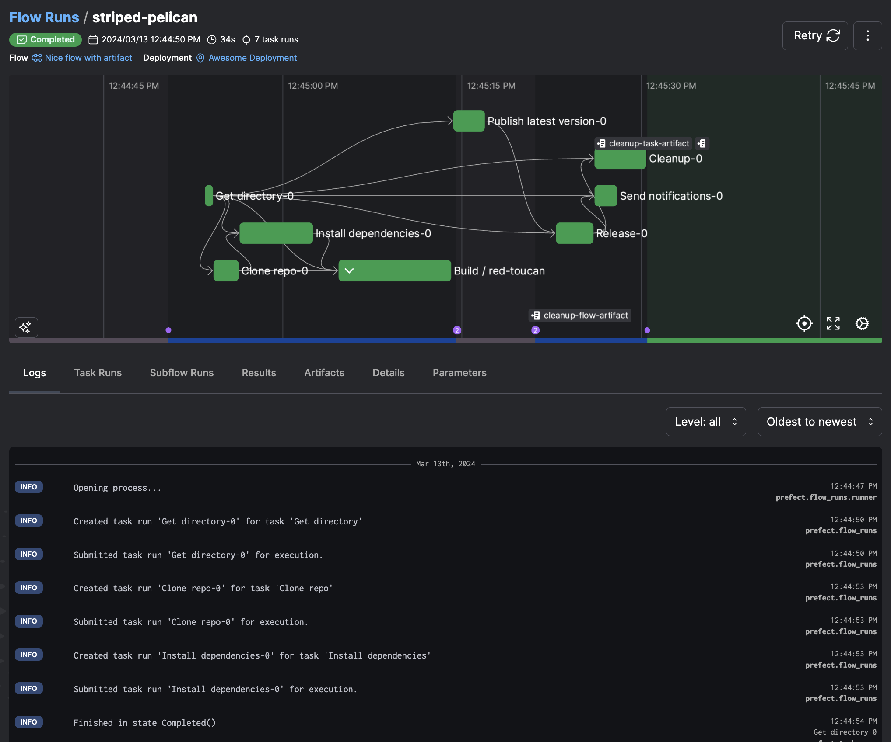

# Deploy with Prefect

## Introduction to Prefect

Prefect is a workflow orchestration and observability platform that automates and orchestrates data pipelines. As an open-source platform, it offers a framework for defining, scheduling, and executing tasks with dependencies. It enables users to observe, maintain, and scale their data workflows efficiently.



### Prefect features

- **Flows**: These contain workflow logic and are defined as Python functions.
- **Tasks**: A task represents a discrete unit of work. Tasks allow encapsulation of workflow logic that can be reused for flows and subflows.
- **Deployments and Scheduling**: Deployments transform workflows from manually called functions into API-managed entities that you can trigger remotely. Prefect allows you to use schedules to automatically create new flow runs for deployments or trigger new runs based on events.
- **Automations**: Prefect Cloud enables you to configure [actions](https://docs.prefect.io/latest/concepts/automations/#actions) that Prefect executes automatically based on [triggers](https://docs.prefect.io/latest/concepts/automations/#triggers).
- **Caching**: This feature enables a task to reflect a completed state without actually executing its defining code.
- **Observability**: This feature allows users to monitor workflows and tasks. It provides insights into data pipeline performance and behavior through logging, metrics, and notifications.

## Building data pipelines with `dlt`

`dlt` is an open-source Python library that enables the declarative loading of data sources into well-structured tables or datasets by automatically inferring and evolving schemas. It simplifies the construction of data pipelines by offering functionality to support the complete extract and load process.

### How does **`dlt`** integrate with Prefect for pipeline orchestration?

Here's a concise guide to orchestrating a `dlt` pipeline with Prefect using "Moving Slack data into BigQuery" as an example. You can find a comprehensive, step-by-step guide in the article [“Building resilient data pipelines in minutes with dlt + Prefect”,](https://www.prefect.io/blog/building-resilient-data-pipelines-in-minutes-with-dlt-prefect) and the corresponding GitHub repository [here.](https://github.com/dylanbhughes/dlt_slack_pipeline/blob/main/slack_pipeline_with_prefect.py)

### Here's a summary of the steps followed:

1. Create a `dlt` pipeline. For detailed instructions on creating a pipeline, please refer to the [documentation](../create-a-pipeline).

1. Add `@task` decorator to the individual functions.
    1. Here we use the `@task` decorator for the `get_users` function: 
        
        ```py
        @task
        def get_users() -> None:
            """Execute a pipeline that will load the Slack users list."""
        ```
        
    1. Use the `@flow` function on the `slack_pipeline` function as:
        
        ```py
        @flow
        def slack_pipeline(
            channels=None, 
            start_date=pendulum.now().subtract(days=1).date()
        ) -> None:
            get_users()
        
        ```
        
2. Lastly, append `.serve` to the `if __name__ == '__main__'` block to automatically create and schedule a Prefect deployment for daily execution as:
    
    ```py
    if __name__ == "__main__":
        slack_pipeline.serve("slack_pipeline", cron="0 0 * * *")
    ```
    
3. You can view deployment details and scheduled runs, including successes and failures, using [PrefectUI](https://app.prefect.cloud/auth/login). This will help you know when a pipeline ran or, more importantly, when it did not.


You can further extend the pipeline by: 

- Setting up [remote infrastructure with workers](https://docs.prefect.io/latest/tutorial/workers/?deviceId=bb3e22c1-c2c7-4981-bd5e-c81715503e08).
- [Adding automations](https://docs.prefect.io/latest/concepts/automations/?deviceId=bb3e22c1-c2c7-4981-bd5e-c81715503e08) to notify the status of the pipeline run.
- [Setting up retries](https://docs.prefect.io/latest/concepts/tasks/?deviceId=bb3e22c1-c2c7-4981-bd5e-c81715503e08#custom-retry-behavior).

