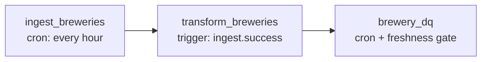

# Orchestrate with dltHub

dltHub's managed platform includes a job orchestrator built around the `@dlt.hub.run` decorators. Unlike external orchestrators (Airflow, Prefect, GitHub Actions), the schedule and the data dependencies live in your Python code — no separate DAG (directed acyclic graph) file or YAML to maintain.

This page walks through three core orchestration primitives: **cron and interval triggers**, **follow-up chains**, and **freshness gates with refresh cascades**.

For the deployment lifecycle (manifest, sync, reconciliation) see [Deployments](../../hub/pipeline-operations/deployments.md).

## Example dependency graph

The example below is a three-job graph: ingest data on a cron, transform it whenever the ingest succeeds, then run data-quality checks once the transform is fresh.



Each job is a decorated Python function. Wiring them into a graph is just passing the upstream job's `.success` or `.is_fresh` to the downstream decorator.

## Cron and interval triggers

`@run.pipeline` and `@run.job` accept a `trigger=` argument. The factories live under `dlt.hub.run.trigger`:

```py
import dlt
from dlt.hub import run
from dlt.hub.run import trigger


@run.pipeline(
    "ingest_breweries",
    trigger=trigger.schedule("0 * * * *"),    # every hour, on the hour
    expose={"tags": ["ingest"], "display_name": "Ingest breweries"},
)
def ingest_breweries():
    pipeline = dlt.pipeline(
        pipeline_name="ingest_breweries",
        destination="warehouse",
        dataset_name="brewery_data",
    )
    pipeline.run(brewery_source())
```

| Trigger factory | When it fires |
|---|---|
| `trigger.schedule("0 * * * *")` | A cron expression. UTC by default; pass `require={"timezone": "..."}` to interpret in another zone. |
| `trigger.every("5m")` | A fixed interval relative to "now". Useful when "every five minutes" matters more than absolute tick times. |
| `trigger.once("2026-12-31T00:00:00Z")` | Single run at a wall-clock time. |
| `trigger.manual()` | Job only runs when invoked by hand via `dlthub run`, `dlthub job trigger`, or the dashboard. |

:::tip Adjust the schedule from the platform
For deployed jobs, you can also change the cron schedule from the dltHub platform — open the job's detail page and click **Manage Schedule**. Pick a quick preset or type a new cron expression. This is useful for ad-hoc pauses or quick tweaks without redeploying. To make a change permanent, update the decorator and run `dlthub deploy`.
:::

A job can have multiple triggers — pass a list:

```py
@run.pipeline(
    "ingest_breweries",
    trigger=[trigger.schedule("0 * * * *"), trigger.manual()],
)
def ingest_breweries():
    ...
```

## Follow-up chains

Every decorated job exposes `.success`, `.fail`, and `.completed` attributes. Pass them as triggers on a downstream job and dltHub fires that job the moment the upstream finishes — no polling, no scheduler delay:

```py
from ingest_breweries import ingest_breweries


@run.pipeline(
    "transform_breweries",
    trigger=ingest_breweries.success,           # fires when ingest succeeds
    expose={"tags": ["transform"], "display_name": "Transform breweries"},
)
def transform_breweries():
    pipeline = dlt.pipeline(
        pipeline_name="transform_breweries",
        destination="warehouse",
        dataset_name="brewery_data",
    )
    # ... run transformations against the dataset ...
```

`.fail` fires only on failure; `.completed` fires on either outcome — useful for cleanup jobs that should run regardless. You can combine cron and follow-up triggers on the same job:

```py
@run.pipeline(
    "transform_breweries",
    trigger=[
        trigger.schedule("30 * * * *"),         # back-stop hourly even if no upstream
        ingest_breweries.success,                # also run as soon as ingest finishes
    ],
)
def transform_breweries():
    ...
```

To find out which trigger fired a particular run, declare a `run_context` parameter:

```py
from dlt.hub.run import TJobRunContext


@run.pipeline("transform_breweries", trigger=[trigger.schedule("30 * * * *"), ingest_breweries.success])
def transform_breweries(run_context: TJobRunContext):
    trigger_type = run_context["trigger"].split(":", 1)[0]
    if trigger_type == "schedule":
        print("Hourly back-stop run")
    elif trigger_type == "job.success":
        print("Upstream finished; running follow-up")
```

`run_context["trigger"]` is a `"type:expression"` string (e.g. `"schedule:30 * * * *"`, `"job.success:jobs.ingest.ingest_breweries"`).

## Freshness gates and refresh cascade

Follow-up triggers run downstream **whenever** upstream finishes. **Freshness gates** are the opposite: they let a downstream job run on its own schedule, but skip if upstream hasn't produced a fresh result yet.

```py
from ingest_breweries import ingest_breweries
from transform_breweries import transform_breweries


@run.job(
    trigger=trigger.schedule("15 * * * *"),     # try every hour at :15
    freshness=[transform_breweries.is_fresh],   # ...but skip if transform isn't fresh
    expose={"tags": ["dq"], "display_name": "Brewery DQ"},
)
def brewery_dq():
    """Run data-quality checks against the latest transformed data."""
    import dlthub.data_quality as dq
    pipeline = dlt.attach("transform_breweries")
    dq.run_metrics(pipeline)
    dq.run_checks(pipeline, checks={
        "breweries": [
            dq.checks.is_not_null("id"),
            dq.checks.is_not_null("name"),
        ],
    })
```

Use freshness when partial data would silently break a metric (e.g. an aggregate that compares this hour to last).

### Refresh cascade

A job marked `refresh="always"` originates a *refresh signal* that propagates downstream through the dependency graph. Each downstream job receives `run_context["refresh"] = True` and can react — for example by passing `refresh="drop_data"` to `pipeline.run`.

```py
@run.job(
    trigger=trigger.manual(),
    refresh="always",
    expose={"tags": ["backfill"], "display_name": "Backfill cascade"},
)
def backfill():
    """Cascade a refresh through the graph; does not load data itself."""


@run.pipeline("ingest_breweries", trigger=[trigger.schedule("0 * * * *"), backfill.success])
def ingest_breweries(run_context: TJobRunContext):
    pipeline = dlt.pipeline(
        pipeline_name="ingest_breweries",
        destination="warehouse",
        dataset_name="brewery_data",
    )
    pipeline.run(
        brewery_source(),
        refresh="drop_data" if run_context["refresh"] else None,
    )
```

Three refresh policies on any decorated job:

| Policy | Behavior |
|---|---|
| `"always"` | Originate a refresh signal on every run of this job. |
| `"auto"` (default) | Forward any refresh signal received from upstream. |
| `"block"` | Stop refresh propagation here. Downstream jobs after this one see `refresh = False`. |

## Wire jobs into the workspace and deploy

Declare every job in `__deployment__.py` so the manifest picks them up:

```py
"""Brewery workspace."""

from ingest_breweries import ingest_breweries
from transform_breweries import transform_breweries
from brewery_dq import brewery_dq
from backfill import backfill

__all__ = ["ingest_breweries", "transform_breweries", "brewery_dq", "backfill"]
```

Deploy and let the scheduler take over:

```sh
uv run dlthub deploy                         # syncs code + manifest to dltHub
uv run dlthub deploy --dry-run               # preview reconciliation
uv run dlthub deploy --show-manifest         # dump the YAML manifest
```

After the first deploy, scheduled jobs start running on their cron. You can:

```sh
dlthub job list                              # see every deployed job + status
dlthub job trigger "tag:ingest"              # bulk-trigger by tag selector
dlthub job logs ingest_breweries --follow    # stream the latest run's logs
dlthub job cancel ingest_breweries           # cancel an in-flight run
```

See [Monitoring and debugging](../../hub/pipeline-operations/monitoring.md) for the full observability surface.

## See also

- [Introduction to dltHub](../../hub/getting-started/introduction.md) — overview of the platform.
- [Triggers and scheduling](../../hub/pipeline-operations/triggers.md) — full reference for triggers, intervals, freshness, and refresh.
- [Deployments](../../hub/pipeline-operations/deployments.md) — `__deployment__.py`, manifest layout, reconciliation rules.
- [dltHub platform tutorial](../../hub/getting-started/platform-tutorial.md) — guided end-to-end walkthrough from scaffold to deploy.
